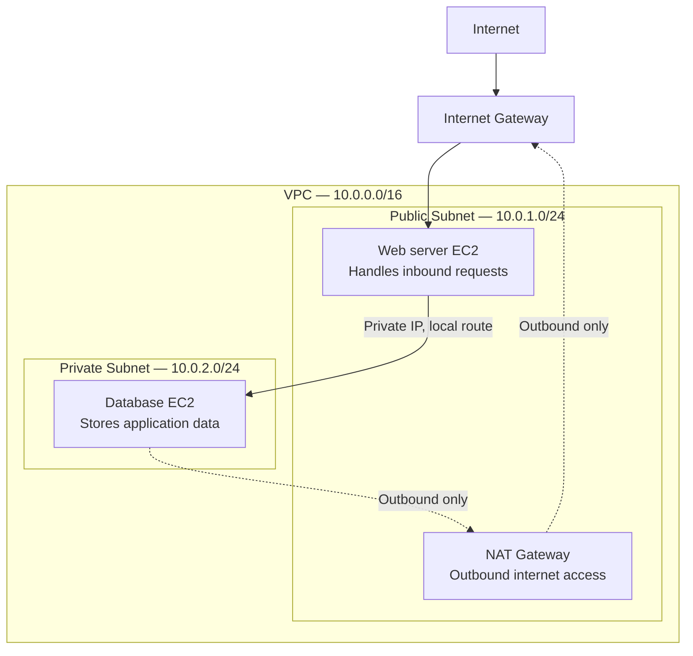

# AWS VPC Configuration Guide

A step-by-step reference for setting up a custom VPC with public and private subnets, an Internet Gateway, a NAT Gateway, and the associated route tables.

---

## Architecture Overview

```
                        ┌─────────────────────────────────────────┐
                        │                  VPC                     │
                        │              10.0.0.0/16                 │
                        │                                           │
   Internet ───IGW────► │  ┌───────────────┐   ┌───────────────┐   │
                        │  │ Public Subnet │   │ Private Subnet│   │
                        │  │ 10.0.1.0/24   │   │ 10.0.2.0/24   │   │
                        │  │               │   │               │   │
                        │  │  NAT Gateway  │◄──┼── outbound     │   │
                        │  └───────────────┘   └───────────────┘   │
                        │        │  Public RT         │ Private RT │
                        │        │  (0.0.0.0/0→IGW)    │(0.0.0.0/0  │
                        │        │                     │  →NAT)    │
                        └─────────────────────────────────────────┘
```

---

## 1. Create the VPC

1. Open **VPC Console** → **Your VPCs** → **Create VPC**.
2. Choose **VPC only** (or "VPC and more" if you want AWS to auto-generate subnets/route tables).
3. Configure:
   - **Name tag**: `my-vpc`
   - **IPv4 CIDR block**: `10.0.0.0/16`
   - **IPv6 CIDR block**: No IPv6 CIDR block (unless needed)
   - **Tenancy**: Default
4. Click **Create VPC**.

**CLI equivalent:**
```bash
aws ec2 create-vpc \
  --cidr-block 10.0.0.0/16 \
  --tag-specifications 'ResourceType=vpc,Tags=[{Key=Name,Value=my-vpc}]'
```

> Enable DNS hostnames and DNS resolution on the VPC (required for public subnet instances to get public DNS names):
```bash
aws ec2 modify-vpc-attribute --vpc-id vpc-xxxxxxxx --enable-dns-support
aws ec2 modify-vpc-attribute --vpc-id vpc-xxxxxxxx --enable-dns-hostnames
```

---

## 2. Create Subnets

Create at least one **public** subnet and one **private** subnet, ideally spread across two Availability Zones for high availability.

| Subnet Name       | CIDR Block   | Availability Zone | Type    |
|--------------------|--------------|--------------------|---------|
| public-subnet-1a   | 10.0.1.0/24  | ap-south-1a        | Public  |
| private-subnet-1a  | 10.0.2.0/24  | ap-south-1a        | Private |
| public-subnet-1b   | 10.0.3.0/24  | ap-south-1b        | Public  |
| private-subnet-1b  | 10.0.4.0/24  | ap-south-1b        | Private |

**Console steps:**
1. **VPC Console** → **Subnets** → **Create subnet**.
2. Select your VPC (`my-vpc`).
3. Add each subnet with its name, AZ, and CIDR block.
4. For public subnets, go to **Subnet Actions** → **Edit subnet settings** → enable **Auto-assign public IPv4 address**.

**CLI equivalent:**
```bash
# Public subnet
aws ec2 create-subnet \
  --vpc-id vpc-xxxxxxxx \
  --cidr-block 10.0.1.0/24 \
  --availability-zone ap-south-1a \
  --tag-specifications 'ResourceType=subnet,Tags=[{Key=Name,Value=public-subnet-1a}]'

# Private subnet
aws ec2 create-subnet \
  --vpc-id vpc-xxxxxxxx \
  --cidr-block 10.0.2.0/24 \
  --availability-zone ap-south-1a \
  --tag-specifications 'ResourceType=subnet,Tags=[{Key=Name,Value=private-subnet-1a}]'

# Enable auto-assign public IP for the public subnet
aws ec2 modify-subnet-attribute \
  --subnet-id subnet-xxxxxxxx \
  --map-public-ip-on-launch
```

---

## 3. Create and Attach an Internet Gateway (IGW)

1. **VPC Console** → **Internet Gateways** → **Create internet gateway**.
2. Name it (e.g., `my-vpc-igw`) → **Create**.
3. Select it → **Actions** → **Attach to VPC** → choose `my-vpc`.

**CLI equivalent:**
```bash
aws ec2 create-internet-gateway \
  --tag-specifications 'ResourceType=internet-gateway,Tags=[{Key=Name,Value=my-vpc-igw}]'

aws ec2 attach-internet-gateway \
  --internet-gateway-id igw-xxxxxxxx \
  --vpc-id vpc-xxxxxxxx
```

---

## 4. Create the Public Route Table

1. **VPC Console** → **Route Tables** → **Create route table**.
2. Name: `public-rt`, VPC: `my-vpc`.
3. Select the route table → **Routes** tab → **Edit routes** → **Add route**:
   - Destination: `0.0.0.0/0`
   - Target: the Internet Gateway (`igw-xxxxxxxx`)
4. Go to **Subnet associations** → **Edit subnet associations** → select all **public** subnets.

**CLI equivalent:**
```bash
aws ec2 create-route-table \
  --vpc-id vpc-xxxxxxxx \
  --tag-specifications 'ResourceType=route-table,Tags=[{Key=Name,Value=public-rt}]'

aws ec2 create-route \
  --route-table-id rtb-public-xxxxxxxx \
  --destination-cidr-block 0.0.0.0/0 \
  --gateway-id igw-xxxxxxxx

aws ec2 associate-route-table \
  --route-table-id rtb-public-xxxxxxxx \
  --subnet-id subnet-public-xxxxxxxx
```

---

## 5. Create a NAT Gateway (for Private Subnet Outbound Access)

A NAT Gateway must sit in a **public** subnet and needs an **Elastic IP**.

1. **VPC Console** → **Elastic IPs** → **Allocate Elastic IP address** → **Allocate**.
2. **VPC Console** → **NAT Gateways** → **Create NAT gateway**.
3. Configure:
   - **Name**: `my-vpc-natgw`
   - **Subnet**: choose a **public** subnet (e.g., `public-subnet-1a`)
   - **Connectivity type**: Public
   - **Elastic IP allocation ID**: select the EIP allocated above
4. Click **Create NAT gateway** (takes a few minutes to become available).

**CLI equivalent:**
```bash
# Allocate an Elastic IP
aws ec2 allocate-address --domain vpc

# Create the NAT Gateway in the public subnet
aws ec2 create-nat-gateway \
  --subnet-id subnet-public-xxxxxxxx \
  --allocation-id eipalloc-xxxxxxxx \
  --tag-specifications 'ResourceType=natgateway,Tags=[{Key=Name,Value=my-vpc-natgw}]'
```

---

## 6. Create the Private Route Table

1. **VPC Console** → **Route Tables** → **Create route table**.
2. Name: `private-rt`, VPC: `my-vpc`.
3. Select the route table → **Routes** tab → **Edit routes** → **Add route**:
   - Destination: `0.0.0.0/0`
   - Target: the NAT Gateway (`nat-xxxxxxxx`)
4. Go to **Subnet associations** → **Edit subnet associations** → select all **private** subnets.

**CLI equivalent:**
```bash
aws ec2 create-route-table \
  --vpc-id vpc-xxxxxxxx \
  --tag-specifications 'ResourceType=route-table,Tags=[{Key=Name,Value=private-rt}]'

aws ec2 create-route \
  --route-table-id rtb-private-xxxxxxxx \
  --destination-cidr-block 0.0.0.0/0 \
  --nat-gateway-id nat-xxxxxxxx

aws ec2 associate-route-table \
  --route-table-id rtb-private-xxxxxxxx \
  --subnet-id subnet-private-xxxxxxxx
```

---

## 7. Verification Checklist

- [ ] VPC created with correct CIDR block
- [ ] Public and private subnets created in the correct AZs
- [ ] DNS hostnames/resolution enabled on the VPC
- [ ] Internet Gateway created and attached to the VPC
- [ ] Public route table has a `0.0.0.0/0` route to the IGW
- [ ] Public subnets associated with the public route table
- [ ] Public subnets have "Auto-assign public IP" enabled
- [ ] Elastic IP allocated for the NAT Gateway
- [ ] NAT Gateway created in a public subnet and in "Available" state
- [ ] Private route table has a `0.0.0.0/0` route to the NAT Gateway
- [ ] Private subnets associated with the private route table
- [ ] Test: EC2 instance in public subnet has internet access directly via IGW
- [ ] Test: EC2 instance in private subnet has outbound-only internet access via NAT Gateway

---

## 8. Request Flow: Public Subnet ↔ Private Subnet

The diagram below shows how a request enters the VPC, and how the public and private subnets talk to each other.



**Request flow (solid lines, top to bottom):**
1. A client on the internet sends a request.
2. It hits the **Internet Gateway**, which is attached to the VPC and performs public IP ↔ private IP translation.
3. The public route table sends it to the **web server EC2** in the public subnet (it has a public IP because "auto-assign public IP" is enabled on that subnet).

**Public → private communication (left-side solid arrow):**
- The web server talks to the **database EC2** in the private subnet using its **private IP** only, over the VPC's internal network.
- This works because both subnets share the same VPC and the **local route** (added automatically to every route table) lets resources inside the VPC reach each other directly — no gateway is involved in this hop.
- The database's security group should only allow inbound traffic from the web server's security group (or its private subnet CIDR), never from the internet.

**Private subnet's outbound-only path (dashed lines):**
- The database instance has no public IP and no direct route to the internet.
- If it needs outbound access (OS patches, hitting an external API, etc.), traffic goes to the **NAT Gateway** in the public subnet via the private route table's `0.0.0.0/0 → NAT` rule.
- The NAT Gateway forwards it out through the **Internet Gateway**.
- Return traffic follows the same path back — nothing from the internet can *initiate* a connection into the private subnet.

That asymmetry — the private subnet can *reach out* via NAT but can't be *reached* from outside — is the core reason for placing the database there.

---

## Notes

- **Cost consideration**: NAT Gateways are billed hourly plus per-GB data processing charges. Use a single NAT Gateway per AZ for production HA, or one shared NAT Gateway for cost savings in non-critical environments.
- **Security**: Route tables control traffic paths, but Security Groups and Network ACLs should also be configured to restrict traffic at the instance and subnet level.
- **High Availability**: For production, deploy NAT Gateways in each AZ used by private subnets so private resources aren't dependent on a single AZ's NAT Gateway.
