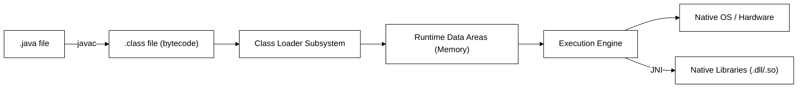
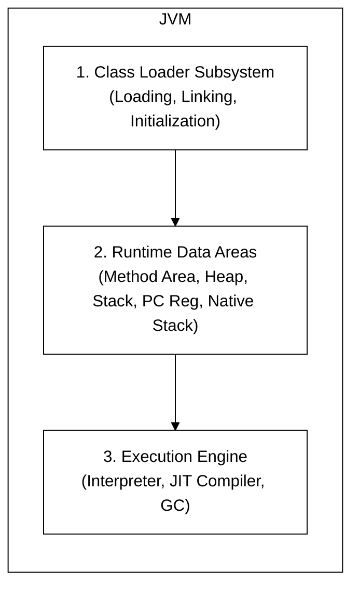
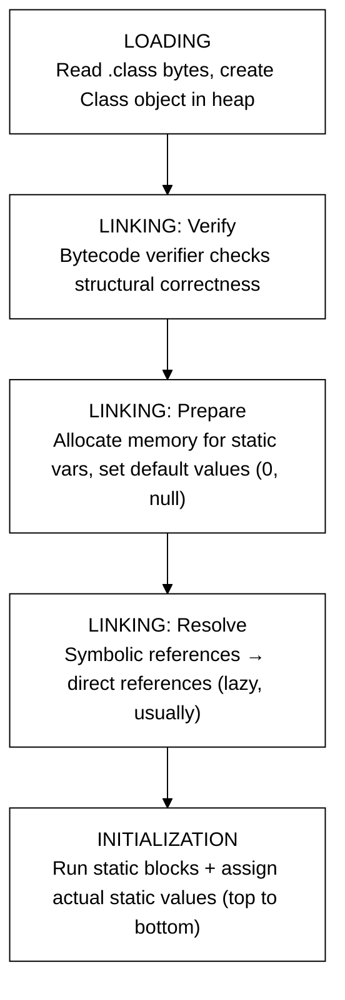
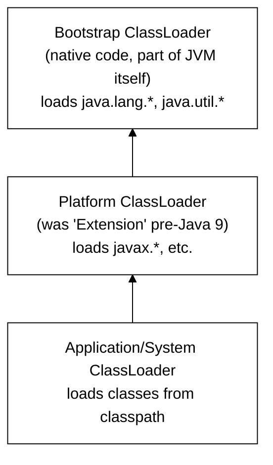
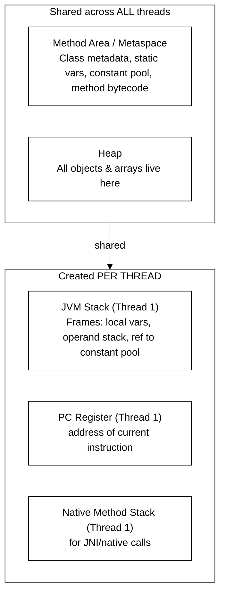
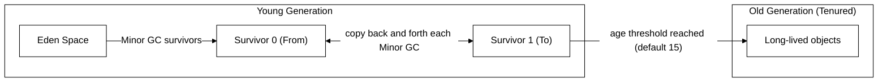
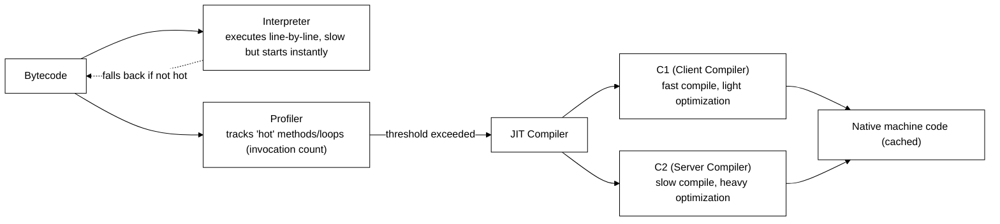
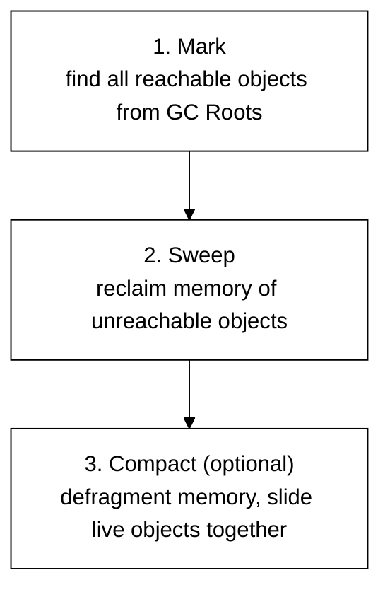
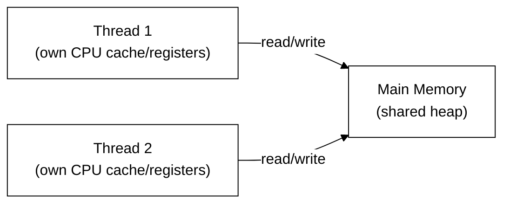
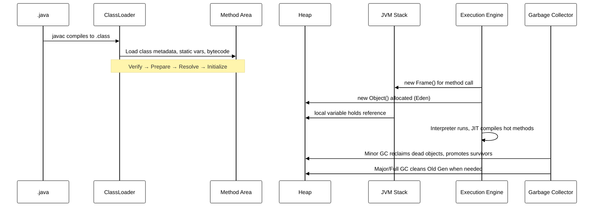

# JVM Internals — Interview Cracking Guide (Expanded Edition)

This version keeps the original structure and diagrams but adds a "why does this actually work this way" layer under each topic. The goal isn't just to memorize facts for an interview — it's to build a mental model precise enough that you could explain any of these ideas to someone else from scratch, or reason about a weird production bug you've never seen before.

Read top to bottom once for the mental model. Then use the "Likely Interview Questions" and "Deeper Dive" boxes as flash-drills.

---

## 1. The Big Picture — How Java Code Runs



### Why it's built this way

Java's whole pitch in 1995 was "write once, run anywhere." The trick that makes this possible is the split between **compilation** and **execution**:

- `javac` doesn't compile Java down to a specific CPU's machine code (like a C compiler would). It compiles to **bytecode** — a fixed, platform-neutral instruction set that assumes nothing about the underlying OS or chip.
- The **JVM** is the thing that actually knows how to run bytecode on a specific machine. There's a different JVM binary for Windows, Linux, macOS, ARM, x86, etc. — but they all agree on what bytecode means.

So the portability doesn't come from Java being "interpreted" (a common misconception) — it comes from the **contract** between `javac`'s output and every JVM's input being identical, regardless of platform.

**Key idea to say out loud in an interview:** JVM is a *specification* (a document describing required behavior). HotSpot, OpenJ9, GraalVM are *implementations* of that spec — the same way "HTTP" is a spec and Chrome/Firefox are implementations of a browser. Almost everything below describes HotSpot behavior specifically, since that's what 90% of interviewers mean by "JVM," even though the spec itself leaves many details (like which GC algorithm to use) up to the implementation.

---

## 2. JVM Architecture — Three Main Subsystems



### Why these three, specifically

Think of it as a pipeline that mirrors how *any* program execution has to work, at a basic level:

1. **Something has to get the code into memory in a usable form.** That's the Class Loader Subsystem's job — it's the "file system reader + linker" of the JVM.
2. **Something has to hold the program's state while it runs.** That's the Runtime Data Areas — think of this as "all the RAM the JVM manages," subdivided by *what* it stores and *who* can see it (a single thread, or every thread).
3. **Something has to actually execute instructions and reclaim memory that's no longer needed.** That's the Execution Engine — it interprets/compiles bytecode into real CPU instructions, and its garbage collector is the automatic memory manager that frees you from `malloc`/`free`.

This 3-way split is also why JVM interview questions cluster into exactly these three buckets — almost every "explain X" question is really asking you to place X correctly into one of these three boxes and explain how it interacts with the other two.

**One-line answer if asked "Explain JVM architecture":**
> "JVM has three parts — the Class Loader Subsystem which loads and prepares `.class` files, the Runtime Data Areas which is where all memory lives, and the Execution Engine which actually runs the bytecode, using an interpreter, JIT compiler, and garbage collector."

---

## 3. Class Loading Subsystem

Three phases: **Loading → Linking → Initialization**. Linking itself has 3 sub-steps.



### Walking through each phase like the JVM actually does it

**Loading:** the JVM asks a classloader to find the bytes for `com.example.Foo` (usually by turning the fully-qualified name into a file path like `com/example/Foo.class` and reading it from the classpath, a JAR, or a network location). It parses the file format and builds an in-memory representation, including a `java.lang.Class` object that becomes your handle to reflect on the type at runtime.

**Verify:** before trusting a single byte of that class file, the JVM runs a **bytecode verifier** — essentially a static analyzer that proves the code can't do anything memory-unsafe: no jumping into the middle of another method, no treating an `int` as an object reference, no underflowing the operand stack. This step exists because bytecode can come from anywhere (a downloaded JAR, a browser applet in the old days, a dynamically generated class) — the JVM can't assume `javac` was the only thing that ever produced it, so it re-checks the safety guarantees itself instead of trusting the compiler.

**Prepare:** memory is allocated for the class's static fields, but they're set to **default values** — `0` for numeric types, `false` for booleans, `null` for references — *not* whatever value your code specifies. This is a distinct step from initialization on purpose: the JVM needs a memory layout for the class to exist before it can safely run arbitrary static-initializer code (which might, in principle, reference the class itself).

**Resolve:** the class file doesn't contain real memory addresses — it contains **symbolic references** like `"java/util/ArrayList"` or `"println(Ljava/lang/String;)V"` sitting in the constant pool. Resolution is the process of turning those symbolic names into direct references (an actual method pointer, an actual field offset). HotSpot does this **lazily** by default — the first time a particular reference is actually used, not all at once — which is why a class with a typo in a rarely-called method can pass loading fine and only blow up later when that method finally executes.

**Initialize:** now, and only now, does the JVM run static initializer blocks and assign the *actual* values you wrote (`static int x = 5;` finally becomes `5`), in the exact top-to-bottom order they appear in the source file. This step is guaranteed to run **exactly once**, and the JVM guarantees it's **thread-safe** — if two threads race to trigger initialization of the same class, one blocks until the other finishes, so you'll never see half-initialized statics.

**Gotcha interviewers love:** *"What's the difference between Prepare and Initialize?"*
- Prepare: `static int x = 5;` → `x` becomes `0` (default value), memory allocated.
- Initialize: `x` actually becomes `5` — static initializer blocks and static assignments run in source order.

### 3a. Classloader Hierarchy (Delegation Model)



### Why delegation, specifically, instead of "just load whatever asks first"

**Parent Delegation Model:** when any classloader is asked to load a class, before it tries to load it itself, it first asks its **parent** to try. Only if the parent (and *its* parent, all the way up to Bootstrap) fails to find the class does the original loader actually attempt to load it.

Walk through why this matters with a concrete scenario: imagine you write your own `java.lang.String` class in your application, intending to sneak in custom behavior, and put it on your classpath. Without delegation, your Application ClassLoader might load *your* `String` first, and now every piece of code in the JVM — including trusted JDK internals — could end up talking to a `String` implementation you control. That's a huge security hole (imagine `String` silently logging every value it holds).

With delegation, the Application ClassLoader is forced to ask the Platform ClassLoader, which asks the Bootstrap ClassLoader — and Bootstrap *always* finds `java.lang.String` first, because that's literally where it lives natively. So your custom class never even gets a chance to load under that name. This gives two concrete guarantees:

1. **Sandboxing/security** — core JDK classes can't be spoofed or overridden by application code.
2. **Uniqueness** — the same class name loaded by the same loader always resolves to the same, single `Class` object, so `instanceof` and casting behave predictably.

**Likely Interview Questions:**
- *"Why can't I write my own `java.lang.String` class and have it load?"* → Bootstrap loader owns `java.lang.*`; parent delegation means your custom `String` never gets a chance to load — this is the **sandboxing/security** benefit of delegation.
- *"How would you break parent delegation?"* → Override `loadClass()` (not just `findClass()`) in a custom ClassLoader — this is literally how app servers like Tomcat isolate webapps from each other (each webapp gets its own classloader that checks itself *before* asking the shared parent, inverting the normal order, so two webapps can each ship a different version of the same library without colliding).
- *"When is a class loaded — at compile time or runtime?"* → Runtime, and lazily (only when first actively used: instantiation, static access, reflection, etc. — not on mere reference). This matters practically: a class with a broken dependency can sit unused in your codebase for months without anyone noticing, because the JVM never even tries to load it until something actually touches it.

---

## 4. Runtime Data Areas (This is THE most-asked topic)



### The single organizing question: "who needs to see this data?"

Every memory area in the JVM exists because of one design question: does this piece of data need to be visible to *every* thread, or does it belong to *one specific thread's* execution?

- **Class metadata** (what methods does `Foo` have, what's its parent class, what does the bytecode for `bar()` look like) is the same no matter which thread is asking — one `Foo` class, shared by everyone. So it lives in one shared place: the **Method Area / Metaspace**.
- **Objects** you `new` up are usually meant to be shareable — you might hand a reference to another thread, put it in a shared cache, etc. So all objects live in one shared place: the **Heap**.
- **Local variables and the call stack**, by contrast, are inherently tied to *one thread's* execution path. If Thread A is three calls deep into `computeTotal()`, that stack of "which method called which, with what local variables" makes no sense shared with Thread B, which is off doing something completely different. So each thread gets its **own private Stack, PC Register, and Native Method Stack.**

Once you see it through that lens, the table below stops being a memorization exercise and becomes something you can derive from first principles.

| Area | Thread-shared? | Stores | Overflow error |
|---|---|---|---|
| Method Area (Metaspace) | Yes | Class structure, method bytecode, runtime constant pool, static variables | `OutOfMemoryError: Metaspace` |
| Heap | Yes | All objects, instance variables, arrays | `OutOfMemoryError: Java heap space` |
| JVM Stack | No (per thread) | Stack frames = local vars + operand stack + frame data, one frame per method call | `StackOverflowError` |
| PC Register | No (per thread) | Address of currently executing JVM instruction | — |
| Native Method Stack | No (per thread) | State for native (non-Java) method calls | `StackOverflowError` (impl-dependent) |

### How a JVM Stack frame actually works

Every time a method is called, a new **frame** is pushed onto that thread's stack. A frame holds three things: (1) an array of **local variable slots** — the method's parameters and locally declared variables; (2) an **operand stack** — a small scratch space bytecode instructions use to hold intermediate values while computing an expression (e.g. computing `a + b * c` pushes and pops values here before the result lands in a local slot); (3) a reference back to the current class's runtime constant pool, so the method can resolve symbolic references it needs. When the method returns, its entire frame is popped and discarded in one shot — this is *why* local variables disappear the instant a method returns, and why returning a reference to a local variable (as you could in C) isn't a concept that exists in Java: only the underlying heap object, not the stack frame itself, can outlive the call.

**Critical clarification interviewers test:** *"Metaspace vs PermGen?"*
- Pre-Java 8: **PermGen** was part of the heap (fixed max size via `-XX:MaxPermSize`), frequent cause of `OutOfMemoryError: PermGen space`.
- Java 8+: **Metaspace** replaced it, lives in **native (off-heap) memory**, grows dynamically by default (bounded by `-XX:MaxMetaspaceSize` if you set it).

The motivation for this change is worth internalizing, not just memorizing: PermGen's fixed size was a constant source of pain for applications that generate lots of classes at runtime (app servers, frameworks using bytecode generation, hot-reload tools) — every dynamically generated class ate into a hard cap that was easy to size wrong. Moving to native memory means the practical limit becomes "how much RAM does the machine have," which is a much more forgiving failure mode.

**Likely Interview Questions:**
- *"Where do static variables live?"* → Method Area / Metaspace (the actual object a static reference points to, if it's an object, lives on the Heap; the reference/slot lives in Method Area).
- *"Where do local variables live?"* → JVM Stack (primitives + object references), the actual objects are on the Heap.
- *"Why does infinite recursion cause StackOverflowError but not OutOfMemoryError?"* → Each recursive call pushes a new frame onto the fixed-size-per-thread Stack, not the Heap. The Heap can (in principle) keep growing until physical memory runs out, but each thread's Stack is capped at a small, fixed size (tunable with `-Xss`, often just 512KB–1MB by default) specifically so that one runaway thread can't silently eat all of the process's memory.

### 4a. Heap Internals — Generational Layout



### Tracing one object's life through this diagram

Say you call `new Order()` inside a request handler. That object is born in **Eden**. Most objects like this — a temporary object created to compute something and then discarded — die almost immediately, within the same request. When Eden fills up, a **Minor GC** fires: it scans Eden (and the currently-active Survivor space) for objects still reachable from a GC Root, copies *only those* into the other, empty Survivor space, and then treats the rest of Eden as instantly reclaimed — there's no need to individually "free" the dead objects one at a time, because nothing pointed to them by the time the scan finishes, and the whole region gets reset for reuse. This is why Minor GC is fast: its cost is proportional to how many objects *survived*, not how many objects died, and most objects die.

If your `Order` object happens to still be referenced (say it got stored in a longer-lived collection), it survives that copy and its **age counter** increments by one. Each subsequent Minor GC that finds it still reachable bumps the counter again, and the two Survivor spaces ping-pong the object back and forth (this is why there are two of them — "From" and "To" swap roles every cycle). Once the age counter crosses a threshold (15 by default), the JVM concludes "this object seems to actually be long-lived" and **promotes** it into the **Old Generation**, where it will only be revisited during the much less frequent, much more expensive **Major/Full GC**.

**Likely Interview Question:** *"Why generational GC instead of scanning the whole heap every time?"*
> Based on the **weak generational hypothesis**: most objects die young. Scanning only Eden most of the time is far cheaper than scanning the entire heap. Concretely: if 95% of objects never survive their first GC cycle (a typical real-world ratio), then designing the collector around "cheaply reclaim Eden constantly, rarely touch Old Gen" matches the actual shape of how programs allocate memory — a request-scoped temporary object and a long-lived cache entry have very different lifetimes, and a generational collector treats them differently instead of paying the same cost to check both every time.

---

## 5. Execution Engine — Interpreter + JIT



### The core trade-off this design is solving

There are two competing goals when running any program: **start fast** and **run fast**. A pure interpreter starts instantly (no compile step) but every single instruction pays interpretation overhead forever. A pure ahead-of-time compiler (like C) runs fast forever but you pay the whole compilation cost up front, and it can't adapt to what actually happens at runtime.

The JVM's answer is to **not choose** — start every method as interpreted bytecode (fast startup, no wasted compilation on code that only runs once), and have a **profiler** silently count how often each method or loop actually executes. Once a method crosses an invocation threshold, the JVM concludes "this is worth the cost of compiling," and hands it to the JIT compiler to turn into real native machine code, which is then cached and reused for all future calls.

**Tiered Compilation (default since Java 8):** rather than jumping straight to the most expensive optimizer, the JVM escalates in tiers. A hot method first gets compiled by **C1** (quick to compile, adds lightweight profiling instrumentation, moderate speedup) — and if the method keeps getting hotter, it gets recompiled from scratch by **C2** (much slower to compile, but applies aggressive optimizations like inlining, loop unrolling, and escape analysis). This mirrors the interpreter-vs-compiler trade-off one level down: C1 is the "fast but modest" option, C2 is the "slow but powerful" option, and tiering lets the JVM only pay C2's cost for code that's hot enough to justify it.

**"Why is JVM code sometimes faster than natively-compiled C after warm-up?"**
> JIT does **runtime profile-guided optimization** — decisions based on actual observed behavior (e.g., which branch is usually taken, which implementation of an interface is actually used) that a static compiler can't know in advance. A C compiler has to generate code that's correct for *every* possible input; the JIT can generate code that's optimal for the input pattern it's *actually observing right now*, and fall back gracefully (see de-optimization below) if that assumption ever breaks. This is also why **benchmarks need warm-up iterations** (JMH does this) — measuring cold-start bytecode-interpreted performance is misleading, since you'd be measuring the slowest possible execution mode instead of the steady-state one your production code actually runs in.

### Deeper Dive — Escape Analysis

**Escape Analysis** is the JIT asking a very specific question about an object: *"does a reference to this object ever leave the method (or thread) that created it?"* If the compiler can prove the answer is no — nothing outside this method will ever see this object — it unlocks optimizations that would be unsafe otherwise:

- **Stack allocation / scalar replacement**: instead of allocating the object on the shared Heap (which requires GC bookkeeping later), the JIT can split the object into its individual fields and treat them like ordinary local variables living directly on the Stack. When the method returns, they simply vanish with the frame — no GC ever needs to look at them.
- **Dead-object elimination**: if the object is created but its fields are never actually read, the JIT can skip the allocation entirely.
- **Lock elision**: if a method synchronizes on an object that provably never escapes, no other thread could ever contend for that lock, so the JIT can strip the synchronization overhead out completely — it would have been a no-op anyway.

The common thread in all three: proving something *can't possibly happen* (escaping, contention, actually being used) lets the compiler skip the work of defending against it.

---

## 6. Garbage Collection — Algorithms Comparison



### Why reachability, not reference counting

**GC Roots** (where reachability analysis starts): local variables on active thread stacks, active JNI references, static variables in loaded classes, and objects currently locked by a monitor. The GC's job is essentially a graph traversal: start at every GC Root, follow every reference you find, and mark every object you reach as "alive." Anything left unmarked at the end is, by definition, unreachable by any live part of the program — and therefore garbage, even if two dead objects still point at each other.

That last point is the key reason Java doesn't use simple **reference counting** (where each object tracks how many references point to it, and gets freed the instant that count hits zero, the way some other languages do). Reference counting can't detect a **cycle**: if Object A holds a reference to Object B and B holds a reference back to A, but nothing else in the program references either of them, their reference counts never drop to zero — they'd leak forever under naive reference counting. Reachability analysis has no such blind spot, because it only cares whether you can walk a path *from a root*, not whether some other dead object happens to still be pointing at you.

### Mark, Sweep, and Compact — three separate concerns

- **Mark**: walk the object graph from GC Roots, flag every reachable object.
- **Sweep**: reclaim the memory occupied by everything left unmarked. The gaps left behind by dead objects are just... gaps — nothing moves.
- **Compact** (optional, separate step): slide the surviving live objects together so the freed memory forms one contiguous block instead of being scattered in fragments.

Sweeping alone is fast but leaves **fragmentation** — lots of small free gaps between surviving objects, which makes it harder to find room for a new large object later (even if the *total* free memory is enough, no single gap might be big enough). Compaction fixes that at the cost of extra work per GC cycle (you have to actually move object data around and fix up every reference that pointed to the old location). This trade-off — fragmentation-but-cheap vs. defragmented-but-costlier — is exactly why different collectors make different choices here, as the table below shows.

| Collector | Approach | Pause Behavior | Use Case |
|---|---|---|---|
| Serial | Single-threaded, stop-the-world | Long pauses | Small heaps, single-core, client apps |
| Parallel (Throughput) | Multi-threaded STW | Long but higher throughput | Batch jobs, throughput > latency |
| CMS (deprecated, removed Java 14) | Mostly-concurrent mark/sweep, no compaction | Shorter pauses, fragmentation risk | Old low-latency choice |
| **G1 (default since Java 9)** | Region-based, concurrent + incremental, compacts | Predictable pause-time target | General purpose default |
| ZGC / Shenandoah | Fully concurrent, region-based, colored pointers | Sub-millisecond pauses even on huge heaps | Very large heaps, ultra-low latency |

### G1 in more depth (very commonly asked)

The traditional Serial/Parallel/CMS model carves the heap into a small, fixed number of large blocks — one contiguous Eden, one or two contiguous Survivor spaces, one contiguous Old Gen. G1 throws that layout out and instead splits the entire heap into **many equal-sized regions** (often a few hundred to a few thousand, depending on heap size) — and any given region can be *labeled* Eden, Survivor, or Old at any time, rather than that role being baked into a fixed memory address range.

This region-based layout is what enables G1's core trick — the thing its name literally refers to: since each region tracks how much garbage it contains, G1 can rank all Old Gen regions by "how much memory would I reclaim by collecting this one" and always collect the **most garbage-dense regions first**. That means every collection pause reclaims the maximum possible memory for the time you spend — rather than, say, having to sweep the entire Old Gen in one pass regardless of which parts of it are actually full of garbage.

This is also *why* you set a **pause time goal** (`-XX:MaxGCPauseMillis=200`) with G1 instead of manually sizing generations: G1 estimates how long collecting each region will take, and picks however many of the most-garbage regions it can fit into your target pause window on each cycle, rather than you having to guess the right static Eden/Old size splits yourself.

**Likely Interview Questions:**
- *"Difference between Minor GC, Major GC, and Full GC?"*
  - Minor GC: cleans Young Gen only.
  - Major GC: cleans Old Gen.
  - Full GC: cleans **entire heap** (Young + Old + Metaspace), most expensive, "stop-the-world" for longest.
- *"How does GC decide an object is garbage?"* → Reachability from GC Roots, not reference counting (avoids the cyclic-reference problem reference counting has, e.g. two objects pointing at each other but unreachable from roots).
- *"Can you force GC?"* → `System.gc()` is only a *hint/request* to the JVM; it's free to ignore it. This is deliberate: if application code could force a GC pause at will, it would undermine the JVM's own scheduling decisions about when a collection is actually worth the pause cost — so the spec explicitly leaves this as a suggestion, not a command.

---

## 7. Java Memory Model (JMM) — Concurrency Angle

This is where "JVM internals" interviews often merge into "concurrency" interviews.



### The core problem, in plain terms

Modern CPUs are fast partly *because* each core keeps its own local cache of recently used memory, rather than going all the way to main RAM on every read/write. That's great for single-threaded performance, but it creates a subtle danger for multi-threaded code: if Thread 1 writes to a shared variable, that write might sit in Thread 1's CPU cache for a while before it's flushed out to main memory — meaning Thread 2, reading the "same" variable from its own cache or from main memory, might see a stale value for an arbitrary amount of time, even though nothing looks wrong in the source code.

On top of that, both the compiler and the CPU are allowed to **reorder instructions** that don't affect single-threaded correctness, to improve performance — but a reordering that's invisible in one thread can produce a genuinely different, surprising outcome when another thread is watching. The **Java Memory Model (JMM)** exists to give programmers a formal, portable contract: specific rules about which writes are *guaranteed* to become visible to which reads, across threads, so your program's behavior doesn't depend on the whims of a particular CPU architecture's cache design.

- **`volatile`**: guarantees visibility (every read goes to main memory, every write flushes to main memory) + prevents instruction reordering around it (establishes a happens-before edge). Does **NOT** guarantee atomicity of compound operations (e.g., `count++` is still not thread-safe even if `count` is volatile) — because `count++` is actually three separate steps (read, add one, write back), and `volatile` only guarantees each of those three individual reads/writes is visible correctly, not that the three steps happen as one indivisible unit.
- **`synchronized`**: guarantees visibility **and** atomicity **and** mutual exclusion, via acquiring/releasing a monitor lock. Establishes happens-before between unlock and subsequent lock on the same monitor — meaning everything a thread did *before* releasing a lock is guaranteed visible to whatever thread acquires that same lock next, giving you a clean, well-defined checkpoint for visibility instead of relying on caches to sort themselves out.
- **`happens-before`**: the formal ordering guarantee JMM provides — e.g., program order within a thread, a monitor unlock happens-before a subsequent lock on the same monitor, a volatile write happens-before a subsequent volatile read of the same variable, thread start happens-before anything in the started thread. Think of "happens-before" less as "happened earlier in time" and more as "is guaranteed to be visible to" — it's a promise about visibility ordering, not just chronological ordering.

**Likely Interview Question:** *"Is `volatile` enough to make a counter thread-safe?"*
> No — `volatile` gives visibility, not atomicity. `i++` is read-modify-write (3 separate operations at the bytecode level); two threads can interleave — Thread A reads 5, Thread B reads 5 before A writes back, both compute 6, both write 6 — and an update gets silently lost. You'd need `AtomicInteger` (which uses a hardware compare-and-swap instruction to make the whole read-modify-write step atomic) or `synchronized` (which prevents the interleaving entirely by only letting one thread execute the critical section at a time).

---

## 8. Putting It Together — Object Lifecycle End-to-End



This diagram is worth internalizing as a single narrative rather than a checklist, because almost every earlier section is just a zoomed-in view of one arrow in this picture: Sections 3 and 3a zoom into the `Loader → Method Area` step; Section 4 zooms into the `Stack`/`Heap` boxes; Section 5 zooms into the `Engine` self-loop; Section 6 zooms into the `GC` arrows. If you can narrate this sequence diagram from memory, in order, you effectively already know the shape of the whole JVM.

**final answer / plain-prose version:**
When we compile a Java program, the `javac` compiler converts the `.java` source file into platform-independent bytecode (`.class`). At runtime, the JVM's ClassLoader loads the class, performs linking (verification, preparation, and resolution), and initializes it. The class metadata is stored in the Method Area (Metaspace), while objects are allocated in the Heap. The Execution Engine initially interprets the bytecode, and as the JVM detects frequently executed methods, the JIT compiler compiles them into native machine code for better performance. Finally, the operating system schedules the JVM's native threads on CPU cores, where the machine code executes.

---

## 9. Rapid-Fire Interview Question Bank

**Fundamentals**
1. What's the difference between JDK, JRE, and JVM?
   → JDK = JRE + dev tools (javac, debugger). JRE = JVM + core libraries. JVM = the engine that executes bytecode. Containment: JDK ⊃ JRE ⊃ JVM.
2. Is Java "pass by value" or "pass by reference"?
   → Always pass by value — for objects, the *value of the reference* (pointer) is copied, not the object itself. You can mutate the object through that copied reference, but reassigning the parameter inside the method has zero effect on the caller's variable.
3. What is bytecode verification and why does it matter?
   → Ensures loaded `.class` files don't violate JVM safety rules (no illegal type casts, no stack over/underflow, no jumping into private code) — security boundary against malicious/corrupt class files, since the JVM can't assume every `.class` file it's handed came from a trustworthy compiler.

**Memory**
4. Stack vs Heap — what goes where?
   → Stack: per-thread frames holding local variables/references and the operand stack for in-progress expression evaluation. Heap: every object and array, shared across all threads.
5. What causes a memory leak in Java if there's a GC?
   → Objects that are *still reachable* (e.g., stuck in a static collection, unclosed listeners, `ThreadLocal` not removed) but logically no longer needed. GC can't collect what's still reachable — a "Java memory leak" always means an unintentional reference chain, never a failure of the collector itself.
6. What's the difference between strong, soft, weak, and phantom references?
   → Strong: never GC'd while reachable (the default kind you use every day). Soft: GC'd only under memory pressure (good for caches that should hold data as long as there's room, but shrink under pressure instead of causing an OOM). Weak: GC'd at the next GC cycle regardless of pressure (e.g., `WeakHashMap`, useful when you want a reference to *not* be the thing keeping an object alive). Phantom: object already finalized, reference queue used for cleanup actions, `get()` always returns null (used for post-mortem cleanup hooks, not for accessing the object).

**GC**
7. What is "stop-the-world" and why is it necessary at all?
   → All application threads pause so the collector can safely determine reachability/move objects without the graph changing underneath it — if a thread kept mutating references while the collector was mid-traversal, the collector could miss a live object or crash following a half-updated pointer. Concurrent collectors (G1, ZGC) minimize but don't fully eliminate this.
8. How would you diagnose a GC-pause problem in production?
   → GC logs (`-Xlog:gc*`), tools like GCViewer/GCEasy, check for frequent Full GCs (heap sizing issue), check object promotion rate (Young Gen sizing issue) — a high promotion rate often means Young Gen is too small, forcing objects into Old Gen before they'd naturally have died.

**JIT / Performance**
9. Why might the *first* few thousand calls to a method be slow, then suddenly fast?
   → Interpreted initially, then JIT-compiled to native code once invocation count crosses a threshold — you're literally watching the method get "promoted" mid-run.
10. What is inlining and why does the JIT do it?
    → Replacing a method call with the method's body directly, avoiding call overhead (setting up a new stack frame, jumping, returning) and enabling further optimizations, since the compiler can now see and optimize across what used to be a call boundary (e.g. dead code elimination across the inlined code).

**Classloading**
11. Can two different classloaders load "the same" class and have two incompatible instances?
    → Yes — this is the classic `ClassCastException: X cannot be cast to X` bug, caused by the same class being loaded by two different loaders (common in app servers/plugin systems). JVM identity of a class = (fully qualified name + defining classloader), so two `Foo` classes loaded by two different loaders are, as far as the JVM is concerned, two entirely unrelated types that just happen to share a name.

---

## 10. Extended Question Bank — Every Angle They Might Ask

Organized by category so you can drill weak spots. Short, interview-ready answers, with the "why" folded in where it isn't obvious from the answer alone.

### A. JVM Basics & Architecture
1. **What is JVM, JRE, JDK — draw the containment relationship.**
   → JDK ⊃ JRE ⊃ JVM. JDK = JRE + compiler (`javac`) + dev tools. JRE = JVM + standard class libraries. JVM = the actual bytecode execution engine.
2. **Is JVM platform-independent?**
   → The *bytecode* is platform-independent; the JVM *implementation* itself is platform-specific (compiled native code per OS/architecture). "Write once, run anywhere" refers to bytecode portability, not to the JVM binary itself being magically cross-platform.
3. **What is the difference between JIT and JVM?**
   → JIT is one component *inside* the JVM's Execution Engine, not a separate thing — a common phrasing mistake is treating them as two competing technologies.
4. **Name some JVM implementations besides HotSpot.**
   → OpenJ9 (Eclipse/IBM), GraalVM, Zing (Azul), Dalvik/ART (Android — not a standard JVM, no bytecode verifier the same way).
5. **What is a `.class` file made of?**
   → Magic number (`0xCAFEBABE`), version info, constant pool, access flags, this/super class, interfaces, fields, methods, attributes. The magic number exists purely so the JVM can instantly reject a file that isn't actually a class file, before wasting time trying to parse it.
6. **What is the constant pool?**
   → A per-class table of literals, class/method/field references resolved symbolically; acts like a symbol table bytecode instructions index into instead of embedding raw addresses — this indirection is exactly what makes lazy resolution (Section 3) possible.

### B. Class Loading
7. **What are the types of classloaders in Java?**
   → Bootstrap, Platform (Extension pre-Java 9), Application/System, plus any custom ones you write.
8. **What is Parent Delegation and why does it exist?**
   → Child asks parent to load first; prevents duplicate/spoofed core classes, provides namespace isolation. (See Section 3a.)
9. **How do you write a custom classloader, and when would you need one?**
   → Extend `ClassLoader`, override `findClass()` (and `loadClass()` if breaking delegation). Used for: hot-reloading, loading classes from DB/network, plugin isolation (OSGi, app servers).
10. **What's the difference between `Class.forName()` and `ClassLoader.loadClass()`?**
    → `Class.forName(name, initialize, loader)` can trigger static initialization immediately; `loadClass()` only loads (linking/init deferred until actual use), and by default doesn't initialize. This matters concretely for JDBC driver registration, which historically relied on `Class.forName` specifically *because* it forces the static block (which registers the driver) to run immediately.
11. **Difference between linking and initialization?**
    → Linking = verify + prepare + resolve (structural setup, default values). Initialization = actually run static initializers with real values, once, in a thread-safe manner.
12. **Is class loading lazy or eager?**
    → Lazy by default — a class loads only on first active use (instantiation, static field/method access, reflection). `Class.forName` with `initialize=true` forces it.
13. **What is `NoClassDefFoundError` vs `ClassNotFoundException`?**
    → `ClassNotFoundException` (checked): thrown when `Class.forName`/`loadClass` can't find a class at runtime. `NoClassDefFoundError` (unchecked, `Error`): class *was* present at compile time but is missing/failed to initialize at runtime (e.g., static init threw an exception the first time, so JVM marks the class permanently unusable) — a classic cause is a static block throwing an exception once, which then poisons every subsequent attempt to use that class for the rest of the JVM's life.

### C. Memory Areas
14. **List all runtime data areas and mark which are per-thread.**
    → Per-thread: JVM Stack, PC Register, Native Method Stack. Shared: Heap, Method Area/Metaspace. (See Section 4 table.)
15. **Where does the String Pool (String intern pool) live?**
    → Since Java 7, moved from PermGen into the main Heap (so it's GC-able and doesn't cause PermGen OOM as easily) — before that, an application that interned huge numbers of unique strings could exhaust the fixed-size PermGen even while the Heap itself had plenty of room.
16. **What does `String s = "abc"` vs `String s = new String("abc")` do differently in memory?**
    → Literal → placed/reused from the String pool (interned) — the compiler recognizes the literal and reuses any existing pooled instance with the same content. `new String(...)` → always creates a brand-new object on the heap, separate from the pool, even if the content matches an existing pooled string.
17. **What is `intern()`?**
    → Forces a String into (or returns the existing reference from) the String pool.
18. **What's the default and max heap size determined by?**
    → JVM heuristics based on available physical memory (roughly 1/4 of RAM for max, 1/64 for initial, historically) unless overridden via `-Xms`/`-Xmx`.
19. **What are `-Xms`, `-Xmx`, `-Xss`, `-XX:MetaspaceSize` for?**
    → `-Xms` initial heap, `-Xmx` max heap, `-Xss` per-thread stack size, `-XX:MetaspaceSize`/`-XX:MaxMetaspaceSize` metaspace initial/max.
20. **Why did PermGen get removed?**
    → Fixed-size, frequent `OutOfMemoryError: PermGen space` in apps with heavy class loading (app servers, frameworks generating classes dynamically); Metaspace uses native memory and grows dynamically.
21. **What causes `OutOfMemoryError: GC overhead limit exceeded`?**
    → JVM detects it's spending >98% of time doing GC while recovering <2% of heap — a strong signal of near-total memory exhaustion, so it fails fast instead of thrashing forever trying to squeeze out a tiny amount of free space over and over.

### D. Garbage Collection
22. **What are GC Roots? Give examples.**
    → Starting points for reachability analysis: local variables/parameters on live thread stacks, active JNI references, static fields of loaded classes, monitor objects currently locked.
23. **Mark-and-Sweep vs Mark-Sweep-Compact — what's the trade-off?**
    → Compaction removes fragmentation (helps future allocation speed, enables simple pointer-bump allocation, where allocating a new object is just "move a pointer forward") but costs more CPU time per GC cycle, since it has to physically move data and fix up every reference to it.
24. **What is a "stop-the-world" pause?**
    → All application threads are frozen while GC (or part of it) runs, so the object graph can't change mid-analysis.
25. **Explain G1GC in your own words (be ready for a 60-second version).**
    → Heap split into fixed-size regions; each region tagged Eden/Survivor/Old dynamically; G1 tracks garbage-per-region and collects the *most garbage first* within a target pause-time budget; performs incremental compaction to avoid fragmentation. (See Section 6.)
26. **What is ZGC / Shenandoah's key trick for sub-millisecond pauses?**
    → Colored pointers / load barriers that let the collector relocate objects *concurrently* with the app running, doing the bookkeeping in the pointer bits themselves instead of stopping the world to fix references — the "color" bits in each pointer track whether the object it points to has already been relocated, so a thread reading a stale pointer gets redirected on the fly rather than the whole world needing to pause to update every reference at once.
27. **What is a memory leak in a garbage-collected language, and give 3 real causes.**
    → Unintentionally-retained reachable objects. Causes: static collections that keep growing, unclosed resources/listeners not deregistered, `ThreadLocal` values never removed in pooled-thread environments (since a thread pool reuses the same thread indefinitely, a forgotten `ThreadLocal` value silently outlives the task that set it).
28. **Difference between `finalize()` and try-with-resources / `AutoCloseable`?**
    → `finalize()` (deprecated since Java 9, removed in later versions) is unreliable — no guaranteed timing, can even resurrect objects, runs on a GC-managed thread. `AutoCloseable`/try-with-resources gives deterministic, immediate cleanup — always prefer it.
29. **What's the difference between throughput, latency, and footprint as GC tuning goals — can you optimize all three at once?**
    → Throughput = % time not spent in GC. Latency = pause length. Footprint = memory used. They trade off against each other; you pick a collector/config based on which two matter most for your workload — e.g. a low-latency trading system will happily spend more CPU (worse throughput) to get shorter pauses.
30. **How do Soft/Weak/Phantom references interact with GC generations?**
    → They're collected according to their strength regardless of generation — e.g., a Weak reference in Old Gen is still cleared at the next GC cycle that visits it, unlike a strong reference which survives as long as reachable.

### E. Execution Engine / JIT
31. **What triggers JIT compilation — is it based on time or invocation count?**
    → Invocation/branch-back count exceeding a threshold (`-XX:CompileThreshold`, tiered by default), not wall-clock time.
32. **What is Tiered Compilation (C1 vs C2)?**
    → C1: quick compile, light profiling/optimization, good for short-lived apps or moderately-hot code. C2: slower to compile, aggressive optimization (inlining, loop transforms), used for very hot code. Default HotSpot config uses both, escalating a method through tiers.
33. **What is de-optimization ("bailing out")?**
    → JIT-compiled code can be invalidated and the JVM falls back to the interpreter if an assumption it optimized for turns out false at runtime (e.g., a class thought to have only one implementor gets a second one loaded — "monomorphic to polymorphic" break). This is the safety valve that makes aggressive speculative optimization possible at all: the JIT can bet on an assumption because it always has an escape hatch if the bet turns out wrong.
34. **What is Escape Analysis and what 3 optimizations does it enable?**
    → Determines if an object's reference "escapes" its allocating method/thread. Enables: (1) stack allocation instead of heap, (2) scalar replacement (splitting an object into its fields, no allocation at all), (3) lock elision (skip synchronization if no other thread can see the object).
35. **What is Loop Unrolling / Loop Invariant Code Motion?**
    → JIT optimizations: unrolling reduces loop-condition-check overhead by duplicating the loop body (fewer branches per unit of work done); invariant code motion hoists computations that don't change per-iteration outside the loop (why recompute something on every pass if the answer never changes?).
36. **Why do JMH benchmarks require warm-up iterations?**
    → To let the JIT actually compile hot paths before measuring — otherwise you're measuring slow interpreted bytecode, not steady-state performance.
37. **What is method inlining, and what limits how aggressively JIT can inline?**
    → Replacing a call site with the callee's body. Limited by method size (`-XX:MaxInlineSize`), call-site "hotness," and whether the call is monomorphic (single implementation) — virtual calls with many possible targets are harder to inline safely, since the compiler would have to guess which implementation to inline, or inline all of them and pick at runtime, both of which erode the benefit.

### F. Java Memory Model & Concurrency
38. **What problem does the JMM solve?**
    → Defines what visibility/ordering guarantees exist for shared variables across threads, since compilers/CPUs/caches can reorder or delay writes for performance.
39. **What is "happens-before" — give 3 concrete happens-before relationships.**
    → Program order within a thread; a `synchronized` unlock happens-before a subsequent lock on the same monitor; a `volatile` write happens-before a subsequent read of that variable; `Thread.start()` happens-before any action in the started thread; a thread terminating happens-before another thread's `Thread.join()` returning.
40. **Does `volatile` prevent race conditions on compound operations like `i++`?**
    → No — visibility only, not atomicity. Use `AtomicInteger`/`synchronized` for compound read-modify-write.
41. **What's the difference between `synchronized` method and `synchronized` block?**
    → Method-level locks on `this` (instance methods) or the `Class` object (static methods); block-level lets you lock on a specific, often smaller-scoped, object — reducing contention by only protecting the exact critical section instead of the entire method body.
42. **What is a monitor, and what are the two things it guarantees?**
    → Intrinsic lock associated with every Java object; guarantees mutual exclusion (only one thread executes the critical section) and visibility (happens-before edge on unlock/lock).
43. **Reentrant locking — what does it mean and does `synchronized` support it?**
    → A thread already holding a lock can re-acquire it without deadlocking itself (e.g., recursive synchronized calls). Yes, both `synchronized` and `ReentrantLock` support it — without reentrancy, a method calling another synchronized method on the same object from within itself would deadlock against its own held lock.
44. **What's biased locking / lock coarsening / lock elision (JVM lock optimizations)?**
    → Biased locking (removed in newer JDKs): optimistically assumes a lock is used by only one thread, cheap re-entry. Lock coarsening: merges adjacent synchronized blocks to reduce overhead. Lock elision: JIT removes locking entirely if escape analysis proves no other thread can see the object.
45. **What's false sharing, and how does it relate to JVM/CPU cache lines?**
    → Two unrelated variables happen to sit on the same CPU cache line (typically 64 bytes); concurrent writes by different threads to each variable cause unnecessary cache invalidation traffic even though there's no logical data race, since the CPU has to treat the whole cache line as dirty whenever *either* variable changes — mitigated with padding (`@Contended` in JDK internals) to force the two variables onto separate cache lines.

### G. Object Model / Language-Level JVM Behavior
46. **What is object header overhead in HotSpot?**
    → Every object has a header (mark word for hashcode/GC-age/lock state, plus a class pointer), typically 12–16 bytes before any actual fields — relevant for memory-footprint questions, especially when you have huge numbers of tiny objects where the header overhead can dwarf the actual data.
47. **What is Compressed Oops?**
    → On 64-bit JVMs with heaps under ~32GB, object references are stored as 32-bit offsets instead of full 64-bit pointers, saving significant memory — enabled by default (`-XX:+UseCompressedOops`). This is a big part of why keeping a heap just under the 32GB threshold is often a better idea than pushing slightly past it.
48. **Why is `==` different from `.equals()` for objects, and how does the JVM implement each?**
    → `==` compares reference values (memory addresses, conceptually) directly at the bytecode level (`if_acmpeq`); `.equals()` is a regular virtual method call, default behavior (from `Object`) also does reference comparison unless overridden.
49. **How does autoboxing interact with the JVM/GC (e.g., `Integer` caching)?**
    → `Integer.valueOf()` caches boxed values from -128 to 127 by default (`IntegerCache`) — reused objects, not new heap allocations, which is why `==` can misleadingly "work" for small ints (both variables point at the same cached object) but fail for larger ones (each autoboxing creates a genuinely new object).
50. **What is the `invokedynamic` bytecode instruction, and what modern feature depends on it?**
    → Added in Java 7 to support dynamically-typed languages and later reused for **lambda expressions/method references** — the actual implementation strategy is decided and linked at first call, not hardcoded at compile time, avoiding a static anonymous-class-per-lambda approach and letting the JVM generate the lambda's backing class lazily, at runtime.

### H. Tooling / Diagnostics (frequently asked in "practical experience" rounds)
51. **How do you take and read a heap dump?**
    → `jmap -dump:live,format=b,file=heap.hprof <pid>` (or `-XX:+HeapDumpOnOutOfMemoryError`), analyze with Eclipse MAT / VisualVM — look at dominator tree / retained size to find leak suspects (the dominator tree tells you *which single object*, if removed, would let the most memory be freed — usually your leak's root cause).
52. **How do you take a thread dump and what do you look for?**
    → `jstack <pid>` (or `kill -3 <pid>`); look for threads `BLOCKED` on the same lock (contention), or in `WAITING`/deadlock cycles.
53. **What JVM flags would you use to log GC activity?**
    → Java 9+: `-Xlog:gc*:file=gc.log:time,uptime,level,tags`. Pre-9: `-XX:+PrintGCDetails -XX:+PrintGCDateStamps`.
54. **What's the difference between `jconsole`, `jvisualvm`, and `async-profiler`/JFR?**
    → jconsole/VisualVM: live JMX-based monitoring, lower overhead but coarser. JFR (Java Flight Recorder) + async-profiler: low-overhead continuous/sampling profiling suitable for production, gives flame graphs, allocation profiling, lock contention detail.
55. **How would you troubleshoot high CPU usage in a running JVM?**
    → `top -H` to find the hot native thread ID, convert to hex, grep for it in a `jstack` thread dump to see what that specific thread is doing — this maps an OS-level "which thread is burning CPU" observation onto a JVM-level "what Java code is that thread executing" answer.

### I. Tricky Conceptual / "Gotcha" Questions
56. **Can the JVM run without a garbage collector?**
    → Conceptually yes (Epsilon GC — a no-op collector added in Java 11) — used for ultra-short-lived processes or to isolate whether GC is the source of a performance issue, by removing GC from the picture entirely and seeing if the symptom disappears.
57. **Does `System.gc()` guarantee garbage collection runs?**
    → No — it's a *request*; the JVM can ignore it (and often `-XX:+DisableExplicitGC` is used in production to prevent misuse, since misplaced `System.gc()` calls in application code have historically caused unexpected full-heap pauses).
58. **Is Java "pure" pass-by-value or pass-by-reference — trick question?**
    → Always pass-by-value. For object arguments, the *reference itself* is copied by value — you can mutate the object it points to, but reassigning the parameter inside the method doesn't affect the caller's reference.
59. **Why can a `final` reference variable still have its object's internal state changed?**
    → `final` fixes the *reference*, not the referenced object's mutability — `final List<String> l = new ArrayList<>(); l.add("x");` is legal; `l = new ArrayList<>();` is not.
60. **Why is `String` immutable, and how does the JVM benefit from it?**
    → Safe sharing in the String pool (interning) — two variables can point at the exact same object without either one worrying the other might mutate it. Thread-safety without synchronization, safe use as a `HashMap` key (hashcode can be cached once, computed on first use, and never becomes stale), security (e.g., class names/file paths passed as Strings can't be mutated after a security check has already validated them).

---

## 11. How to Use This Before an Interview

- Redraw the **Runtime Data Areas** diagram (Section 4) from memory — this is asked in almost every JVM interview.
- Be able to say the **class loading phases** (Loading → Verify → Prepare → Resolve → Initialize) without hesitating, and be ready to explain *why* Prepare and Initialize are separate steps.
- Practice explaining **G1 GC's region-based approach** in under 30 seconds — it's the current default and a favorite deep-dive topic.
- Know one crisp example each for `volatile` vs `synchronized` — interviewers often want a real code snippet, not just theory, and want to hear you explain *why* one gives atomicity and the other doesn't.
- If you only have time to internalize one thing from this whole guide, make it this: almost every JVM question is really asking "where does this data live, who can see it, and what triggers it to be reclaimed or recompiled." Answer those three questions for any new concept you encounter and you'll usually be able to reason your way to a correct answer even if you've never seen the exact question before.

Good luck — you've got the map now.

---

# Appendix: Java Garbage Collection Notes (Algorithm vs Collector)

This section deliberately keeps the Algorithm/Collector distinction separate from Section 6 above, because interviewers frequently test whether you conflate the two.

## 1. Garbage Collection Algorithm

### Definition
A **Garbage Collection Algorithm** is the **technique or logic** used to identify and reclaim unused memory from the heap.

> Think of it as **"How garbage collection works."**

### Types of Garbage Collection Algorithms

### 1. Mark-Sweep
- Marks all reachable (live) objects.
- Sweeps (deletes) unreachable objects.
- ❌ Problem: Causes memory fragmentation, since dead objects are simply removed in place, leaving gaps rather than a contiguous free block.

```
Before GC:
[A][B][C][D]

Live Objects:
A, C

After Sweep:
[A][ ][C][ ]
```

---

### 2. Mark-Compact
- Marks all live objects.
- Moves (compacts) live objects together.
- Removes memory fragmentation, at the cost of the extra work of physically relocating objects and fixing every reference that pointed to them.

```
Before:
[A][ ][C][ ]

After Compact:
[A][C][ ][ ]
```

---

### 3. Copying Algorithm
- Copies live objects from one memory region to another.
- Old region is discarded completely — since it's abandoned wholesale rather than swept object-by-object, there's no per-dead-object bookkeeping cost at all.
- Very fast, exactly *because* most objects it deals with are dead (see the weak generational hypothesis in Section 4a).
- Mainly used in the **Young Generation**, where that hypothesis holds strongest.

```
Eden:
[A][B][C][D]

Live Objects:
A, C

↓

Survivor:
[A][C]
```

---

## 2. Garbage Collector

### Definition

A **Garbage Collector** is the **actual JVM implementation** that performs garbage collection by using one or more garbage collection algorithms.

> Think of it as **"Who performs the garbage collection."**

A single collector often mixes algorithms across generations — using the fast Copying algorithm where the generational hypothesis pays off (Young Gen) and Mark-Compact where objects are expected to be longer-lived and fragmentation matters more (Old Gen). That's precisely what the table below shows.

---

## Types of Garbage Collectors

### 1. Serial GC
- Single-threaded
- Suitable for small applications
- Uses:
    - Young → Copying
    - Old → Mark-Compact

---

### 2. Parallel GC
- Multi-threaded
- Optimized for high throughput
- Uses:
    - Young → Copying
    - Old → Mark-Compact

---

### 3. CMS (Concurrent Mark Sweep)
- Performs most GC concurrently
- Uses Mark-Sweep
- ❌ Problem:
    - Memory Fragmentation, precisely because it deliberately skips compaction to stay concurrent — that trade-off is what eventually made it fall out of favor.
- Deprecated and removed from modern Java.

---

### 4. G1GC (Garbage First GC)
- Default GC in Java 9+
- Divides heap into multiple regions.
- Uses:
    - Young → Copying
    - Old → Mark-Compact
    - Concurrent Marking

---

### 5. ZGC
- Designed for huge heap sizes.
- Extremely low pause times.
- Performs most work concurrently.

---

### 6. Shenandoah GC
- Similar to ZGC.
- Concurrent garbage collection.
- Very low pause times.

---

## 3. Current JVM Garbage Collector (Java 17/21/24)

### Default Garbage Collector

✅ **G1GC (Garbage First Garbage Collector)**

### Algorithms used by G1GC

```
G1GC
│
├── Young Generation
│      ↓
│   Copying Algorithm
│
├── Old Generation
│      ↓
│   Mark-Compact
│
└── Concurrent Marking
```

---

## 4. Interview Questions

### Q1. What is the difference between an Algorithm and a Collector?

**Algorithm** — defines **how** memory is reclaimed.
Examples: Mark-Sweep, Mark-Compact, Copying.

**Collector** — JVM implementation that performs garbage collection using one or more algorithms.
Examples: Serial GC, Parallel GC, G1GC, ZGC.

The distinction matters because it explains why "which collector should I use" and "which algorithm is more efficient" are actually different questions — a single collector like G1 mixes multiple algorithms across different parts of the heap, so "G1 uses the Copying algorithm" is true only for its Young Generation, not universally.

### Q2. What is the default Garbage Collector in modern Java?

**Answer:** G1GC (Garbage First Garbage Collector).

### Q3. Which algorithms does G1GC use?

- Young Generation → Copying
- Old Generation → Mark-Compact
- Concurrent Marking

---

## Easy Interview Analogy

**Algorithm = Recipe 🍲** — tells **how** to cook. Examples: Mark-Sweep, Mark-Compact, Copying.

**Collector = Chef 👨‍🍳** — uses one or more recipes to prepare the meal. Examples: G1GC, ZGC, Parallel GC.

---

## Quick Revision

**Algorithms**
- ✅ Mark-Sweep
- ✅ Mark-Compact
- ✅ Copying

**Collectors**
- ✅ Serial GC
- ✅ Parallel GC
- ✅ CMS
- ✅ G1GC ⭐ (Default)
- ✅ ZGC
- ✅ Shenandoah

---

## One-Line Interview Answer

> **Garbage Collection Algorithms define *how* memory is reclaimed, while Garbage Collectors are JVM implementations that use those algorithms to perform garbage collection. In modern Java (17/21/24), the default collector is G1GC, which uses the Copying algorithm for the Young Generation, Mark-Compact for the Old Generation, and Concurrent Marking to minimize pause times.**

---

## Reference

- GeeksforGeeks — [How JVM Works – JVM Architecture](https://www.geeksforgeeks.org/java/how-jvm-works-jvm-architecture/)
