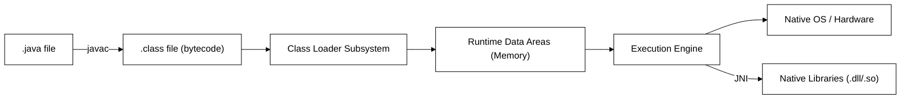
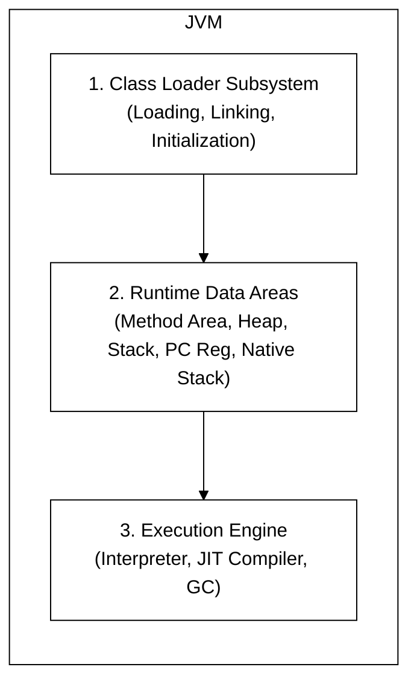
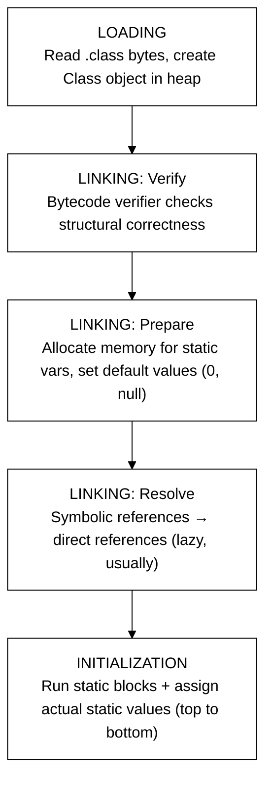
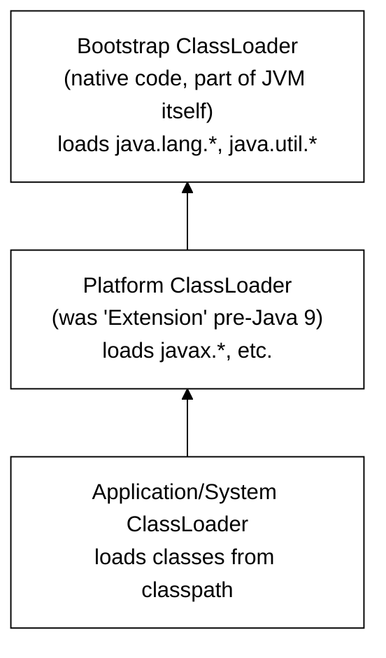
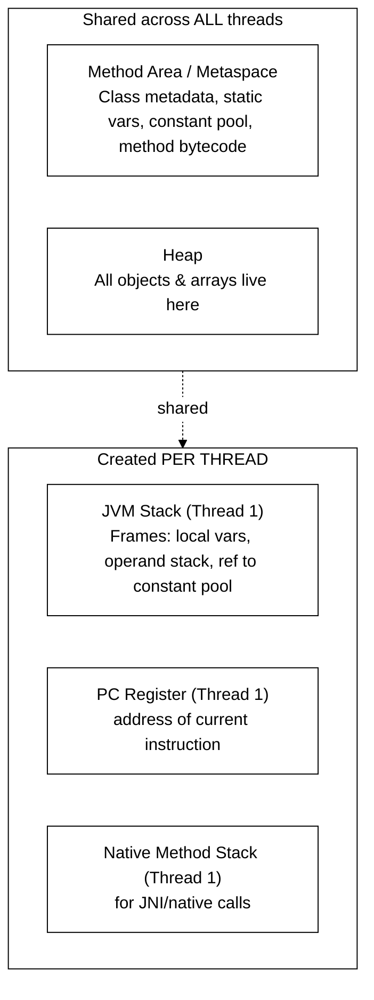
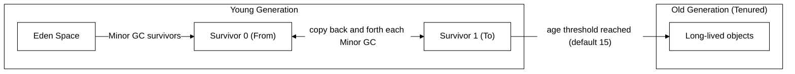
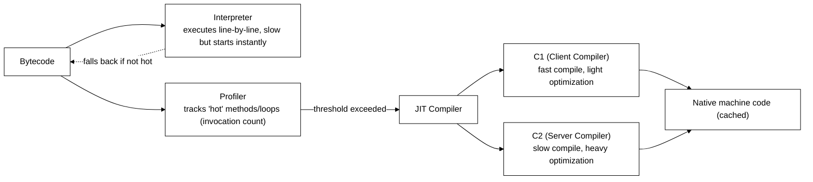
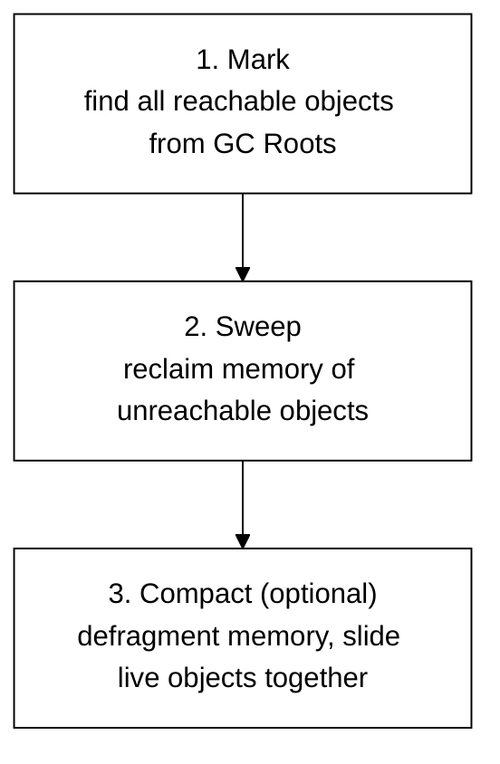
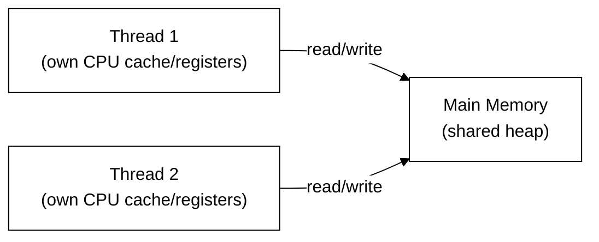
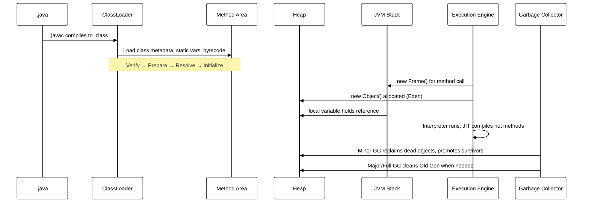

# JVM Internals — Interview Cracking Guide

A structured, diagram-backed walkthrough of everything interviewers usually probe on JVM internals. Read top to bottom once, then use the "Likely Interview Questions" boxes as flash-drills.

---

## 1. The Big Picture — How Java Code Runs

**Key idea to say out loud in an interview:** JVM is a *specification*. HotSpot, OpenJ9, GraalVM are *implementations*. Almost everything below describes HotSpot behavior, since that's what 90% of interviewers mean by "JVM."

---

## 2. JVM Architecture — Three Main Subsystems

**One-line answer if asked "Explain JVM architecture":**
> "JVM has three parts — the Class Loader Subsystem which loads and prepares `.class` files, the Runtime Data Areas which is where all memory lives, and the Execution Engine which actually runs the bytecode, using an interpreter, JIT compiler, and garbage collector."

---

## 3. Class Loading Subsystem

Three phases: **Loading → Linking → Initialization**. Linking itself has 3 sub-steps.

**Gotcha interviewers love:** *"What's the difference between Prepare and Initialize?"*
- Prepare: `static int x = 5;` → `x` becomes `0` (default value), memory allocated.
- Initialize: `x` actually becomes `5` — static initializer blocks and static assignments run in source order.

### 3a. Classloader Hierarchy (Delegation Model)

**Parent Delegation Model:** A class loader asks its **parent first** before trying to load a class itself. This:
1. Prevents core classes (`java.lang.String`) from being overridden/spoofed.
2. Ensures the same class isn't loaded twice by different loaders.

**Likely Interview Questions:**
- *"Why can't I write my own `java.lang.String` class and have it load?"* → Bootstrap loader owns `java.lang.*`; parent delegation means your custom `String` never gets a chance to load — this is the **sandboxing/security** benefit of delegation.
- *"How would you break parent delegation?"* → Override `loadClass()` (not just `findClass()`) in a custom ClassLoader — this is literally how app servers like Tomcat isolate webapps from each other.
- *"When is a class loaded — at compile time or runtime?"* → Runtime, and lazily (only when first actively used: instantiation, static access, reflection, etc. — not on mere reference).

---

## 4. Runtime Data Areas (This is THE most-asked topic)

| Area | Thread-shared? | Stores | Overflow error |
|---|---|---|---|
| Method Area (Metaspace) | Yes | Class structure, method bytecode, runtime constant pool, static variables | `OutOfMemoryError: Metaspace` |
| Heap | Yes | All objects, instance variables, arrays | `OutOfMemoryError: Java heap space` |
| JVM Stack | No (per thread) | Stack frames = local vars + operand stack + frame data, one frame per method call | `StackOverflowError` |
| PC Register | No (per thread) | Address of currently executing JVM instruction | — |
| Native Method Stack | No (per thread) | State for native (non-Java) method calls | `StackOverflowError` (impl-dependent) |

**Critical clarification interviewers test:** *"Metaspace vs PermGen?"*
- Pre-Java 8: **PermGen** was part of the heap (fixed max size via `-XX:MaxPermSize`), frequent cause of `OutOfMemoryError: PermGen space`.
- Java 8+: **Metaspace** replaced it, lives in **native (off-heap) memory**, grows dynamically by default (bounded by `-XX:MaxMetaspaceSize` if you set it).

**Likely Interview Questions:**
- *"Where do static variables live?"* → Method Area / Metaspace (the actual object a static reference points to, if it's an object, lives on the Heap; the reference/slot lives in Method Area).
- *"Where do local variables live?"* → JVM Stack (primitives + object references), the actual objects are on the Heap.
- *"Why does infinite recursion cause StackOverflowError but not OutOfMemoryError?"* → Each recursive call pushes a new frame onto the fixed-size-per-thread Stack, not the Heap.

### 4a. Heap Internals — Generational Layout

- New objects → **Eden**.
- **Minor GC** runs when Eden fills → live objects copied to a Survivor space; dead objects reclaimed instantly (this is why Minor GC is fast).
- Objects that survive several Minor GCs (age counter, default tenuring threshold ~15) get **promoted** to Old Gen.
- **Major/Full GC** cleans the Old Generation — much more expensive, causes longer pauses.

**Likely Interview Question:** *"Why generational GC instead of scanning the whole heap every time?"*
> Based on the **weak generational hypothesis**: most objects die young. Scanning only Eden most of the time is far cheaper than scanning the entire heap.

---

## 5. Execution Engine — Interpreter + JIT

**Tiered Compilation (default since Java 8):** Method starts interpreted → gets compiled by C1 (with light profiling) → if it's *really* hot, gets recompiled by C2 with aggressive optimizations (inlining, loop unrolling, escape analysis, dead code elimination).

**"Why is JVM code sometimes faster than natively-compiled C after warm-up?"**
> JIT does **runtime profile-guided optimization** — decisions based on actual observed behavior (e.g., which branch is usually taken, which implementation of an interface is actually used) that a static compiler can't know in advance. This is also why **benchmarks need warm-up iterations** (JMH does this) — measuring cold-start bytecode-interpreted performance is misleading.

**Related concept: Escape Analysis** — if the JIT proves an object never "escapes" a method (no reference leaves), it can:
- Allocate on the stack instead of heap (scalar replacement), or
- Eliminate the allocation (dead object) entirely, or
- Skip synchronization on it (lock elision) — since no other thread can ever see it.

---

## 6. Garbage Collection — Algorithms Comparison

**GC Roots** (where reachability analysis starts): local variables on active thread stacks, active JNI references, static variables in loaded classes.

| Collector | Approach | Pause Behavior | Use Case |
|---|---|---|---|
| Serial | Single-threaded, stop-the-world | Long pauses | Small heaps, single-core, client apps |
| Parallel (Throughput) | Multi-threaded STW | Long but higher throughput | Batch jobs, throughput > latency |
| CMS (deprecated, removed Java 14) | Mostly-concurrent mark/sweep, no compaction | Shorter pauses, fragmentation risk | Old low-latency choice |
| **G1 (default since Java 9)** | Region-based, concurrent + incremental, compacts | Predictable pause-time target | General purpose default |
| ZGC / Shenandoah | Fully concurrent, region-based, colored pointers | Sub-millisecond pauses even on huge heaps | Very large heaps, ultra-low latency |

**G1 in more depth (very commonly asked):**
- Heap is split into many equal-sized **regions** (not fixed Eden/Survivor/Old blocks).
- Regions are dynamically labeled Eden, Survivor, or Old.
- G1 tracks "liveness" per region and always collects the regions with the **most garbage first** ("Garbage First" — hence the name) to give the most reclaimed memory per unit of pause time.
- You set a *pause time goal* (`-XX:MaxGCPauseMillis=200`) and G1 tries to honor it, rather than you tuning generation sizes directly.

**Likely Interview Questions:**
- *"Difference between Minor GC, Major GC, and Full GC?"*
  - Minor GC: cleans Young Gen only.
  - Major GC: cleans Old Gen.
  - Full GC: cleans **entire heap** (Young + Old + Metaspace), most expensive, "stop-the-world" for longest.
- *"How does GC decide an object is garbage?"* → Reachability from GC Roots, not reference counting (avoids the cyclic-reference problem reference counting has, e.g. two objects pointing at each other but unreachable from roots).
- *"Can you force GC?"* → `System.gc()` is only a *hint/request* to the JVM; it's free to ignore it.

---

## 7. Java Memory Model (JMM) — Concurrency Angle

This is where "JVM internals" interviews often merge into "concurrency" interviews.

**The core problem:** each thread may cache variables locally (CPU cache/registers) for performance — so Thread 2 might not immediately see a write Thread 1 made. JMM defines rules for **when writes become visible to other threads**.

- **`volatile`**: guarantees visibility (every read goes to main memory, every write flushes to main memory) + prevents instruction reordering around it (establishes a happens-before edge). Does **NOT** guarantee atomicity of compound operations (e.g., `count++` is still not thread-safe even if `count` is volatile).
- **`synchronized`**: guarantees visibility **and** atomicity **and** mutual exclusion, via acquiring/releasing a monitor lock. Establishes happens-before between unlock and subsequent lock on the same monitor.
- **`happens-before`**: the formal ordering guarantee JMM provides — e.g., program order within a thread, a monitor unlock happens-before a subsequent lock on it, a volatile write happens-before a subsequent volatile read of the same variable, thread start happens-before anything in the started thread.

**Likely Interview Question:** *"Is `volatile` enough to make a counter thread-safe?"*
> No — `volatile` gives visibility, not atomicity. `i++` is read-modify-write (3 separate operations at the bytecode level); two threads can interleave and lose an update. You'd need `AtomicInteger` or `synchronized`.

---

## 8. Putting It Together — Object Lifecycle End-to-End

---

## 9. Rapid-Fire Interview Question Bank

**Fundamentals**
1. What's the difference between JDK, JRE, and JVM?
   → JDK = JRE + dev tools (javac, debugger). JRE = JVM + core libraries. JVM = the engine that executes bytecode.
2. Is Java "pass by value" or "pass by reference"?
   → Always pass by value — for objects, the *value of the reference* (pointer) is copied, not the object itself.
3. What is bytecode verification and why does it matter?
   → Ensures loaded `.class` files don't violate JVM safety rules (no illegal type casts, no stack over/underflow, no jumping into private code) — security boundary against malicious/corrupt class files.

**Memory**
4. Stack vs Heap — what goes where?
5. What causes a memory leak in Java if there's a GC?
   → Objects that are *still reachable* (e.g., stuck in a static collection, unclosed listeners, ThreadLocal not removed) but logically no longer needed. GC can't collect what's still reachable.
6. What's the difference between strong, soft, weak, and phantom references?
   → Strong: never GC'd while reachable. Soft: GC'd only under memory pressure (good for caches). Weak: GC'd at next GC cycle regardless of pressure (e.g., `WeakHashMap`). Phantom: object already finalized, reference queue used for cleanup actions, `get()` always returns null.

**GC**
7. What is "stop-the-world" and why is it necessary at all?
   → All application threads pause so the collector can safely determine reachability/move objects without the graph changing underneath it. Concurrent collectors (G1, ZGC) minimize but don't fully eliminate this.
8. How would you diagnose a GC-pause problem in production?
   → GC logs (`-Xlog:gc*`), tools like GCViewer/GCEasy, check for frequent Full GCs (heap sizing issue), check object promotion rate (Young Gen sizing issue).

**JIT / Performance**
9. Why might the *first* few thousand calls to a method be slow, then suddenly fast?
   → Interpreted initially, then JIT-compiled to native code once invocation count crosses a threshold.
10. What is inlining and why does the JIT do it?
    → Replacing a method call with the method's body directly, avoiding call overhead and enabling further optimizations (dead code elimination across the inlined boundary).

**Classloading**
11. Can two different classloaders load "the same" class and have two incompatible instances?
    → Yes — this is the classic `ClassCastException: X cannot be cast to X` bug, caused by the same class being loaded by two different loaders (common in app servers/plugin systems). JVM identity of a class = (fully qualified name + defining classloader).

---

## 10. Extended Question Bank — Every Angle They Might Ask

Organized by category so you can drill weak spots. Short, interview-ready answers.

### A. JVM Basics & Architecture
1. **What is JVM, JRE, JDK — draw the containment relationship.**
   → JDK ⊃ JRE ⊃ JVM. JDK = JRE + compiler (`javac`) + dev tools. JRE = JVM + standard class libraries. JVM = the actual bytecode execution engine.
2. **Is JVM platform-independent?**
   → The *bytecode* is platform-independent; the JVM *implementation* itself is platform-specific (compiled native code per OS/architecture). "Write once, run anywhere" refers to bytecode portability.
3. **What is the difference between JIT and JVM?**
   → JIT is one component *inside* the JVM's Execution Engine, not a separate thing.
4. **Name some JVM implementations besides HotSpot.**
   → OpenJ9 (Eclipse/IBM), GraalVM, Zing (Azul), Dalvik/ART (Android — not a standard JVM, no bytecode verifier the same way).
5. **What is a `.class` file made of?**
   → Magic number (`0xCAFEBABE`), version info, constant pool, access flags, this/super class, interfaces, fields, methods, attributes.
6. **What is the constant pool?**
   → A per-class table of literals, class/method/field references resolved symbolically; acts like a symbol table bytecode instructions index into instead of embedding raw addresses.

### B. Class Loading
7. **What are the types of classloaders in Java?**
   → Bootstrap, Platform (Extension pre-Java 9), Application/System, plus any custom ones you write.
8. **What is Parent Delegation and why does it exist?**
   → Child asks parent to load first; prevents duplicate/spoofed core classes, provides namespace isolation. (See Section 3a.)
9. **How do you write a custom classloader, and when would you need one?**
   → Extend `ClassLoader`, override `findClass()` (and `loadClass()` if breaking delegation). Used for: hot-reloading, loading classes from DB/network, plugin isolation (OSGi, app servers).
10. **What's the difference between `Class.forName()` and `ClassLoader.loadClass()`?**
    → `Class.forName(name, initialize, loader)` can trigger static initialization immediately; `loadClass()` only loads (linking/init deferred until actual use), and by default doesn't initialize.
11. **Difference between linking and initialization?**
    → Linking = verify + prepare + resolve (structural setup, default values). Initialization = actually run static initializers with real values, once, in a thread-safe manner.
12. **Is class loading lazy or eager?**
    → Lazy by default — a class loads only on first active use (instantiation, static field/method access, reflection). `Class.forName` with `initialize=true` forces it.
13. **What is `NoClassDefFoundError` vs `ClassNotFoundException`?**
    → `ClassNotFoundException` (checked): thrown when `Class.forName`/`loadClass` can't find a class at runtime. `NoClassDefFoundError` (unchecked, `Error`): class *was* present at compile time but is missing/failed to initialize at runtime (e.g., static init threw an exception the first time, so JVM marks the class permanently unusable).

### C. Memory Areas
14. **List all runtime data areas and mark which are per-thread.**
    → Per-thread: JVM Stack, PC Register, Native Method Stack. Shared: Heap, Method Area/Metaspace. (See Section 4 table.)
15. **Where does the String Pool (String intern pool) live?**
    → Since Java 7, moved from PermGen into the main Heap (so it's GC-able and doesn't cause PermGen OOM as easily).
16. **What does `String s = "abc"` vs `String s = new String("abc")` do differently in memory?**
    → Literal → placed/reused from the String pool (interned). `new String(...)` → always creates a new object on the heap, separate from the pool, even if the content matches.
17. **What is `intern()`?**
    → Forces a String into (or returns the existing reference from) the String pool.
18. **What's the default and max heap size determined by?**
    → JVM heuristics based on available physical memory (roughly 1/4 of RAM for max, 1/64 for initial, historically) unless overridden via `-Xms`/`-Xmx`.
19. **What are `-Xms`, `-Xmx`, `-Xss`, `-XX:MetaspaceSize` for?**
    → `-Xms` initial heap, `-Xmx` max heap, `-Xss` per-thread stack size, `-XX:MetaspaceSize`/`-XX:MaxMetaspaceSize` metaspace initial/max.
20. **Why did PermGen get removed?**
    → Fixed-size, frequent `OutOfMemoryError: PermGen space` in apps with heavy class loading (app servers, frameworks generating classes dynamically); Metaspace uses native memory and grows dynamically.
21. **What causes `OutOfMemoryError: GC overhead limit exceeded`?**
    → JVM detects it's spending >98% of time doing GC while recovering <2% of heap — a strong signal of near-total memory exhaustion, so it fails fast instead of thrashing forever.

### D. Garbage Collection
22. **What are GC Roots? Give examples.**
    → Starting points for reachability analysis: local variables/parameters on live thread stacks, active JNI references, static fields of loaded classes, monitor objects currently locked.
23. **Mark-and-Sweep vs Mark-Sweep-Compact — what's the trade-off?**
    → Compaction removes fragmentation (helps future allocation speed, enables simple pointer-bump allocation) but costs more CPU time per GC cycle.
24. **What is a "stop-the-world" pause?**
    → All application threads are frozen while GC (or part of it) runs, so the object graph can't change mid-analysis.
25. **Explain G1GC in your own words (be ready for a 60-second version).**
    → Heap split into fixed-size regions; each region tagged Eden/Survivor/Old dynamically; G1 tracks garbage-per-region and collects the *most garbage first* within a target pause-time budget; performs incremental compaction to avoid fragmentation. (See Section 6.)
26. **What is ZGC / Shenandoah's key trick for sub-millisecond pauses?**
    → Colored pointers / load barriers that let the collector relocate objects *concurrently* with the app running, doing the bookkeeping in the pointer bits themselves instead of stopping the world to fix references.
27. **What is a memory leak in a garbage-collected language, and give 3 real causes.**
    → Unintentionally-retained reachable objects. Causes: static collections that keep growing, unclosed resources/listeners not deregistered, `ThreadLocal` values never removed in pooled-thread environments.
28. **Difference between `finalize()` and try-with-resources / `AutoCloseable`?**
    → `finalize()` (deprecated since Java 9, removed in later versions) is unreliable — no guaranteed timing, can even resurrect objects, runs on a GC-managed thread. `AutoCloseable`/try-with-resources gives deterministic, immediate cleanup — always prefer it.
29. **What's the difference between throughput, latency, and footprint as GC tuning goals — can you optimize all three at once?**
    → Throughput = % time not spent in GC. Latency = pause length. Footprint = memory used. They trade off against each other; you pick a collector/config based on which two matter most for your workload.
30. **How do Soft/Weak/Phantom references interact with GC generations?**
    → They're collected according to their strength regardless of generation — e.g., a Weak reference in Old Gen is still cleared at the next GC cycle that visits it, unlike a strong reference which survives as long as reachable.

### E. Execution Engine / JIT
31. **What triggers JIT compilation — is it based on time or invocation count?**
    → Invocation/branch-back count exceeding a threshold (`-XX:CompileThreshold`, tiered by default), not wall-clock time.
32. **What is Tiered Compilation (C1 vs C2)?**
    → C1: quick compile, light profiling/optimization, good for short-lived apps or moderately-hot code. C2: slower to compile, aggressive optimization (inlining, loop transforms), used for very hot code. Default HotSpot config uses both, escalating a method through tiers.
33. **What is de-optimization ("bailing out")?**
    → JIT-compiled code can be invalidated and the JVM falls back to the interpreter if an assumption it optimized for turns out false at runtime (e.g., a class thought to have only one implementor gets a second one loaded — "monomorphic to polymorphic" break).
34. **What is Escape Analysis and what 3 optimizations does it enable?**
    → Determines if an object's reference "escapes" its allocating method/thread. Enables: (1) stack allocation instead of heap, (2) scalar replacement (splitting an object into its fields, no allocation at all), (3) lock elision (skip synchronization if no other thread can see the object).
35. **What is Loop Unrolling / Loop Invariant Code Motion?**
    → JIT optimizations: unrolling reduces loop-condition-check overhead by duplicating the loop body; invariant code motion hoists computations that don't change per-iteration outside the loop.
36. **Why do JMH benchmarks require warm-up iterations?**
    → To let the JIT actually compile hot paths before measuring — otherwise you're measuring slow interpreted bytecode, not steady-state performance.
37. **What is method inlining, and what limits how aggressively JIT can inline?**
    → Replacing a call site with the callee's body. Limited by method size (`-XX:MaxInlineSize`), call-site "hotness," and whether the call is monomorphic (single implementation) — virtual calls with many possible targets are harder to inline safely.

### F. Java Memory Model & Concurrency
38. **What problem does the JMM solve?**
    → Defines what visibility/ordering guarantees exist for shared variables across threads, since compilers/CPUs/caches can reorder or delay writes for performance.
39. **What is "happens-before" — give 3 concrete happens-before relationships.**
    → Program order within a thread; a `synchronized` unlock happens-before a subsequent lock on the same monitor; a `volatile` write happens-before a subsequent read of that variable; `Thread.start()` happens-before any action in the started thread; a thread terminating happens-before another thread's `Thread.join()` returning.
40. **Does `volatile` prevent race conditions on compound operations like `i++`?**
    → No — visibility only, not atomicity. Use `AtomicInteger`/`synchronized` for compound read-modify-write.
41. **What's the difference between `synchronized` method and `synchronized` block?**
    → Method-level locks on `this` (instance methods) or the `Class` object (static methods); block-level lets you lock on a specific, often smaller-scoped, object — reduces contention.
42. **What is a monitor, and what are the two things it guarantees?**
    → Intrinsic lock associated with every Java object; guarantees mutual exclusion (only one thread executes the critical section) and visibility (happens-before edge on unlock/lock).
43. **Reentrant locking — what does it mean and does `synchronized` support it?**
    → A thread already holding a lock can re-acquire it without deadlocking itself (e.g., recursive synchronized calls). Yes, both `synchronized` and `ReentrantLock` support it.
44. **What's biased locking / lock coarsening / lock elision (JVM lock optimizations)?**
    → Biased locking (removed in newer JDKs): optimistically assumes a lock is used by only one thread, cheap re-entry. Lock coarsening: merges adjacent synchronized blocks to reduce overhead. Lock elision: JIT removes locking entirely if escape analysis proves no other thread can see the object.
45. **What's false sharing, and how does it relate to JVM/CPU cache lines?**
    → Two unrelated variables happen to sit on the same CPU cache line; concurrent writes by different threads to each variable cause unnecessary cache invalidation traffic even though there's no logical data race — mitigated with padding (`@Contended` in JDK internals).

### G. Object Model / Language-Level JVM Behavior
46. **What is object header overhead in HotSpot?**
    → Every object has a header (mark word for hashcode/GC-age/lock state, plus a class pointer), typically 12–16 bytes before any actual fields — relevant for memory-footprint questions.
47. **What is Compressed Oops?**
    → On 64-bit JVMs with heaps under ~32GB, object references are stored as 32-bit offsets instead of full 64-bit pointers, saving significant memory — enabled by default (`-XX:+UseCompressedOops`).
48. **Why is `==` different from `.equals()` for objects, and how does the JVM implement each?**
    → `==` compares reference values (memory addresses, conceptually) directly at the bytecode level (`if_acmpeq`); `.equals()` is a regular virtual method call, default behavior (from `Object`) also does reference comparison unless overridden.
49. **How does autoboxing interact with the JVM/GC (e.g., `Integer` caching)?**
    → `Integer.valueOf()` caches boxed values from -128 to 127 by default (`IntegerCache`) — reused objects, not new heap allocations, which is why `==` can misleadingly "work" for small ints but fail for larger ones.
50. **What is the `invokedynamic` bytecode instruction, and what modern feature depends on it?**
    → Added in Java 7 to support dynamically-typed languages and later reused for **lambda expressions/method references** — the actual implementation strategy is decided and linked at first call, not hardcoded at compile time, avoiding a static anonymous-class-per-lambda approach.

### H. Tooling / Diagnostics (frequently asked in "practical experience" rounds)
51. **How do you take and read a heap dump?**
    → `jmap -dump:live,format=b,file=heap.hprof <pid>` (or `-XX:+HeapDumpOnOutOfMemoryError`), analyze with Eclipse MAT / VisualVM — look at dominator tree / retained size to find leak suspects.
52. **How do you take a thread dump and what do you look for?**
    → `jstack <pid>` (or `kill -3 <pid>`); look for threads `BLOCKED` on the same lock (contention), or in `WAITING`/deadlock cycles.
53. **What JVM flags would you use to log GC activity?**
    → Java 9+: `-Xlog:gc*:file=gc.log:time,uptime,level,tags`. Pre-9: `-XX:+PrintGCDetails -XX:+PrintGCDateStamps`.
54. **What's the difference between `jconsole`, `jvisualvm`, and `async-profiler`/JFR?**
    → jconsole/VisualVM: live JMX-based monitoring, lower overhead but coarser. JFR (Java Flight Recorder) + async-profiler: low-overhead continuous/sampling profiling suitable for production, gives flame graphs, allocation profiling, lock contention detail.
55. **How would you troubleshoot high CPU usage in a running JVM?**
    → `top -H` to find the hot native thread ID, convert to hex, grep for it in a `jstack` thread dump to see what that specific thread is doing.

### I. Tricky Conceptual / "Gotcha" Questions
56. **Can the JVM run without a garbage collector?**
    → Conceptually yes (Epsilon GC — a no-op collector added in Java 11) — used for ultra-short-lived processes or to isolate whether GC is the source of a performance issue.
57. **Does `System.gc()` guarantee garbage collection runs?**
    → No — it's a *request*; the JVM can ignore it (and often `-XX:+DisableExplicitGC` is used in production to prevent misuse).
58. **Is Java "pure" pass-by-value or pass-by-reference — trick question?**
    → Always pass-by-value. For object arguments, the *reference itself* is copied by value — you can mutate the object it points to, but reassigning the parameter inside the method doesn't affect the caller's reference.
59. **Why can a `final` reference variable still have its object's internal state changed?**
    → `final` fixes the *reference*, not the referenced object's mutability — `final List<String> l = new ArrayList<>(); l.add("x");` is legal; `l = new ArrayList<>();` is not.
60. **Why is `String` immutable, and how does the JVM benefit from it?**
    → Safe sharing in the String pool (interning), thread-safety without synchronization, safe use as a `HashMap` key (hashcode can be cached once), security (e.g., class names/file paths passed as Strings can't be mutated after a security check).

---

## 11. How to Use This Before an Interview

- Redraw the **Runtime Data Areas** diagram (Section 4) from memory — this is asked in almost every JVM interview.
- Be able to say the **class loading phases** (Loading → Verify → Prepare → Resolve → Initialize) without hesitating.
- Practice explaining **G1 GC's region-based approach** in under 30 seconds — it's the current default and a favorite deep-dive topic.
- Know one crisp example each for `volatile` vs `synchronized` — interviewers often want a real code snippet, not just theory.

Good luck — you've got the map now.
