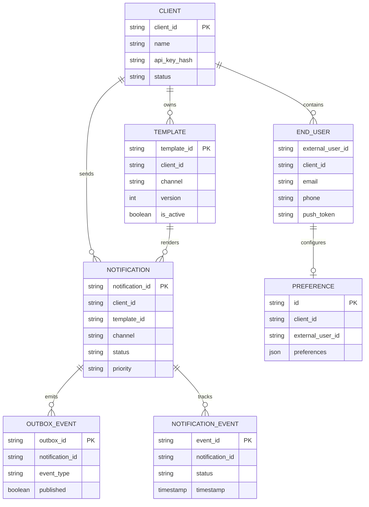
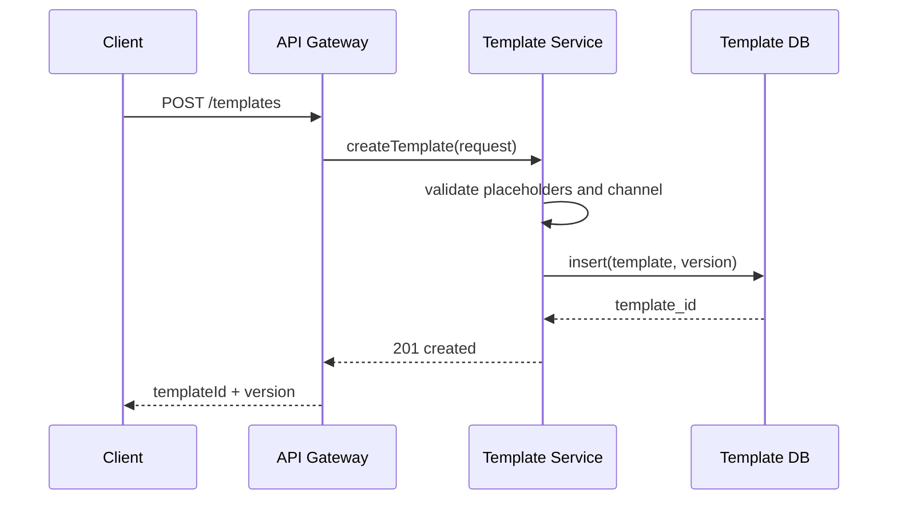
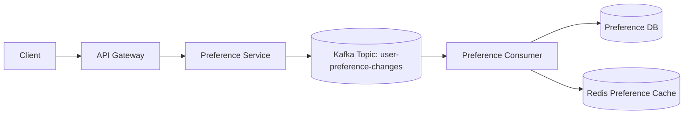
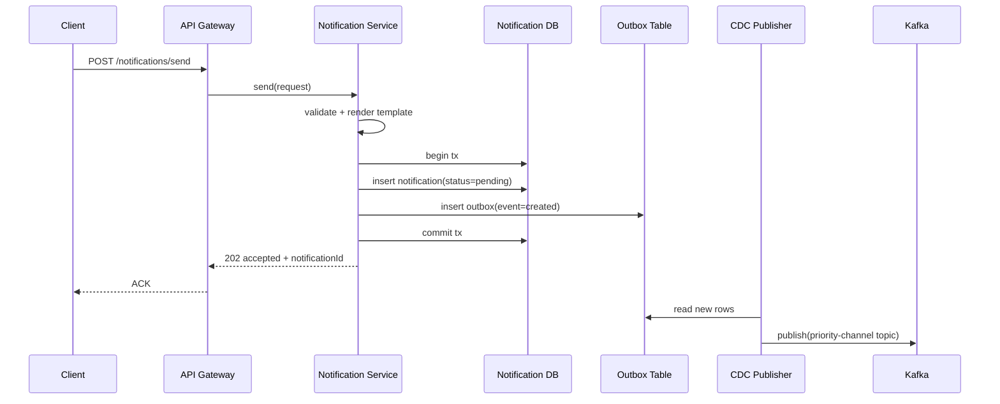
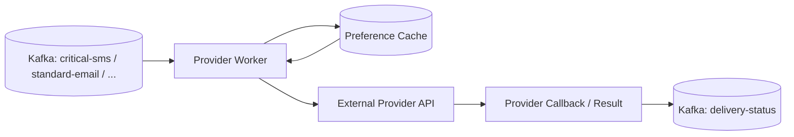
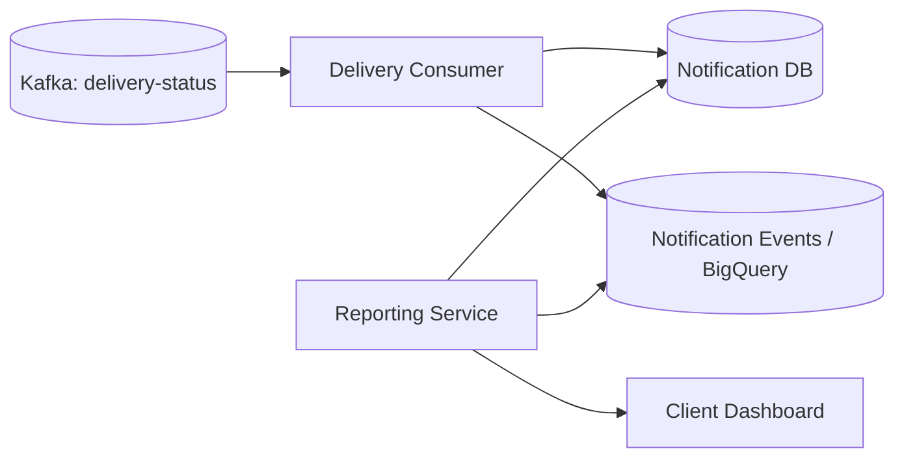
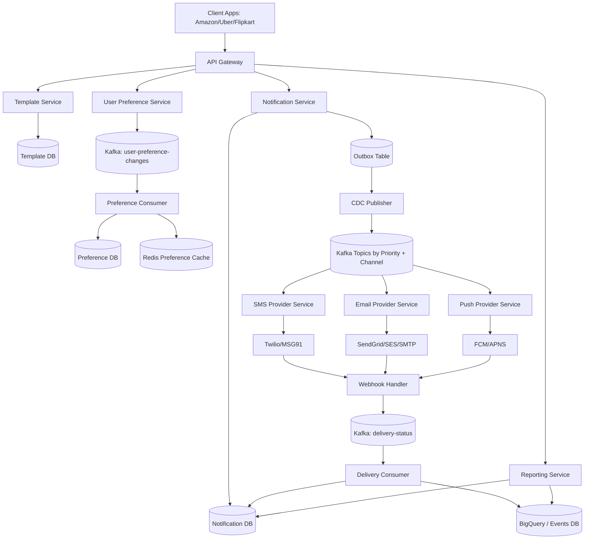
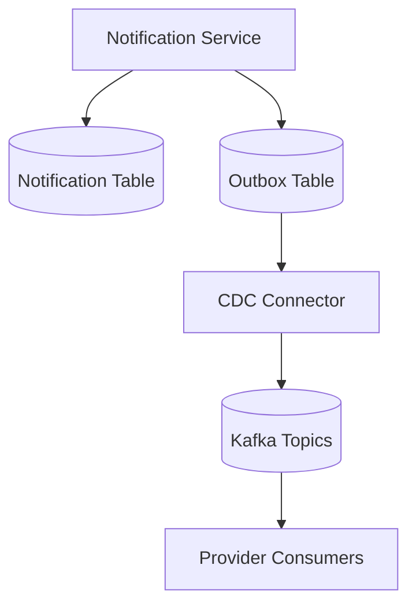

# Notification Service - System Design Interview Notes

## 1) Problem Statement
A Notification Service allows multiple client applications to send messages to their end-users across channels such as Email, SMS/OTP, and Push notifications.

Typical use cases:
- Critical transactional messages (OTP, payment alerts, login alerts)
- Standard product events (order shipped, booking confirmed)
- Promotional campaigns (offers, recommendations, reminders)

The system must support:
- Multi-channel delivery with channel-specific providers
- Real-time delivery for critical notifications
- Scheduled and bulk delivery for non-critical campaigns
- Template-driven personalization
- User-controlled channel preferences
- Full delivery-status visibility for client dashboards

---

## 2) Requirements (Sequential)

## 2.1 Functional Requirements
| Requirement | Description |
|---|---|
| Multi-channel support | Send notifications over Email, SMS, and Push |
| Notification types | Support real-time and scheduled notifications |
| Template system | Create reusable templates with variable placeholders |
| Delivery status dashboard | Expose pending/sent/delivered/failed states |
| User preferences | Allow end-users to opt in/out by channel |
| Webhook ingestion | Process provider callbacks for final delivery states |

## 2.2 Non-Functional Requirements
| Requirement | Specification |
|---|---|
| Scale | Up to 1M requests per minute from multiple clients |
| Availability | High availability is prioritized over strict consistency |
| CAP choice | AP-oriented behavior for preference/template propagation |
| Latency - critical | Near real-time for OTP and high-priority alerts |
| Latency - standard/promo | 5-10 seconds acceptable for non-critical traffic |
| Durability | No message loss after ACK to clients |
| Observability | End-to-end tracing, metrics, and auditable status history |

## 2.3 Capacity Assumptions
1. Incoming API traffic: `1,000,000 requests/min` (`~16,667 RPS`)
2. Peak fan-out (multi-channel): up to `2-3 channel sends` per request
3. Provider calls at peak can exceed `30,000-50,000 ops/sec`
4. Event stream throughput must support retries + delivery callbacks
5. Storage should preserve message records and event history for audit windows

Quick estimate:
- If average payload metadata is `~1.5 KB`, then ingest is `~1.5 GB/min` at peak.
- With status events and retries, analytics/event storage is multiple times main write volume.

---

## 3) Entity Design (Data Model)

## 3.1 Client
Represents a third-party app or business account using this platform.

| Field | Type | Description |
|---|---|---|
| `client_id` | string | Unique identifier for each client application |
| `name` | string | Client name (for dashboard/reporting) |
| `api_key_hash` | string | Credentials for authenticated API access |
| `status` | enum | Active/suspended lifecycle state |
| `created_at` | timestamp | Registration time |

## 3.2 EndUser
Represents the actual recipient belonging to a client.

| Field | Type | Description |
|---|---|---|
| `external_user_id` | string | User ID in client domain |
| `client_id` | string | Parent client |
| `email` | string | Optional recipient email |
| `phone` | string | Optional recipient phone |
| `push_token` | string | Optional device token |
| `created_at` | timestamp | First-seen time |

## 3.3 NotificationTemplate
Reusable content model with channel + version controls.

| Field | Type | Description |
|---|---|---|
| `template_id` | string | Unique template ID |
| `client_id` | string | Owner client |
| `name` | string | Human-readable template name |
| `type` | enum | `transactional` or `promotional` |
| `channel` | enum | `email`, `sms`, `push` |
| `content` | text | Message body with variables (`{{name}}`) |
| `variables` | json/array | Required variable list |
| `version` | integer | Template version |
| `is_active` | boolean | Active template flag |
| `created_at` | timestamp | Creation time |
| `updated_at` | timestamp | Last update time |

## 3.4 NotificationPreference
User-level channel controls.

| Field | Type | Description |
|---|---|---|
| `id` | string | Preference row ID |
| `client_id` | string | Owner client |
| `external_user_id` | string | End-user identifier |
| `preferences` | json | Example: `{"email": true, "sms": false, "push": true}` |
| `updated_at` | timestamp | Last preference update |

## 3.5 Notification
Primary send request record.

| Field | Type | Description |
|---|---|---|
| `notification_id` | string | Primary ID |
| `client_id` | string | Requesting client |
| `external_user_id` | string | Recipient user |
| `template_id` | string | Template reference |
| `channel` | enum | Target channel |
| `payload` | json | Resolved message content |
| `status` | enum | `pending`, `sent`, `delivered`, `failed`, `bounced` |
| `priority` | enum | `low`, `medium`, `high` |
| `scheduled_at` | timestamp | Optional delayed send time |
| `created_at` | timestamp | Creation time |
| `updated_at` | timestamp | Last status update |

## 3.6 OutboxEvent
Durable event table for CDC publishing.

| Field | Type | Description |
|---|---|---|
| `outbox_id` | string | Primary ID |
| `notification_id` | string | Related notification |
| `event_type` | enum | `created`, `sent`, `delivered`, `failed` |
| `payload` | json | Event data to be published |
| `published` | boolean | CDC publication marker |
| `created_at` | timestamp | Event creation time |

## 3.7 NotificationEvent (Analytics/History)
Event-level immutable timeline for reporting and audits.

| Field | Type | Description |
|---|---|---|
| `event_id` | string | Event ID |
| `notification_id` | string | Related notification |
| `status` | enum | Event status at that time |
| `timestamp` | timestamp | Event time |
| `metadata` | json | Provider response, errors, codes |



---

## 4) API Design

## 4.1 Create Template
`POST /templates`

Request:
```json
{
  "clientId": "amazon",
  "name": "otp_sms_v1",
  "type": "transactional",
  "channel": "sms",
  "content": "Your OTP is {{otp}}. Valid for {{ttlMinutes}} minutes.",
  "variables": ["otp", "ttlMinutes"],
  "version": 1,
  "isActive": true
}
```

Response:
```json
{
  "templateId": "tpl_9a12",
  "version": 1,
  "status": "created"
}
```

## 4.2 Get Template
`GET /templates/{templateId}?version=2`

Response:
```json
{
  "templateId": "tpl_9a12",
  "name": "otp_sms_v2",
  "type": "transactional",
  "channel": "sms",
  "content": "Your OTP is {{otp}}.",
  "variables": ["otp"],
  "version": 2,
  "isActive": true
}
```

## 4.3 Send Notification
`POST /notifications/send`

Request:
```json
{
  "clientId": "uber",
  "templateId": "tpl_9a12",
  "recipientId": "user_123",
  "variables": {
    "otp": "483920",
    "ttlMinutes": 2
  },
  "channel": "sms",
  "priority": "high",
  "schedule": null
}
```

Response:
```json
{
  "notificationId": "ntf_781ab",
  "status": "accepted",
  "ackAt": "2026-04-11T10:22:10Z"
}
```

## 4.4 Get Notification Status
`GET /notifications/{notificationId}/status`

Response:
```json
{
  "notificationId": "ntf_781ab",
  "status": "delivered",
  "channel": "sms",
  "provider": "twilio",
  "updatedAt": "2026-04-11T10:22:11Z"
}
```

## 4.5 Update User Preferences
`PUT /users/{userId}/preferences`

Request:
```json
{
  "clientId": "flipkart",
  "email": true,
  "sms": false,
  "push": true
}
```

Response:
```json
{
  "userId": "user_123",
  "status": "updated"
}
```

## 4.6 Provider Callback (Webhook)
`POST /providers/callbacks/{provider}`

Purpose:
- Receive final delivery states (`delivered`, `failed`, `bounced`, `opened`, `clicked`)
- Update Notification + NotificationEvent stores

Common error codes:
1. `400` invalid payload or template variables
2. `401/403` auth failure
3. `404` unknown template/notification/user
4. `429` rate limit exceeded
5. `503` provider unavailable (request accepted + retry policy applies)

---

## 5) High-Level Design (Mapped to Functional Requirements)

## 5.1 Template Management Flow
1. Client creates/updates template.
2. Template Service validates schema and variables.
3. Template is versioned and stored in Template DB.
4. Active version is served during send flow.



## 5.2 User Preference Update Flow
1. Client updates user preference.
2. Preference Service validates and emits change event.
3. Consumer writes to Preference DB.
4. Cache invalidation/update propagates to provider workers.



## 5.3 Send Notification Flow (Durable Path)
1. Notification request reaches Notification Service.
2. Service resolves template + renders payload.
3. In one DB transaction, write Notification row + Outbox row.
4. ACK is sent to client after durable write.
5. CDC publishes Outbox records to Kafka topics.



## 5.4 Provider Delivery Flow
1. Channel-specific consumer reads Kafka topic.
2. Consumer checks preference cache.
3. If opted in, call external provider.
4. Publish status update to `delivery-status` topic.



## 5.5 Delivery Status and Reporting Flow
1. Delivery consumer updates final status in Notification DB.
2. Event timeline is appended to analytics store (BigQuery/events table).
3. Reporting Service joins both stores for dashboard APIs.



---

## 6) Core Component Diagram



---

## 7) Deep Dive

## 7.1 Template Service Design
Template DB schema highlights:
1. `template_id`, `client_id`, `name`
2. `type` (`promotional`/`transactional`)
3. `channel` (`email`/`sms`/`push`)
4. `content` with placeholders (`{{orderId}}`)
5. `variables` list for runtime validation
6. `version`, `is_active`, timestamps

Design choices:
1. Use immutable versions for auditability.
2. Keep one active version per `(client_id, name, channel)`.
3. Validate variable completeness before enqueueing notifications.

## 7.2 User Preference Service Design
Why async updates through Kafka:
1. Decouples API writes from downstream consumers.
2. Supports replay for rebuilding cache/state.
3. Enables eventual-consistent preference propagation at scale.

Preference schema:
1. `client_id`
2. `external_user_id`
3. `preferences` JSON
4. `updated_at`

Provider workers should read from cache first, not DB.

## 7.3 Notification Durability: Outbox + CDC
Guarantee:
- Once ACK is returned, notification is already persisted.

Pattern:
1. Write Notification + Outbox in same transaction.
2. CDC publishes outbox rows to Kafka reliably.
3. Retries are idempotent using `notification_id` as dedupe key.



## 7.4 Kafka Topic Strategy
Partitioning by priority and channel:
1. `critical-sms`
2. `critical-email`
3. `critical-push`
4. `standard-sms`
5. `standard-email`
6. `standard-push`
7. `promotional-sms`
8. `promotional-email`
9. `promotional-push`
10. `bulk-email`
11. `bulk-sms`
12. `retry-queue`
13. `dlq`

Benefits:
1. Independent scaling per traffic class.
2. Isolation so promotional spikes do not starve OTP traffic.
3. Cleaner SLO management and alerting.

## 7.5 Provider Services
Channel workers:
1. SMS Provider Service -> Twilio/MSG91
2. Email Provider Service -> SendGrid/SES/SMTP
3. Push Provider Service -> FCM/APNS

Worker responsibilities:
1. Consume assigned topics
2. Resolve/check preference from cache
3. Send to provider with per-provider rate limiting
4. Emit status updates
5. Retry transient failures
6. Route poison messages to DLQ

## 7.6 Delivery Status Tracking
Flow:
1. Worker emits interim status (`sent`/`failed`) to `delivery-status`.
2. Webhook callbacks emit terminal status (`delivered`/`bounced`/`opened`/`clicked`).
3. Delivery Consumer updates Notification DB and event history store.

Status model:
`pending -> sent -> delivered`
`pending -> failed -> retry -> sent`
`sent -> bounced`

## 7.7 Reporting Service
Read path combines:
1. Notification DB for current/final state
2. BigQuery/event store for timeline and campaign analytics

Outputs:
1. Per-notification status
2. Channel success/failure rates
3. Latency distribution by priority/channel
4. Campaign-level aggregates

## 7.8 Preference Cache Layer
Cache strategy:
1. Key: `(client_id, external_user_id)`
2. Value: compact channel preference JSON
3. Read-through on miss
4. Event-driven invalidation on updates
5. Short TTL where stale preference risk must be minimized

## 7.9 Priority-Based Latency Optimization
Two paths:
1. Fast path for OTP/critical traffic
2. Safe path for standard/promotional traffic

```mermaid
flowchart LR
  N[Notification Request] --> P{Priority}
  P -->|High (OTP/Critical)| F[Direct Publish to Critical Kafka Topic]
  P -->|Medium/Low| S[Persist Notification + Outbox]
  S --> CDC[CDC Publish]
  F --> C1[High Replica Consumers]
  CDC --> C2[Standard Consumers]
  C1 --> Ext1[Provider APIs]
  C2 --> Ext2[Provider APIs]
```

Why this split:
1. Critical path minimizes additional hops.
2. Non-critical path maximizes durability and replay flexibility.

## 7.10 Rate Limiting Strategy
Two-level control:
1. API Gateway limits incoming calls by `client_id` (token bucket)
2. Provider worker limits outbound calls by provider policy

Behavior:
1. Return `429` on client abuse/throttling
2. Queue buffering when provider quota is near limit
3. Backoff + jitter for retries

## 7.11 Availability, Consistency, and Failure Handling
1. Choose availability for send path and preference propagation.
2. Accept eventual consistency for preference/template updates.
3. Keep notification creation strongly durable before ACK.
4. Use retries + DLQ + replay for recovery.
5. Multi-AZ deployment for API, Kafka, and data stores.

---

## 8) Trade-offs to Mention in Interview
1. **Outbox + CDC** improves durability but adds operational complexity.
2. **Fast path for OTP** reduces latency but creates dual write paths to maintain.
3. **Eventual consistency for preferences** increases availability but can send short-lived stale-channel deliveries.
4. **Topic-per-priority/channel** increases isolation but grows topic/consumer management overhead.
5. **Webhook-driven final status** is accurate but depends on provider callback reliability.

---

## 9) Bottlenecks and Mitigations
1. **Provider API throttling**
   - Mitigate with per-provider rate limiters, buffering, and adaptive retries.
2. **Kafka partition hot spots**
   - Mitigate with balanced partition keys and auto-scaling consumers.
3. **Preference cache misses at peak**
   - Mitigate with warmup, read-through caching, and local fallback cache.
4. **CDC lag during spikes**
   - Mitigate with connector scaling and backpressure monitoring.
5. **DLQ growth**
   - Mitigate with automated re-drive workflows and alert thresholds.
6. **Callback storms for campaigns**
   - Mitigate with webhook autoscaling, idempotency keys, and ingestion queues.

---

## 10) Interview Answer Template (Quick Revision)
Use this order while speaking:
1. Clarify requirements (critical vs promotional, multi-channel, status visibility).
2. Define entities (`Client`, `User`, `Template`, `Preference`, `Notification`, `Outbox`, `Event`).
3. Present APIs (`POST /templates`, `POST /notifications/send`, `GET status`, `PUT preferences`).
4. Explain durability-first send path (Notification + Outbox, CDC, Kafka).
5. Explain channel consumers and provider integration.
6. Explain delivery-status tracking and reporting architecture.
7. Explain cache, rate limiting, retries, DLQ, and CAP trade-offs.
8. End with bottlenecks and mitigations.

---

## 11) Final Summary
A production-grade Notification Service should be:
1. **Durable** (ACK only after persistent write)
2. **Scalable** (Kafka + partitioned consumers + provider isolation)
3. **Low-latency for critical traffic** (priority-aware fast path)
4. **Flexible** (template versioning + scheduled sends + multi-channel routing)
5. **User-respecting** (preference-aware delivery)
6. **Observable** (event timeline + reporting + audit trail)

This structure presents both high-level clarity and implementation depth, which is ideal for system design interviews.
