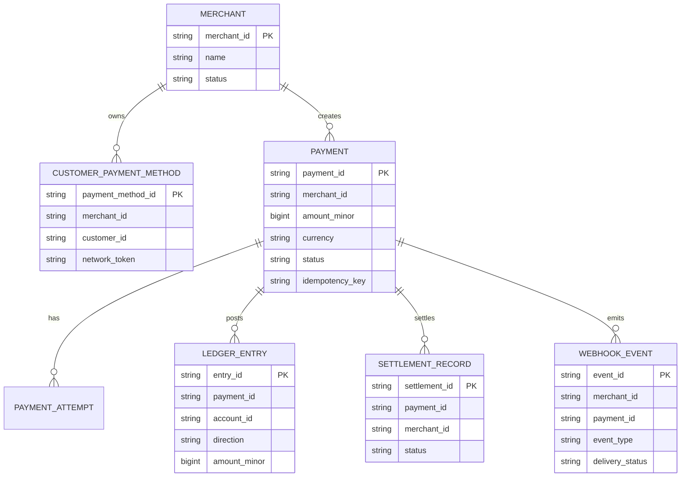
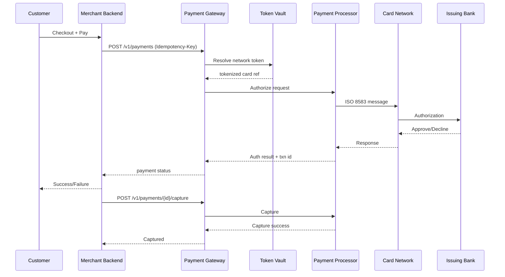
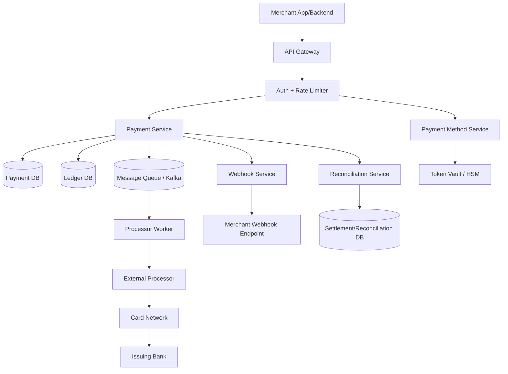
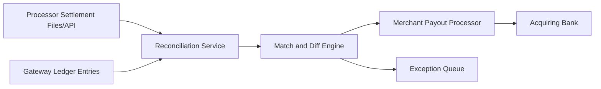
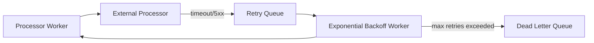

# Payment Gateway - System Design Interview Notes

## 1) Problem Statement
A payment gateway enables merchants to accept customer payments without integrating separately with each card network, processor, and bank.

Typical examples:
- Stripe
- Razorpay
- Adyen
- Braintree

The system should:
- Accept card payments securely (pay-in flow)
- Support merchant payouts and settlement visibility (pay-out flow)
- Store reusable payment methods using tokenization (not raw PAN)
- Provide reliable status tracking and webhooks
- Handle retries safely without duplicate charges

---

## 2) Requirements (Sequential)

## 2.1 Functional Requirements
| Requirement | Description |
|---|---|
| Pay-in flow | Create and process customer payments for merchant orders |
| Pay-out flow | Track settlement and payout status for merchants |
| Card tokenization | Save card as token for future payments |
| Auth and capture | Support one-step sale and two-step auth/capture |
| Refunds | Full or partial refund support |
| Payment status | Query current payment state |
| Webhooks | Notify merchants about async state updates |
| Idempotency | Prevent duplicate charges on retries |

## 2.2 Non-Functional Requirements
| Requirement | Specification |
|---|---|
| Security | PCI DSS compliance, encryption, tokenization, audit logs |
| Consistency | Strong consistency for payment state and ledger writes |
| Availability | High availability with graceful degradation |
| Reliability | Durable processing and safe retry handling |
| Low latency | Fast authorization response for checkout UX |
| Reconciliation | Daily reconciliation with processor/acquirer reports |
| Observability | End-to-end tracing, metrics, alerts, immutable event logs |
| Compliance | Support SCA/3DS and regional regulations where required |

## 2.3 Capacity Assumptions
1. Transactions/day: `1,000,000`
2. Average TPS: `~12` (`1,000,000 / 86,400`)
3. Peak multiplier: `10x`
4. Peak TPS target: `~120 TPS` minimum
5. Keep headroom for retries and webhook storms (`~300-500 TPS` internal handling)

Storage rough sizing:
1. If each payment lifecycle stores `5-10 KB` (requests, responses, metadata, events), daily data can be several GB.
2. Ledger and audit events will dominate long-term storage, so archival and partitioning are required.

---

## 3) Key Terms

## 3.1 Payment Gateway
Service that accepts payment requests from merchants and coordinates processing securely.

## 3.2 Payment Processor
Entity that routes transaction messages to card networks and issuer/acquirer rails.

## 3.3 Payment Service Provider (PSP)
Provider combining gateway + processor + value-added services.

## 3.4 Issuing Bank
Bank that issued the customer's card and approves/declines authorization.

## 3.5 Acquiring Bank
Bank that settles funds for the merchant.

## 3.6 Card Association
Network such as Visa, Mastercard, Amex, Discover.

## 3.7 PCI DSS
Security standard for handling card data.

## 3.8 3-D Secure
Additional cardholder authentication (for example, OTP/challenge flow).

## 3.9 ISO 8583
Common financial message format used in card processing systems.

---

## 4) Entity Design (Schema)

## 4.1 Merchant
| Field | Type | Description |
|---|---|---|
| `merchant_id` | string | Merchant identifier |
| `name` | string | Merchant display name |
| `status` | enum | `active`, `suspended` |
| `api_key_hash` | string | Auth credential hash |
| `created_at` | timestamp | Onboarding time |

## 4.2 CustomerPaymentMethod
Stores tokenized card references only.

| Field | Type | Description |
|---|---|---|
| `payment_method_id` | string | Token record ID |
| `merchant_id` | string | Owner merchant |
| `customer_id` | string | Customer within merchant scope |
| `network_token` | string | Token from vault/network |
| `last4` | string | Last 4 digits for display |
| `expiry_month` | int | Card expiry month |
| `expiry_year` | int | Card expiry year |
| `card_brand` | string | Visa/Mastercard/etc |
| `created_at` | timestamp | Creation time |

## 4.3 Payment
Primary payment object.

| Field | Type | Description |
|---|---|---|
| `payment_id` | string | Global payment identifier |
| `merchant_id` | string | Merchant initiating payment |
| `order_id` | string | Merchant order reference |
| `customer_id` | string | Customer reference |
| `amount_minor` | bigint | Amount in minor unit (paise/cents) |
| `currency` | string | ISO currency code |
| `status` | enum | `created`, `authorized`, `captured`, `failed`, `refunded`, `voided` |
| `payment_method_id` | string | Tokenized method reference |
| `idempotency_key` | string | Request de-duplication key |
| `created_at` | timestamp | Created time |
| `updated_at` | timestamp | Last state update |


## 4.5 LedgerEntry (Double-Entry Bookkeeping)
| Field | Type | Description |
|---|---|---|
| `entry_id` | string | Ledger entry ID |
| `payment_id` | string | Related payment |
| `account_id` | string | Logical account (customer liability, merchant payable, fees) |
| `direction` | enum | `debit` or `credit` |
| `amount_minor` | bigint | Amount in minor unit |
| `currency` | string | ISO currency |
| `created_at` | timestamp | Entry timestamp |

## 4.6 SettlementRecord
| Field | Type | Description |
|---|---|---|
| `settlement_id` | string | Settlement batch/item ID |
| `payment_id` | string | Related payment |
| `merchant_id` | string | Merchant receiving funds |
| `status` | enum | `pending`, `in_progress`, `settled`, `failed` |
| `settled_at` | timestamp | Settlement completion time |
| `created_at` | timestamp | Created time |

## 4.7 WebhookEvent
| Field | Type | Description |
|---|---|---|
| `event_id` | string | Webhook event ID |
| `merchant_id` | string | Target merchant |
| `payment_id` | string | Related payment |
| `event_type` | string | `payment.captured`, `payment.failed`, etc |
| `payload` | json | Event body |
| `delivery_status` | enum | `pending`, `sent`, `acked`, `failed` |
| `created_at` | timestamp | Event created time |



---

## 5) API Design

Headers:
1. `Authorization: Bearer <merchant_key>`
2. `Idempotency-Key: <unique_key_per_business_operation>`

## 5.1 Tokenize Card
`POST /v1/payment-methods/tokenize`

Request:
```json
{
  "merchantId": "m_101",
  "customerId": "cust_44",
  "card": {
    "pan": "4111111111111111",
    "expMonth": 12,
    "expYear": 2030,
    "cvv": "123"
  }
}
```

Response:
```json
{
  "paymentMethodId": "pm_8f12",
  "last4": "1111",
  "cardBrand": "visa"
}
```

## 5.2 Create Payment (Auth)
`POST /v1/payments`

Request:
```json
{
  "merchantId": "m_101",
  "orderId": "ord_782",
  "customerId": "cust_44",
  "paymentMethodId": "pm_8f12",
  "amountMinor": 259900,
  "currency": "INR",
  "capture": false,
  "threeDS": {
    "enabled": true
  }
}
```

Response:
```json
{
  "paymentId": "pay_71ac",
  "status": "authorized",
  "requiresAction": false
}
```

## 5.3 Capture Authorized Payment
`GET /v1/payments/{paymentId}`

Response:
```json
{
  "paymentId": "pay_71ac",
  "status": "captured"
}
```

## 5.4 Refund Payment
`POST /v1/payments/{paymentId}/refunds`

Request:
```json
{
  "amountMinor": 100000,
  "reason": "customer_requested"
}
```

Response:
```json
{
  "refundId": "rf_11d9",
  "status": "pending"
}
```

## 5.5 Get Payment Status
`GET /v1/payments/{paymentId}`

Response:
```json
{
  "paymentId": "pay_71ac",
  "orderId": "ord_782",
  "status": "captured",
  "amountMinor": 259900,
  "currency": "INR",
  "processorTxnId": "txn_9981"
}
```

## 5.6 Webhook Delivery
`POST /v1/webhooks/payment-events`

Event example:
```json
{
  "eventId": "evt_313",
  "eventType": "payment.captured",
  "paymentId": "pay_71ac",
  "merchantId": "m_101",
  "timestamp": "2026-04-12T09:10:00Z"
}
```

Common HTTP errors:
1. `400` bad request
2. `401/403` auth failure
3. `409` duplicate idempotency conflict
4. `422` business validation failure
5. `429` rate limited
6. `500/503` temporary failure

---

## 6) High-Level Architecture

## 6.1 Authorization and Capture Flow


## 6.2 System Components


## 6.3 Settlement and Reconciliation Flow


---

## 7) Deep Dive

## 7.1 Tokenization and PCI Scope Reduction
1. Raw card data should never be persisted in primary app databases.
2. Card details are exchanged over TLS and sent to token vault/HSM.
3. Gateway stores only token + last4 + expiry metadata.
4. This reduces PCI scope significantly compared to storing PAN/CVV.

## 7.2 Payment State Machine
Suggested state model:
1. `created`
2. `requires_action` (3DS challenge needed)
3. `authorized`
4. `captured`
5. `failed`
6. `voided`
7. `partially_refunded`
8. `refunded`

State transitions must be validated to prevent invalid updates.

## 7.3 Idempotency (Exactly-Once Effect)
1. Merchant sends `Idempotency-Key` per business operation.
2. Gateway stores key + canonical request hash + response.
3. Same key + same payload returns cached response.
4. Same key + different payload returns `409 Conflict`.
5. Idempotency records should have TTL but long enough for retry windows.

## 7.4 Durable Processing with Queue + Retry
1. Synchronous path handles customer-facing auth response.
2. Async tasks (webhooks, reconciliation, non-critical post-processing) use queue.
3. Retry with exponential backoff for transient failures.
4. Move permanently failing jobs to DLQ for manual/automated replay.



## 7.5 Double-Entry Ledger and Reconciliation
1. Every financial operation posts balanced debit and credit entries.
2. `sum(debit) == sum(credit)` invariant enforces accounting correctness.
3. Merchant payable, platform fees, and settlement accounts remain auditable.
4. Daily reconciliation compares internal ledger with processor/acquirer reports.

## 7.6 Consistency and CAP Choices
1. Payment authorization and ledger posting need strong consistency.
2. Webhooks, reporting dashboards, and analytics can be eventually consistent.
3. During partial outages, prefer safe fail behavior over uncertain charge state.

## 7.7 Processor Routing and Failover
1. Route by card BIN, geography, success rate, and cost.
2. On processor outage, switch to secondary processor when supported.
3. Preserve idempotency and traceability across routing attempts.
4. Keep merchant-visible status consistent despite backend rerouting.

## 7.8 Fraud and Risk Controls
1. Velocity checks per card, customer, IP, and merchant.
2. Risk scoring before authorization.
3. Trigger 3DS challenge for high-risk scenarios.
4. Blocklists and anomaly alerts for suspicious behavior.

## 7.9 Webhooks and Delivery Guarantees
1. Sign every webhook payload with HMAC.
2. Merchant verifies signature and timestamp.
3. Retries use exponential backoff.
4. Merchant endpoint should also be idempotent.
5. Keep webhook event log for replay support.

## 7.10 Data Partitioning and Indexing
1. Partition payment tables by `created_at` month or merchant shard.
2. Primary indexes:
   - `payment_id`
   - `(merchant_id, order_id)`
   - `(merchant_id, idempotency_key)`
3. Archive old immutable events to lower-cost storage.

## 7.11 Failure Scenarios
1. Gateway timeout after processor succeeded:
   - Use reconciliation + status poll before retrying to avoid duplicate charge.
2. Webhook delivery failure:
   - Retry, then DLQ, then replay tooling.
3. DB primary failure:
   - Automatic failover with strong consistency safeguards.
4. Queue lag spike:
   - Autoscale workers and prioritize critical topics.

---

## 8) Trade-offs to Mention in Interview
1. **Strong consistency** improves financial correctness but can reduce availability under partitions.
2. **Two-step auth/capture** gives merchant control but increases state-management complexity.
3. **Single processor** is simple but creates dependency risk.
4. **Multi-processor routing** improves resilience but increases operational complexity.
5. **Aggressive retries** improve recovery but can amplify duplicate/timeout ambiguity without idempotency.

---

## 9) Bottlenecks and Mitigations
1. **Processor downtime or high latency**
   - Use smart routing, circuit breakers, and fallback processor.
2. **Hot merchants during sales**
   - Apply per-merchant rate limits and dedicated worker pools.
3. **Webhook storms**
   - Queue webhooks, batch dispatch where possible, autoscale delivery workers.
4. **Reconciliation mismatch growth**
   - Automated diff engine, alerting, and exception workflows.
5. **Ledger write contention**
   - Partition by merchant/time and use append-only writes.

---

## 10) Interview Answer Template (Quick Revision)
Use this order while speaking:
1. Clarify functional scope (pay-in, payout, tokenization, refunds).
2. State non-functional goals (security, consistency, reliability, reconciliation).
3. Define core entities (`Payment`, `Attempt`, `Ledger`, `Settlement`, `Webhook`).
4. Explain API contracts and idempotency strategy.
5. Walk through auth/capture sequence.
6. Explain queue/retry/DLQ and webhook delivery.
7. Explain ledger + reconciliation correctness model.
8. End with trade-offs and failure handling.

---

## 11) Final Summary
A production payment gateway should be:
1. **Secure** (tokenization + PCI controls)
2. **Correct** (idempotency + strong ledger consistency)
3. **Reliable** (retries, backoff, DLQ, failover)
4. **Scalable** (partitioning, queue-based async processing)
5. **Auditable** (double-entry ledger + reconciliation + webhook/event logs)

This structure is practical for real systems and strong for system design interviews.


Outbox Pattern (Short Notes)
1) What problem does it solve?
When a service does both:

DB write (e.g., create order)
Message publish (e.g., send OrderCreated to Kafka)
you can get inconsistency if one succeeds and the other fails.

Example failure:

Order saved in DB ✅
Kafka publish failed ❌
Result: other services never know the order was created.
2) Outbox pattern idea
Write business data and event data in the same DB transaction.

Inside one transaction:

Insert/Update business row (orders)
Insert event row (outbox_events)
Commit
Then a background publisher reads unsent outbox rows and publishes them to Kafka/RabbitMQ.

3) Why it works
Atomicity at DB level: either both rows commit or none.
If broker is down, event is still stored in DB.
Publisher can retry until success.
4) Flow diagram
Client -> Order Service
Order Service -> DB Transaction:
  - write order
  - write outbox event
Commit

Background Outbox Publisher:
  - read unsent outbox rows
  - publish to Kafka
  - mark row as SENT
5) Simple example
Business use case
User places an order.

Transaction
orders: (order_id=101, status='CREATED')
outbox_events: (event_id='e1', event_type='OrderCreated', payload='{order_id:101}', status='PENDING')
Commit succeeds.

Background job
Picks event_id='e1'
Publishes to Kafka topic order-events
Updates outbox row status to SENT
6) Key interview points
Outbox pattern avoids dual-write inconsistency.
Works well with Kafka/RabbitMQ and microservices.
Delivery is usually at-least-once.
Consumers must be idempotent (handle duplicate events safely).
Common implementation: poll outbox table in batches + retries + DLQ/alerting for repeated failures.


# Additional discussion
1. retry storm(thundering herd)
- we will use exponential jitter to reduce load on the payment svc
- what is expoenntial backoff
- Exponential backoff means retrying a failed request with increasing delay.

- Example:

- 1st retry → 1 sec
- 2nd retry → 2 sec
- 3rd retry → 4 sec
- 4th retry → 8 sec
2. scaling main db
- as platoform grows to milions payment process then w will follow db partiton
- we wil partition the db based on the merchent id so that recancilliation svc will fetch the all theapyment of same merchent id from same db .
3. clock skew in reconcilliation
- reconcile based on strict time and universtal transaction id.


## Kafka Failure Handling Summary

### 1. Consumer Failure (Crash)

* Kafka handles via **rebalance**
* Another consumer resumes from **last committed offset**
* Use:

  * **Manual offset commit**
  * **Idempotent consumers**

---

### 2. Event Processing Failure

* Consumer is alive but processing fails
* Handle using:

  * **Retry (exponential backoff + jitter)** → for transient errors
  * **DLQ (Dead Letter Queue)** → for permanent failures
* After DLQ → **commit offset** (avoid partition blocking)

---

### 3. Retry vs DLQ

* **Retry → temporary issues**
* **DLQ → permanent failures**
* DLQ = just another Kafka topic (not built-in)

---

### 4. Producer Side

* **Retry → built-in (Kafka producer config)**
* **Idempotent producer → avoids duplicates**
* **DLQ → not built-in (manual if needed)**

---

### 5. Key Concepts

* Kafka = **at-least-once delivery**
* Must handle:

  * Idempotency
  * Offset management
  * Retry + DLQ

---

### One-Line Summary

> Kafka handles consumer failure, while application logic handles processing failure using retry and DLQ.

