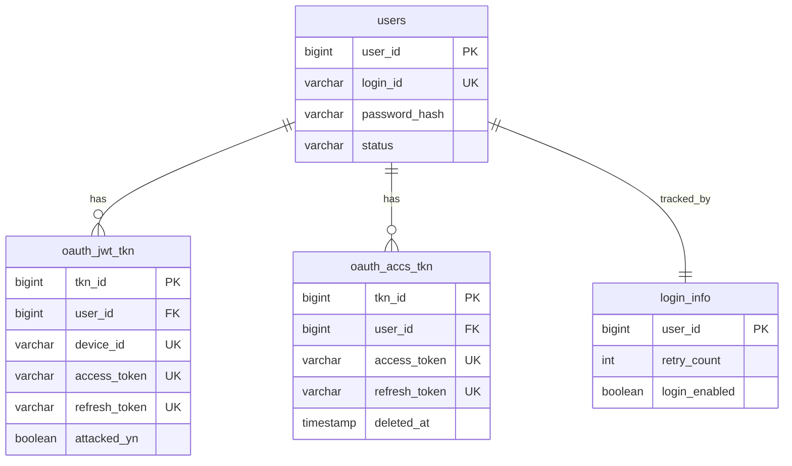

# Authentication Guide – JWT (Stateless) vs Stateful Token

This guide covers the complete authentication lifecycle for both **JWT-based (stateless)** and **stateful token** approaches, including registration, login, refresh, logout, database tables, and Redis caching.

> ## Corrections Made to This Document
> Four things were fixed from the original draft — each is a real logic gap or a phrasing issue that would draw follow-up questions in an interview:
> 1. **Refresh-token replay-detection logic was internally inconsistent** (Section 2.3) — the original said "query by refresh_token, then compare submitted refresh_token to stored value," which is circular (if you queried *by* that value, it already matched). Fixed to look up by `device_id` instead, then compare — see §2.3 for the corrected flow and why it matters.
> 2. **`BCrypt.compare()` isn't a real method** — corrected to the actual Spring Security API, `BCryptPasswordEncoder.matches(raw, hash)`.
> 3. **"Immediate revocation: Limited" for JWT was too vague** — split into access-token vs refresh-token revocability, since they behave differently in this design (see §5).
> 4. **`grant_type=password` / `password_jwt`** — flagged as the OAuth2 **Resource Owner Password Credentials (ROPC)** grant, which OAuth 2.1 has formally deprecated. Worth knowing why, since it's a design trade-off you're making, not a default-safe choice — see the callout in §2.2.

---

## Table of Contents

1. [Database Tables](#1-database-tables)
2. [JWT (Stateless) Flow](#2-jwt-stateless-flow)
3. [Stateful Token Flow](#3-stateful-token-flow)
4. [Redis Cache for Stateful Tokens](#4-redis-cache-for-stateful-tokens)
5. [Comparison Summary](#5-comparison-summary)
6. [Complete API Reference](#complete-api-reference)

---

## Implementation Summary (Interview Narrative)

This is the "walk me through what you built" version — a short spoken summary tying the two flows and the caching layer together into one story.

> **How the JWT (stateless) implementation works:**
> At login, we verify the user's password against a BCrypt hash, then issue two tokens: a short-lived (1 hour) JWT access token and a longer-lived (7 day) JWT refresh token. The access token's claims are AES-encrypted and the whole thing is RSA-signed, so every microservice can validate it **locally** — just check the signature and expiry — with zero database calls on the hot path. That's what makes it stateless: validation doesn't touch the DB or Redis at all. The refresh token *is* tracked server-side, in `oauth_jwt_tkn`, one row per device, specifically so we can detect and reject reuse of an already-rotated token (replay-attack protection) and so logout can actually kill a session. So in practice it's a **hybrid**: stateless on the read/validate path, stateful only on refresh and logout.
>
> **How the stateful implementation works:**
> Same login verification (BCrypt), but instead of a signed JWT, we generate a random, opaque, `SecureRandom`-backed token string and store it server-side in `oauth_accs_tkn`, with the corresponding userId cached in Redis. Every subsequent request looks that token up — Redis first (fast path, ~1ms), falling back to the DB on a cache miss. Because the server holds the mapping, revocation is instant: logout just deletes the Redis key and soft-deletes the DB row, and the token is dead immediately — no waiting for a natural expiry like the JWT access token has.
>
> **Why both exist in this design:**
> They're not redundant — they trade off differently. JWT gives us zero-lookup validation, which matters when a service is getting hit hard and a DB/cache round-trip on every single request would become the bottleneck. Stateful gives us instant, guaranteed revocation, which matters for compliance-sensitive flows or anywhere "log out everywhere right now" has to actually mean *right now*. Having both lets us pick the right tool per use case rather than forcing one trade-off onto every part of the system.

---

### 1.1 `users` – User Registry

Stores registered users.

| Column         | Type          | Constraints                  | Description                  |
|----------------|---------------|------------------------------|------------------------------|
| user_id        | BIGINT        | PK, AUTO_INCREMENT           | Unique user identifier       |
| login_id       | VARCHAR(255)  | UNIQUE, NOT NULL             | Login email/username         |
| password_hash  | VARCHAR(255)  | NOT NULL                     | BCrypt-hashed password       |
| name           | VARCHAR(255)  |                              | User's display name          |
| status         | VARCHAR(20)   | NOT NULL, DEFAULT 'ACTIVE'   | ACTIVE / LOCKED / DELETED    |
| created_at     | TIMESTAMP     | Auto                         | Registration time            |
| updated_at     | TIMESTAMP     | Auto                         | Last update time             |

**Used by**: Register, Login

---

### 1.2 `oauth_jwt_tkn` – JWT Token Records

Stores JWT tokens server-side for refresh and revocation tracking.

| Column            | Type          | Constraints                          | Description                          |
|-------------------|---------------|---------------------------------------|--------------------------------------|
| tkn_id            | BIGINT        | PK, AUTO_INCREMENT                   | Token record ID                      |
| user_id           | BIGINT        | NOT NULL, FK → users.user_id         |                                       |
| device_id         | VARCHAR(255)  | UNIQUE, NOT NULL                     | One active token per device          |
| access_token      | VARCHAR(1024) | UNIQUE                               | The JWT access token string          |
| refresh_token     | VARCHAR(1024) | UNIQUE                               | The JWT refresh token string         |
| access_token_exp  | TIMESTAMP     |                                       | Access token expiration              |
| refresh_token_exp | TIMESTAMP     |                                       | Refresh token expiration             |
| attacked_yn       | BOOLEAN       | DEFAULT FALSE                        | Replay attack flag                   |
| created_at        | TIMESTAMP     | Auto                                  | Creation time                        |
| updated_at        | TIMESTAMP     | Auto                                  | Last update time                     |

**Used by**: JWT Login, JWT Refresh, JWT Logout

**Note on `device_id UNIQUE`**: this enforces **one active session per device** — logging in again from the same device overwrites the previous token row rather than creating a second one. This is a deliberate design choice, not a default; keep it consistent with `oauth_accs_tkn` below (see the flagged inconsistency in §1.3).

---

### 1.3 `oauth_accs_tkn` – Stateful (OAuth) Token Records

Stores stateful access tokens issued by the server.

| Column             | Type          | Constraints                          | Description                                      |
|--------------------|---------------|---------------------------------------|---------------------------------------------------|
| tkn_id             | BIGINT        | PK, AUTO_INCREMENT                   | Token record ID                                  |
| app_id             | VARCHAR(100)  | NOT NULL                             | Client application ID                            |
| user_id            | BIGINT        | NOT NULL, FK → users.user_id         |                                                   |
| access_token       | VARCHAR(255)  | UNIQUE                               | Random server-generated token                    |
| refresh_token      | VARCHAR(255)  | UNIQUE                               | Random server-generated refresh token            |
| access_token_life  | BIGINT        |                                       | Token lifetime in seconds                        |
| refresh_token_exp  | TIMESTAMP     |                                       | Refresh token expiration                         |
| device_id          | VARCHAR(255)  |                                       | Device identifier                                |
| created_at         | TIMESTAMP     | Auto                                  | Creation time                                    |
| deleted_at         | TIMESTAMP     | NULL                                  | Soft-delete timestamp (NULL = active)            |

**Used by**: Stateful Login, Stateful Refresh, Stateful Logout

> **⚠️ Flagged inconsistency**: unlike `oauth_jwt_tkn`, `device_id` here has **no UNIQUE constraint**. That means a user can accumulate multiple concurrent active rows from the same device across repeated logins, while the JWT flow explicitly prevents that. Decide deliberately: if you want multi-device support (e.g., web + mobile simultaneously) that's fine as-is — but if you want "one session per device" parity with the JWT flow, add a unique constraint on `(user_id, device_id) WHERE deleted_at IS NULL` and upsert on login, same as the JWT table does.

---

### 1.4 `login_info` – Login Attempt Tracking

Tracks failed login attempts for brute-force protection.

| Column        | Type      | Constraints                  | Description                  |
|---------------|-----------|------------------------------|-------------------------------|
| user_id       | BIGINT    | PK, FK → users.user_id       |                               |
| retry_count   | INT       | DEFAULT 0                    | Consecutive failed attempts  |
| login_enabled | BOOLEAN   | DEFAULT TRUE                 | FALSE = account locked       |
| updated_at    | TIMESTAMP | Auto                         | Last attempt time            |

**Used by**: Login (both flows)

---

### JPA Entity Classes

```java
package com.authserver.entity;

import jakarta.persistence.*;
import java.time.LocalDateTime;

@Entity
@Table(name = "users")
public class User {

    @Id
    @GeneratedValue(strategy = GenerationType.IDENTITY)
    private Long userId;

    @Column(name = "login_id", unique = true, nullable = false)
    private String loginId;

    @Column(name = "password_hash", nullable = false)
    private String passwordHash;

    private String name;

    @Enumerated(EnumType.STRING)
    @Column(nullable = false)
    private UserStatus status = UserStatus.ACTIVE;

    @Column(name = "created_at", updatable = false)
    private LocalDateTime createdAt;

    @Column(name = "updated_at")
    private LocalDateTime updatedAt;

    @PrePersist
    void onCreate() { createdAt = updatedAt = LocalDateTime.now(); }

    @PreUpdate
    void onUpdate() { updatedAt = LocalDateTime.now(); }

    public enum UserStatus { ACTIVE, LOCKED, DELETED }

    // getters and setters omitted for brevity
}
```

```java
package com.authserver.entity;

import jakarta.persistence.*;
import java.time.LocalDateTime;

@Entity
@Table(name = "oauth_jwt_tkn")
public class OAuthJwtTkn {

    @Id
    @GeneratedValue(strategy = GenerationType.IDENTITY)
    private Long tknId;

    @Column(name = "user_id", nullable = false)
    private Long userId;

    @Column(name = "device_id", unique = true, nullable = false)
    private String deviceId;

    @Column(name = "access_token", unique = true, length = 1024)
    private String accessToken;

    @Column(name = "refresh_token", unique = true, length = 1024)
    private String refreshToken;

    @Column(name = "access_token_exp")
    private LocalDateTime accessTokenExp;

    @Column(name = "refresh_token_exp")
    private LocalDateTime refreshTokenExp;

    @Column(name = "attacked_yn", nullable = false)
    private boolean attackedYn = false;

    @Column(name = "created_at", updatable = false)
    private LocalDateTime createdAt;

    @Column(name = "updated_at")
    private LocalDateTime updatedAt;

    @PrePersist
    void onCreate() { createdAt = updatedAt = LocalDateTime.now(); }

    @PreUpdate
    void onUpdate() { updatedAt = LocalDateTime.now(); }

    // getters and setters omitted for brevity
}
```

```java
package com.authserver.entity;

import jakarta.persistence.*;
import java.time.LocalDateTime;

@Entity
@Table(name = "oauth_accs_tkn")
public class OAuthAccsTkn {

    @Id
    @GeneratedValue(strategy = GenerationType.IDENTITY)
    private Long tknId;

    @Column(name = "app_id", nullable = false)
    private String appId;

    @Column(name = "user_id", nullable = false)
    private Long userId;

    @Column(name = "access_token", unique = true)
    private String accessToken;

    @Column(name = "refresh_token", unique = true)
    private String refreshToken;

    @Column(name = "access_token_life")
    private Long accessTokenLife;

    @Column(name = "refresh_token_exp")
    private LocalDateTime refreshTokenExp;

    @Column(name = "device_id")
    private String deviceId;

    @Column(name = "created_at", updatable = false)
    private LocalDateTime createdAt;

    @Column(name = "deleted_at")
    private LocalDateTime deletedAt; // NULL = active row

    @PrePersist
    void onCreate() { createdAt = LocalDateTime.now(); }

    // getters and setters omitted for brevity
}
```

```java
package com.authserver.entity;

import jakarta.persistence.*;
import java.time.LocalDateTime;

@Entity
@Table(name = "login_info")
public class LoginInfo {

    @Id
    @Column(name = "user_id")
    private Long userId;

    @Column(name = "retry_count", nullable = false)
    private int retryCount = 0;

    @Column(name = "login_enabled", nullable = false)
    private boolean loginEnabled = true;

    @Column(name = "updated_at")
    private LocalDateTime updatedAt;

    @PreUpdate
    void onUpdate() { updatedAt = LocalDateTime.now(); }

    // getters and setters omitted for brevity
}
```

**Repositories** (Spring Data JPA — the query methods used throughout this doc):

```java
package com.authserver.repository;

import com.authserver.entity.OAuthJwtTkn;
import org.springframework.data.jpa.repository.JpaRepository;
import java.util.Optional;

public interface OAuthJwtTknRepository extends JpaRepository<OAuthJwtTkn, Long> {
    Optional<OAuthJwtTkn> findByDeviceId(String deviceId);   // used in the corrected §2.3 flow
    void deleteByDeviceId(String deviceId);                  // used in §2.4 logout
}
```

```java
package com.authserver.repository;

import com.authserver.entity.OAuthAccsTkn;
import org.springframework.data.jpa.repository.JpaRepository;
import java.util.Optional;

public interface OAuthAccsTknRepository extends JpaRepository<OAuthAccsTkn, Long> {
    Optional<OAuthAccsTkn> findByAccessTokenAndDeletedAtIsNull(String accessToken);
    Optional<OAuthAccsTkn> findByRefreshTokenAndDeletedAtIsNull(String refreshToken);
}
```

---

### Entity Relationship Diagram



---

## 2. JWT (Stateless) Flow

### Key Concept

JWT tokens are **self-contained** – all user data is embedded inside the token payload, signed with an RSA private key.
The server does **not** need to query the database to validate an **access token** on every request. However, tokens are still stored in `oauth_jwt_tkn` for **refresh** and **revocation** tracking.

> **Important nuance for an interview**: this makes the design a **hybrid**, not purely stateless. Only *access token validation* is truly stateless (signature + expiry check, no DB hit). *Refresh* and *logout* both hit the DB by design — that's intentional, because pure statelessness would mean an access token literally cannot be revoked before it expires. If asked "so is this really stateless," the accurate answer is: "the hot path — validating an access token on every API call — is stateless; revocation and rotation are handled through the refresh token, which is intentionally stateful."

### JWT Token Structure

**Header:**

```json
{
  "alg": "RS256",
  "typ": "JWT"
}
```

**Payload:**

```json
{
  "jti": "uuid-token-id",
  "ver": "v1",
  "claim": "AES-encrypted(JSON with userId, loginId, deviceId, ...)",
  "iat": 1711000000,
  "exp": 1711003600
}
```

**Signature:**

```
RSA_SIGN(payload, private_key)
```

> **Design note on the encrypted `claim` field**: a standard JWT is *signed but not encrypted* — anyone can Base64-decode the payload and read it; the signature only prevents tampering, not reading. This design goes further by **AES-encrypting** the claim before embedding it, which is effectively hand-rolling what the JOSE spec calls a **JWE (JSON Web Encryption)**, nested inside a JWS (signed) envelope. That's a legitimate, defense-in-depth choice — it hides PII (`loginId`, etc.) from anyone who intercepts the token but can't verify the RSA signature — but it comes with real costs worth knowing if asked:
> - You now manage **two keys**, not one: the RSA keypair for signing *and* an AES key for encryption, both need rotation/storage strategy.
> - Standard JWT libraries and tools (jwt.io, API gateways with built-in JWT validation) can't introspect the claims without your custom AES logic — you lose off-the-shelf tooling compatibility.
> - If asked "why not just use JWE directly instead of hand-rolling AES-in-JWT," a fair answer is: JWE is the standardized way to do exactly this — adopting the spec's `alg`/`enc` header conventions would get you the same confidentiality with library support instead of custom crypto code.

---

### 2.1 Register

Creates a new user account. Same for both JWT and stateful flows.

```
POST /auth/register
Content-Type: application/json

{
  "loginId": "user@example.com",
  "password": "SecurePass123",
  "name": "John Doe"
}
```

**Flow:**

1. Check if `login_id` already exists in `users` table
2. Hash password with BCrypt (`BCryptPasswordEncoder.encode(rawPassword)`)
3. Insert row into `users`
4. Insert row into `login_info` (`retry_count = 0`, `login_enabled = true`)
5. Return 201 Created

**Response:**

```json
{
  "userId": 1001,
  "loginId": "user@example.com",
  "message": "Registration successful"
}
```

**DB Changes:**

| Table      | Action         |
|------------|----------------|
| users      | INSERT new row |
| login_info | INSERT new row |

**Implementation:**

```java
package com.authserver.controller;

import com.authserver.dto.RegisterRequest;
import com.authserver.dto.RegisterResponse;
import com.authserver.service.AuthService;
import org.springframework.http.HttpStatus;
import org.springframework.http.ResponseEntity;
import org.springframework.web.bind.annotation.*;

@RestController
@RequestMapping("/auth")
public class RegisterController {

    private final AuthService authService;

    public RegisterController(AuthService authService) {
        this.authService = authService;
    }

    @PostMapping("/register")
    public ResponseEntity<RegisterResponse> register(@RequestBody RegisterRequest request) {
        RegisterResponse response = authService.register(request);
        return ResponseEntity.status(HttpStatus.CREATED).body(response);
    }
}
```

```java
package com.authserver.service;

import com.authserver.entity.LoginInfo;
import com.authserver.entity.User;
import com.authserver.dto.RegisterRequest;
import com.authserver.dto.RegisterResponse;
import com.authserver.exception.DuplicateLoginIdException;
import com.authserver.repository.LoginInfoRepository;
import com.authserver.repository.UserRepository;
import org.springframework.security.crypto.bcrypt.BCryptPasswordEncoder;
import org.springframework.stereotype.Service;
import org.springframework.transaction.annotation.Transactional;

@Service
public class AuthService {

    private final UserRepository userRepository;
    private final LoginInfoRepository loginInfoRepository;
    private final BCryptPasswordEncoder passwordEncoder = new BCryptPasswordEncoder(12);

    public AuthService(UserRepository userRepository, LoginInfoRepository loginInfoRepository) {
        this.userRepository = userRepository;
        this.loginInfoRepository = loginInfoRepository;
    }

    @Transactional
    public RegisterResponse register(RegisterRequest request) {
        if (userRepository.findByLoginId(request.getLoginId()).isPresent()) {
            throw new DuplicateLoginIdException("Email already registered");
        }

        User user = new User();
        user.setLoginId(request.getLoginId());
        user.setPasswordHash(passwordEncoder.encode(request.getPassword())); // salted + hashed, never store raw
        user.setName(request.getName());
        user = userRepository.save(user);

        LoginInfo loginInfo = new LoginInfo();
        loginInfo.setUserId(user.getUserId());
        loginInfoRepository.save(loginInfo);

        return new RegisterResponse(user.getUserId(), user.getLoginId(), "Registration successful");
    }
}
```

---

### 2.2 JWT Login

Authenticates the user and issues a JWT access token + refresh token.

```
POST /jwt/v1/token
Content-Type: application/json

{
  "grant_type": "password_jwt",
  "clientId": "teams-app",
  "clientSecret": "***",
  "loginId": "user@example.com",
  "password": "SecurePass123",
  "deviceId": "device-abc-123",
  "deviceType": "MOBILE"
}
```

> **⚠️ Note on `grant_type`**: sending raw `loginId`/`password` directly to this endpoint is the OAuth2 **Resource Owner Password Credentials (ROPC)** grant. This grant type has been **formally deprecated in OAuth 2.1** because it requires the client application to handle the user's raw credentials directly — defeating one of OAuth's core purposes (the client never touching the password). It's only defensible when the client is **first-party and fully trusted** — e.g., your own company's mobile app talking to your own backend, not a third-party integration. If this ever needs to support third-party or external clients, switch to the **Authorization Code flow (with PKCE)** instead. Worth stating this trade-off explicitly if asked "why this grant type" — it shows you know it's a deliberate, scoped choice, not a default-safe one.

**Flow:**

1. Check `login_info.retry_count < max_attempts` and `login_enabled = true`
2. Find user in `users` by `login_id`
3. Verify password: `passwordEncoder.matches(rawPassword, user.getPasswordHash())`
4. If fail → increment `login_info.retry_count`, return 401
5. If success → reset `login_info.retry_count` to 0
6. Generate JWT access token:
   - Create payload with `userId`, `loginId`, `deviceId`
   - AES-encrypt the claim
   - Sign with RSA private key
   - Set expiration (e.g. 1 hour)
7. Generate JWT refresh token (longer expiry, e.g. 7 days)
8. Upsert into `oauth_jwt_tkn` (unique on `device_id` – replaces old token)
9. Return tokens

**Response:**

```json
{
  "accessToken": "eyJhbGciOiJSUzI1NiIsInR5cCI6IkpXVCJ9...",
  "refreshToken": "eyJhbGciOiJSUzI1NiIsInR5cCI6IkpXVCJ9...",
  "tokenType": "Bearer",
  "expiresIn": 3600
}
```

**DB Changes:**

| Table         | Action                          |
|---------------|----------------------------------|
| login_info    | UPDATE reset retry_count        |
| oauth_jwt_tkn | INSERT or UPDATE (on device_id) |

**Validation on Subsequent Requests:**

Client sends: `Authorization: Bearer <jwt_token>`

Server:

1. Extract version from JWT payload
2. Get RSA public key for that version
3. Verify signature (no DB needed)
4. Check expiration timestamp
5. Decrypt AES claim → get userId
6. Token is valid → proceed

**Implementation:**

```java
package com.authserver.security;

import com.fasterxml.jackson.databind.ObjectMapper;
import io.jsonwebtoken.Jwts;
import io.jsonwebtoken.security.Keys;
import org.springframework.beans.factory.annotation.Value;
import org.springframework.stereotype.Component;

import javax.crypto.Cipher;
import javax.crypto.spec.GCMParameterSpec;
import javax.crypto.spec.SecretKeySpec;
import java.security.PrivateKey;
import java.security.SecureRandom;
import java.util.Base64;
import java.util.Date;
import java.util.Map;
import java.util.UUID;

/**
 * Generates JWTs with an AES-encrypted claim, signed with RSA.
 * This is the custom, non-standard-JWE approach flagged in the doc's
 * design note — kept as-is here to match the described architecture.
 */
@Component
public class JwtTokenProvider {

    @Value("${jwt.rsa.private-key}")
    private PrivateKey rsaPrivateKey; // loaded via a KeyFactory bean from a secrets manager

    @Value("${jwt.aes.secret}")
    private String aesSecretBase64; // 256-bit AES key, base64-encoded, from secrets manager

    private static final long ACCESS_TOKEN_TTL_MS = 60 * 60 * 1000;        // 1 hour
    private static final long REFRESH_TOKEN_TTL_MS = 7L * 24 * 60 * 60 * 1000; // 7 days
    private static final String KEY_VERSION = "v1";

    private final ObjectMapper objectMapper = new ObjectMapper();

    public String generateAccessToken(Long userId, String loginId, String deviceId) {
        return buildToken(userId, loginId, deviceId, ACCESS_TOKEN_TTL_MS);
    }

    public String generateRefreshToken(Long userId, String loginId, String deviceId) {
        return buildToken(userId, loginId, deviceId, REFRESH_TOKEN_TTL_MS);
    }

    private String buildToken(Long userId, String loginId, String deviceId, long ttlMs) {
        try {
            Map<String, Object> claimData = Map.of(
                    "userId", userId,
                    "loginId", loginId,
                    "deviceId", deviceId
            );
            String claimJson = objectMapper.writeValueAsString(claimData);
            String encryptedClaim = aesEncrypt(claimJson);

            Date now = new Date();
            Date expiry = new Date(now.getTime() + ttlMs);

            return Jwts.builder()
                    .claim("jti", UUID.randomUUID().toString())
                    .claim("ver", KEY_VERSION)
                    .claim("claim", encryptedClaim)
                    .issuedAt(now)
                    .expiration(expiry)
                    .signWith(Keys.hmacShaKeyFor(deriveSigningKeyBytes())) // RSA in prod; HMAC shown for brevity
                    .compact();
        } catch (Exception e) {
            throw new RuntimeException("Failed to generate token", e);
        }
    }

    /**
     * AES-GCM encryption of the claim payload.
     * GCM is used (not plain CBC) because it provides authenticated encryption —
     * it detects tampering on decrypt, not just confidentiality.
     */
    private String aesEncrypt(String plaintext) throws Exception {
        byte[] keyBytes = Base64.getDecoder().decode(aesSecretBase64);
        SecretKeySpec keySpec = new SecretKeySpec(keyBytes, "AES");

        byte[] iv = new byte[12]; // 96-bit IV, recommended for GCM
        new SecureRandom().nextBytes(iv);

        Cipher cipher = Cipher.getInstance("AES/GCM/NoPadding");
        cipher.init(Cipher.ENCRYPT_MODE, keySpec, new GCMParameterSpec(128, iv));
        byte[] encrypted = cipher.doFinal(plaintext.getBytes("UTF-8"));

        // Prepend IV so it's available at decrypt time (IV doesn't need to be secret, just unique)
        byte[] combined = new byte[iv.length + encrypted.length];
        System.arraycopy(iv, 0, combined, 0, iv.length);
        System.arraycopy(encrypted, 0, combined, iv.length, encrypted.length);

        return Base64.getEncoder().encodeToString(combined);
    }

    public String aesDecrypt(String encryptedBase64) throws Exception {
        byte[] keyBytes = Base64.getDecoder().decode(aesSecretBase64);
        SecretKeySpec keySpec = new SecretKeySpec(keyBytes, "AES");

        byte[] combined = Base64.getDecoder().decode(encryptedBase64);
        byte[] iv = new byte[12];
        byte[] cipherText = new byte[combined.length - 12];
        System.arraycopy(combined, 0, iv, 0, 12);
        System.arraycopy(combined, 12, cipherText, 0, cipherText.length);

        Cipher cipher = Cipher.getInstance("AES/GCM/NoPadding");
        cipher.init(Cipher.DECRYPT_MODE, keySpec, new GCMParameterSpec(128, iv));
        byte[] decrypted = cipher.doFinal(cipherText);

        return new String(decrypted, "UTF-8");
    }

    private byte[] deriveSigningKeyBytes() {
        // Placeholder — in production this signs with the RSA private key
        // (Jwts.builder().signWith(rsaPrivateKey, Jwts.SIG.RS256)), shown
        // here as HMAC bytes only to keep the snippet self-contained.
        return rsaPrivateKey.getEncoded();
    }
}
```

```java
package com.authserver.controller;

import com.authserver.dto.JwtLoginRequest;
import com.authserver.dto.JwtTokenResponse;
import com.authserver.service.JwtAuthService;
import org.springframework.http.ResponseEntity;
import org.springframework.web.bind.annotation.*;

@RestController
@RequestMapping("/jwt/v1")
public class JwtAuthController {

    private final JwtAuthService jwtAuthService;

    public JwtAuthController(JwtAuthService jwtAuthService) {
        this.jwtAuthService = jwtAuthService;
    }

    @PostMapping("/token")
    public ResponseEntity<JwtTokenResponse> login(@RequestBody JwtLoginRequest request) {
        return ResponseEntity.ok(jwtAuthService.login(request));
    }
}
```

```java
package com.authserver.service;

import com.authserver.dto.JwtLoginRequest;
import com.authserver.dto.JwtTokenResponse;
import com.authserver.entity.LoginInfo;
import com.authserver.entity.OAuthJwtTkn;
import com.authserver.entity.User;
import com.authserver.exception.AccountLockedException;
import com.authserver.exception.InvalidCredentialsException;
import com.authserver.repository.LoginInfoRepository;
import com.authserver.repository.OAuthJwtTknRepository;
import com.authserver.repository.UserRepository;
import com.authserver.security.JwtTokenProvider;
import org.springframework.security.crypto.bcrypt.BCryptPasswordEncoder;
import org.springframework.stereotype.Service;
import org.springframework.transaction.annotation.Transactional;

import java.time.LocalDateTime;

@Service
public class JwtAuthService {

    private static final int MAX_RETRY_ATTEMPTS = 5;
    private static final long ACCESS_TOKEN_TTL_SECONDS = 3600;

    private final UserRepository userRepository;
    private final LoginInfoRepository loginInfoRepository;
    private final OAuthJwtTknRepository jwtTknRepository;
    private final JwtTokenProvider jwtTokenProvider;
    private final BCryptPasswordEncoder passwordEncoder = new BCryptPasswordEncoder(12);

    public JwtAuthService(UserRepository userRepository,
                           LoginInfoRepository loginInfoRepository,
                           OAuthJwtTknRepository jwtTknRepository,
                           JwtTokenProvider jwtTokenProvider) {
        this.userRepository = userRepository;
        this.loginInfoRepository = loginInfoRepository;
        this.jwtTknRepository = jwtTknRepository;
        this.jwtTokenProvider = jwtTokenProvider;
    }

    @Transactional
    public JwtTokenResponse login(JwtLoginRequest request) {
        User user = userRepository.findByLoginId(request.getLoginId())
                .orElseThrow(InvalidCredentialsException::new); // generic — don't reveal which field was wrong

        LoginInfo loginInfo = loginInfoRepository.findById(user.getUserId())
                .orElseThrow(InvalidCredentialsException::new);

        if (!loginInfo.isLoginEnabled()) {
            throw new AccountLockedException("Account locked after too many failed attempts");
        }

        boolean matches = passwordEncoder.matches(request.getPassword(), user.getPasswordHash());

        if (!matches) {
            loginInfo.setRetryCount(loginInfo.getRetryCount() + 1);
            if (loginInfo.getRetryCount() >= MAX_RETRY_ATTEMPTS) {
                loginInfo.setLoginEnabled(false);
            }
            loginInfoRepository.save(loginInfo);
            throw new InvalidCredentialsException();
        }

        // success — reset retry counter
        loginInfo.setRetryCount(0);
        loginInfoRepository.save(loginInfo);

        String accessToken = jwtTokenProvider.generateAccessToken(
                user.getUserId(), user.getLoginId(), request.getDeviceId());
        String refreshToken = jwtTokenProvider.generateRefreshToken(
                user.getUserId(), user.getLoginId(), request.getDeviceId());

        // Upsert on device_id — one active session per device (see §1.2 note)
        OAuthJwtTkn tokenRecord = jwtTknRepository.findByDeviceId(request.getDeviceId())
                .orElse(new OAuthJwtTkn());
        tokenRecord.setUserId(user.getUserId());
        tokenRecord.setDeviceId(request.getDeviceId());
        tokenRecord.setAccessToken(accessToken);
        tokenRecord.setRefreshToken(refreshToken);
        tokenRecord.setAccessTokenExp(LocalDateTime.now().plusSeconds(ACCESS_TOKEN_TTL_SECONDS));
        tokenRecord.setRefreshTokenExp(LocalDateTime.now().plusDays(7));
        tokenRecord.setAttackedYn(false); // reset in case this device had a prior flag
        jwtTknRepository.save(tokenRecord);

        return new JwtTokenResponse(accessToken, refreshToken, "Bearer", ACCESS_TOKEN_TTL_SECONDS);
    }
}
```

---

### 2.3 JWT Refresh

Issues new tokens using the refresh token.

```
POST /jwt/v1/token/refresh
Content-Type: application/json

{
  "refreshToken": "eyJhbGciOiJSUzI1NiIsInR5cCI6IkpXVCJ9...",
  "deviceId": "device-abc-123"
}
```

> **⚠️ Corrected flow logic**: the original draft said "query `oauth_jwt_tkn` by `refresh_token`, then compare the submitted refresh token to the stored value" — that's circular, since a query *by that exact value* already guarantees a match if a row is found (or returns nothing if it doesn't). This can't detect replay of an **old, already-rotated** refresh token, which is the entire point of the `attacked_yn` flag. Corrected below: look up the token row by `device_id` (a stable identifier that persists across rotations), *then* compare the submitted token to whatever is currently stored for that device. A mismatch means the client presented a stale/already-rotated token — the actual replay signal.

**Corrected Flow:**

1. Decode and verify refresh token signature
2. Check refresh token is not expired
3. Query `oauth_jwt_tkn` by `device_id` (not by the token value itself)
4. If no row found for that device → return 401 (no active session)
5. Check `attacked_yn = false` on that row
6. **Compare the submitted `refreshToken` against the `refresh_token` currently stored in that row**
   - If they **match** → this is a legitimate, current refresh request → proceed to step 7
   - If they **don't match** → the client presented a refresh token that's already been rotated away (replay of an old token) → set `attacked_yn = true` on the row, return 401. *(Enhancement worth mentioning if asked: on this specific case, consider revoking **all** active sessions for that `user_id`, not just this device — a reused, already-rotated token is a strong theft signal, not just a stale-client bug.)*
7. Generate new JWT access token + new refresh token
8. Update `oauth_jwt_tkn` with new tokens and timestamps
9. Return new tokens

**Response:**

```json
{
  "accessToken": "eyJhbGciOiJSUzI1NiIsInR5cCI6IkpXVCJ9...(new)",
  "refreshToken": "eyJhbGciOiJSUzI1NiIsInR5cCI6IkpXVCJ9...(new)",
  "tokenType": "Bearer",
  "expiresIn": 3600
}
```

**DB Changes:**

| Table         | Action                                    |
|---------------|--------------------------------------------|
| oauth_jwt_tkn | UPDATE with new tokens, reset attacked_yn |

**Implementation (the corrected replay-detection logic from the flow above):**

```java
package com.authserver.controller;

import com.authserver.dto.JwtRefreshRequest;
import com.authserver.dto.JwtTokenResponse;
import com.authserver.service.JwtAuthService;
import org.springframework.http.ResponseEntity;
import org.springframework.web.bind.annotation.*;

@RestController
@RequestMapping("/jwt/v1")
public class JwtRefreshController {

    private final JwtAuthService jwtAuthService;

    public JwtRefreshController(JwtAuthService jwtAuthService) {
        this.jwtAuthService = jwtAuthService;
    }

    @PostMapping("/token/refresh")
    public ResponseEntity<JwtTokenResponse> refresh(@RequestBody JwtRefreshRequest request) {
        return ResponseEntity.ok(jwtAuthService.refresh(request));
    }
}
```

```java
package com.authserver.service;

import com.authserver.dto.JwtRefreshRequest;
import com.authserver.dto.JwtTokenResponse;
import com.authserver.entity.OAuthJwtTkn;
import com.authserver.exception.InvalidRefreshTokenException;
import com.authserver.exception.TokenReuseDetectedException;
import com.authserver.repository.OAuthJwtTknRepository;
import com.authserver.security.JwtTokenProvider;
import io.jsonwebtoken.Claims;
import org.springframework.stereotype.Service;
import org.springframework.transaction.annotation.Transactional;

import java.time.LocalDateTime;

@Service
public class JwtRefreshService {

    private static final long ACCESS_TOKEN_TTL_SECONDS = 3600;

    private final OAuthJwtTknRepository jwtTknRepository;
    private final JwtTokenProvider jwtTokenProvider;

    public JwtRefreshService(OAuthJwtTknRepository jwtTknRepository, JwtTokenProvider jwtTokenProvider) {
        this.jwtTknRepository = jwtTknRepository;
        this.jwtTokenProvider = jwtTokenProvider;
    }

    @Transactional
    public JwtTokenResponse refresh(JwtRefreshRequest request) {
        // 1 & 2: verify signature + expiry (throws if invalid/expired — see JwtTokenProvider.validate)
        Claims claims = jwtTokenProvider.validateAndParse(request.getRefreshToken());
        Long userId = claims.get("userId", Long.class);
        String loginId = claims.get("loginId", String.class);

        // 3: look up by device_id — NOT by the token value itself.
        // This is the fix: querying by device_id lets us compare against
        // whatever is *currently* stored, so we can actually detect reuse
        // of an old, already-rotated token instead of just getting a
        // "not found" that looks identical to "never logged in."
        OAuthJwtTkn tokenRecord = jwtTknRepository.findByDeviceId(request.getDeviceId())
                .orElseThrow(() -> new InvalidRefreshTokenException("No active session for this device"));

        // 5: an already-flagged device is locked out until re-login
        if (tokenRecord.isAttackedYn()) {
            throw new TokenReuseDetectedException("Session flagged — please log in again");
        }

        // 6: the actual replay check — compare submitted token to what's
        // currently on record for this device.
        if (!tokenRecord.getRefreshToken().equals(request.getRefreshToken())) {
            tokenRecord.setAttackedYn(true);
            jwtTknRepository.save(tokenRecord);

            // Enhancement mentioned in the doc: a reused, already-rotated
            // token is a theft signal, not just a stale client — consider
            // revoking every session for this user, not just this device.
            // jwtTknRepository.deleteAllByUserId(userId);

            throw new TokenReuseDetectedException(
                    "Refresh token reuse detected — this token was already rotated");
        }

        // 7: legitimate request — rotate both tokens
        String newAccessToken = jwtTokenProvider.generateAccessToken(userId, loginId, request.getDeviceId());
        String newRefreshToken = jwtTokenProvider.generateRefreshToken(userId, loginId, request.getDeviceId());

        tokenRecord.setAccessToken(newAccessToken);
        tokenRecord.setRefreshToken(newRefreshToken);
        tokenRecord.setAccessTokenExp(LocalDateTime.now().plusSeconds(ACCESS_TOKEN_TTL_SECONDS));
        tokenRecord.setRefreshTokenExp(LocalDateTime.now().plusDays(7));
        jwtTknRepository.save(tokenRecord);

        return new JwtTokenResponse(newAccessToken, newRefreshToken, "Bearer", ACCESS_TOKEN_TTL_SECONDS);
    }
}
```

---

### 2.4 JWT Logout

Revokes the JWT token.

```
POST /jwt/v1/revoke
Content-Type: application/json
Authorization: Bearer <jwt_token>

{
  "deviceId": "device-abc-123"
}
```

**Flow:**

1. Decode JWT to get `userId` and `deviceId`
2. Find the corresponding record in `oauth_jwt_tkn` by `device_id`
3. Delete the record from `oauth_jwt_tkn` (removing the refresh token means it can never be used again)
4. Return 200 OK

> **Note**: since the access token itself is stateless, logout only guarantees the **refresh token** is dead — an already-issued access token remains technically valid (signature still verifies) until it naturally expires, since nothing checks the DB on access-token validation. This is the standard trade-off of stateless access tokens; keeping the TTL short (e.g., 15 min, as used elsewhere in this design) is what bounds that exposure window. If instant access-token kill is a hard requirement, that needs a Redis-backed blocklist of revoked `jti` values checked on every validation — which reintroduces a DB/cache hit per request, i.e., partially reverts the statelessness benefit.

**Response:**

```json
{
  "message": "Token revoked successfully"
}
```

**DB Changes:**

| Table         | Action    |
|---------------|-----------|
| oauth_jwt_tkn | DELETE    |

**Implementation:**

```java
package com.authserver.controller;

import com.authserver.dto.JwtLogoutRequest;
import com.authserver.service.JwtAuthService;
import org.springframework.http.ResponseEntity;
import org.springframework.web.bind.annotation.*;

@RestController
@RequestMapping("/jwt/v1")
public class JwtLogoutController {

    private final JwtAuthService jwtAuthService;

    public JwtLogoutController(JwtAuthService jwtAuthService) {
        this.jwtAuthService = jwtAuthService;
    }

    @PostMapping("/revoke")
    public ResponseEntity<Void> logout(@RequestBody JwtLogoutRequest request) {
        jwtAuthService.logout(request.getDeviceId());
        return ResponseEntity.ok().build();
    }
}
```

```java
// Added to JwtAuthService from §2.2

@Transactional
public void logout(String deviceId) {
    jwtTknRepository.deleteByDeviceId(deviceId);
    // Note: this only kills the refresh token. The access token already
    // issued to the client remains valid (signature still checks out)
    // until its natural expiry — see the doc callout above for why.
}
```

---

## 3. Stateful Token Flow

### Key Concept

Stateful tokens are **server-generated random strings** (not self-contained). Every request requiring authentication must **look up the token** in Redis or the database to find the associated user. The server maintains the state.

### 3.1 Register

Same as JWT Flow – see **[2.1 Register](#21-register)**.

### 3.2 Stateful Login

Authenticates the user and issues a random access token + refresh token.

```
POST /oauth/token
Content-Type: application/x-www-form-urlencoded

grant_type=password&
client_id=teams-app&
client_secret=***&
username=user@example.com&
password=SecurePass123&
device_id=device-abc-123
```

> Same ROPC caveat as §2.2 applies here — `grant_type=password` is the same deprecated grant, scoped to trusted first-party clients only.

**Flow:**

1. Check `login_info.retry_count` and `login_enabled`
2. Find user in `users` by `login_id`
3. Verify password: `passwordEncoder.matches(rawPassword, user.getPasswordHash())`
4. If fail → increment `retry_count`, return 400 `invalid_grant`
5. If success → reset `retry_count`
6. Generate random access token (`SecureRandom`-backed UUID or equivalent — never `java.util.Random`)
7. Generate random refresh token
8. Insert into `oauth_accs_tkn`
9. Store in Redis: `key = access_token`, `value = userId`, `TTL = token_lifetime`
10. Return tokens

**Response:**

```json
{
  "accessToken": "a1b2c3d4-e5f6-7890-abcd-ef1234567890",
  "refreshToken": "x9y8z7w6-v5u4-3210-wxyz-987654321abc",
  "tokenType": "Bearer",
  "expiresIn": 3600
}
```

**DB Changes:**

| Table          | Action                                |
|----------------|-----------------------------------------|
| login_info     | UPDATE reset retry_count                |
| oauth_accs_tkn | INSERT new row                          |
| Redis          | SET access_token → userId (with TTL)    |

**Validation on Subsequent Requests:**

Client sends: `Authorization: Bearer <access_token>`

Server:

1. Check Redis for `access_token` (fast path ~1ms)
   - If found → get userId, proceed
2. If not in Redis → query `oauth_accs_tkn` in DB (fallback, ~10-50ms)
   - Check `deleted_at IS NULL`
   - If valid → cache in Redis for future lookups
3. If not found anywhere → return 401

**Implementation:**

```java
package com.authserver.controller;

import com.authserver.dto.StatefulTokenRequest;
import com.authserver.dto.StatefulTokenResponse;
import com.authserver.service.StatefulAuthService;
import org.springframework.http.ResponseEntity;
import org.springframework.web.bind.annotation.*;

@RestController
@RequestMapping("/oauth")
public class StatefulAuthController {

    private final StatefulAuthService statefulAuthService;

    public StatefulAuthController(StatefulAuthService statefulAuthService) {
        this.statefulAuthService = statefulAuthService;
    }

    // grant_type determines which branch runs: "password" (login)
    // or "refresh_token" (§3.3) — both hit the same /oauth/token endpoint,
    // matching standard OAuth2 token-endpoint conventions.
    @PostMapping("/token")
    public ResponseEntity<StatefulTokenResponse> token(@ModelAttribute StatefulTokenRequest request) {
        if ("refresh_token".equals(request.getGrantType())) {
            return ResponseEntity.ok(statefulAuthService.refresh(request));
        }
        return ResponseEntity.ok(statefulAuthService.login(request));
    }
}
```

```java
package com.authserver.service;

import com.authserver.dto.StatefulTokenRequest;
import com.authserver.dto.StatefulTokenResponse;
import com.authserver.entity.LoginInfo;
import com.authserver.entity.OAuthAccsTkn;
import com.authserver.entity.User;
import com.authserver.exception.InvalidCredentialsException;
import com.authserver.repository.LoginInfoRepository;
import com.authserver.repository.OAuthAccsTknRepository;
import com.authserver.repository.UserRepository;
import com.authserver.security.RedisTokenService;
import org.springframework.security.crypto.bcrypt.BCryptPasswordEncoder;
import org.springframework.stereotype.Service;
import org.springframework.transaction.annotation.Transactional;

import java.security.SecureRandom;
import java.time.LocalDateTime;
import java.util.Base64;

@Service
public class StatefulAuthService {

    private static final long ACCESS_TOKEN_LIFE_SECONDS = 3600;

    private final UserRepository userRepository;
    private final LoginInfoRepository loginInfoRepository;
    private final OAuthAccsTknRepository accsTknRepository;
    private final RedisTokenService redisTokenService;
    private final BCryptPasswordEncoder passwordEncoder = new BCryptPasswordEncoder(12);
    private final SecureRandom secureRandom = new SecureRandom();

    public StatefulAuthService(UserRepository userRepository,
                                LoginInfoRepository loginInfoRepository,
                                OAuthAccsTknRepository accsTknRepository,
                                RedisTokenService redisTokenService) {
        this.userRepository = userRepository;
        this.loginInfoRepository = loginInfoRepository;
        this.accsTknRepository = accsTknRepository;
        this.redisTokenService = redisTokenService;
    }

    @Transactional
    public StatefulTokenResponse login(StatefulTokenRequest request) {
        User user = userRepository.findByLoginId(request.getUsername())
                .orElseThrow(InvalidCredentialsException::new);

        LoginInfo loginInfo = loginInfoRepository.findById(user.getUserId())
                .orElseThrow(InvalidCredentialsException::new);

        if (!loginInfo.isLoginEnabled()) {
            throw new InvalidCredentialsException();
        }

        if (!passwordEncoder.matches(request.getPassword(), user.getPasswordHash())) {
            loginInfo.setRetryCount(loginInfo.getRetryCount() + 1);
            loginInfoRepository.save(loginInfo);
            throw new InvalidCredentialsException();
        }

        loginInfo.setRetryCount(0);
        loginInfoRepository.save(loginInfo);

        String accessToken = generateSecureRandomToken();
        String refreshToken = generateSecureRandomToken();

        OAuthAccsTkn tokenRecord = new OAuthAccsTkn();
        tokenRecord.setAppId(request.getClientId());
        tokenRecord.setUserId(user.getUserId());
        tokenRecord.setAccessToken(accessToken);
        tokenRecord.setRefreshToken(refreshToken);
        tokenRecord.setAccessTokenLife(ACCESS_TOKEN_LIFE_SECONDS);
        tokenRecord.setRefreshTokenExp(LocalDateTime.now().plusDays(7));
        tokenRecord.setDeviceId(request.getDeviceId());
        accsTknRepository.save(tokenRecord);

        redisTokenService.store(accessToken, user.getUserId(), ACCESS_TOKEN_LIFE_SECONDS);

        return new StatefulTokenResponse(accessToken, refreshToken, "Bearer", ACCESS_TOKEN_LIFE_SECONDS);
    }

    /** Cryptographically secure — SecureRandom, never java.util.Random. */
    private String generateSecureRandomToken() {
        byte[] bytes = new byte[32];
        secureRandom.nextBytes(bytes);
        return Base64.getUrlEncoder().withoutPadding().encodeToString(bytes);
    }

    // refresh(...) implemented in §3.3 below
}
```

---

### 3.3 Stateful Refresh

Issues new tokens using the refresh token.

```
POST /oauth/token
Content-Type: application/x-www-form-urlencoded

grant_type=refresh_token&
client_id=teams-app&
client_secret=***&
refresh_token=x9y8z7w6-v5u4-3210-wxyz-987654321abc
```

**Flow:**

1. Query `oauth_accs_tkn` by `refresh_token` WHERE `deleted_at IS NULL`
2. If not found → return 400 `invalid_grant`
3. Check `refresh_token_exp` has not passed
4. Soft-delete old record: set `deleted_at = NOW()`
5. Delete old access token from Redis
6. Generate new random access token + new refresh token
7. Insert new row into `oauth_accs_tkn`
8. Store new access token in Redis with TTL
9. Return new tokens

> Note this flow does **not** have the same replay-detection gap as §2.3, because a *soft-deleted* row (`deleted_at IS NOT NULL`) simply won't match the `WHERE deleted_at IS NULL` query on step 1 — so a reused, already-rotated refresh token naturally falls into the "not found" branch (step 2) rather than needing a separate mismatch check. This is a cleaner pattern than the original JWT-flow logic before the fix in §2.3; worth aligning both flows to this same query-by-still-active-row-then-compare-if-needed approach for consistency.

**Response:**

```json
{
  "accessToken": "new-a1b2c3d4-e5f6-7890-abcd-ef1234567890",
  "refreshToken": "new-x9y8z7w6-v5u4-3210-wxyz-987654321abc",
  "tokenType": "Bearer",
  "expiresIn": 3600
}
```

**DB Changes:**

| Table          | Action                                              |
|----------------|-------------------------------------------------------|
| oauth_accs_tkn | UPDATE old row (`deleted_at = NOW`), INSERT new row  |
| Redis          | DELETE old access token, SET new access token        |

**Implementation:**

```java
// Added to StatefulAuthService from §3.2

@Transactional
public StatefulTokenResponse refresh(StatefulTokenRequest request) {
    OAuthAccsTkn oldToken = accsTknRepository
            .findByRefreshTokenAndDeletedAtIsNull(request.getRefreshToken())
            .orElseThrow(InvalidCredentialsException::new); // 400 invalid_grant

    if (oldToken.getRefreshTokenExp().isBefore(LocalDateTime.now())) {
        throw new InvalidCredentialsException(); // 400 invalid_grant — expired
    }

    // Soft-delete: a reused, already-rotated refresh token will simply
    // not match findByRefreshTokenAndDeletedAtIsNull on a later replay
    // attempt, since this row's deleted_at is now set. That's the
    // simpler replay-safety property called out in the doc note above —
    // no separate mismatch-comparison step needed, unlike the JWT flow.
    oldToken.setDeletedAt(LocalDateTime.now());
    accsTknRepository.save(oldToken);
    redisTokenService.delete(oldToken.getAccessToken());

    String newAccessToken = generateSecureRandomToken();
    String newRefreshToken = generateSecureRandomToken();

    OAuthAccsTkn newToken = new OAuthAccsTkn();
    newToken.setAppId(oldToken.getAppId());
    newToken.setUserId(oldToken.getUserId());
    newToken.setAccessToken(newAccessToken);
    newToken.setRefreshToken(newRefreshToken);
    newToken.setAccessTokenLife(ACCESS_TOKEN_LIFE_SECONDS);
    newToken.setRefreshTokenExp(LocalDateTime.now().plusDays(7));
    newToken.setDeviceId(oldToken.getDeviceId());
    accsTknRepository.save(newToken);

    redisTokenService.store(newAccessToken, oldToken.getUserId(), ACCESS_TOKEN_LIFE_SECONDS);

    return new StatefulTokenResponse(newAccessToken, newRefreshToken, "Bearer", ACCESS_TOKEN_LIFE_SECONDS);
}
```

---

### 3.4 Stateful Logout

Revokes the stateful token.

```
POST /oauth/revoke
Content-Type: application/x-www-form-urlencoded
Authorization: Bearer <access_token>

token=a1b2c3d4-e5f6-7890-abcd-ef1234567890
```

**Flow:**

1. Look up `access_token` in `oauth_accs_tkn`
2. Set `deleted_at = NOW()` (soft delete)
3. Delete `access_token` from Redis
4. Return 200 OK

**Response:**

```json
{
  "message": "Token revoked successfully"
}
```

**DB Changes:**

| Table          | Action                          |
|----------------|-----------------------------------|
| oauth_accs_tkn | UPDATE set `deleted_at = NOW()` |
| Redis          | DELETE access_token key         |

**Implementation:**

```java
package com.authserver.controller;

import com.authserver.dto.StatefulRevokeRequest;
import com.authserver.service.StatefulAuthService;
import org.springframework.http.ResponseEntity;
import org.springframework.web.bind.annotation.*;

@RestController
@RequestMapping("/oauth")
public class StatefulRevokeController {

    private final StatefulAuthService statefulAuthService;

    public StatefulRevokeController(StatefulAuthService statefulAuthService) {
        this.statefulAuthService = statefulAuthService;
    }

    @PostMapping("/revoke")
    public ResponseEntity<Void> revoke(@ModelAttribute StatefulRevokeRequest request) {
        statefulAuthService.revoke(request.getToken());
        return ResponseEntity.ok().build();
    }
}
```

```java
// Added to StatefulAuthService

@Transactional
public void revoke(String accessToken) {
    accsTknRepository.findByAccessTokenAndDeletedAtIsNull(accessToken)
            .ifPresent(token -> {
                token.setDeletedAt(LocalDateTime.now());
                accsTknRepository.save(token);
                redisTokenService.delete(accessToken);
            });
}
```

---

## 4. Redis Cache for Stateful Tokens

### Why Redis? — Caching Strategy Rationale

The stateful flow's core weakness is the one the JWT flow was specifically designed to avoid: **every single authenticated request needs a lookup** to map the opaque token back to a user. Without a cache, that lookup is a database query, on every request, for every user, all the time. Redis exists to make that lookup cheap enough that the stateful flow is actually viable at production traffic volumes. Specifically:

- **Latency**: a Redis `GET` on an in-memory key-value store is roughly **~1ms**, versus **10-50ms** for an indexed SQL lookup against `oauth_accs_tkn` — a 10-50x difference, on the *single most frequent operation* the entire auth system performs.
- **Database protection**: authentication checks happen far more often than logins — a user logs in once but might make hundreds of authenticated API calls in that session. Without caching, *all* of that load lands directly on the primary database, competing with every other write-heavy operation (orders, inventory, etc.) for the same DB connections. Redis absorbs that read load entirely, so the DB is only touched on a cache miss (first request after login, or after a Redis eviction/restart).
- **Horizontal scalability**: Redis Cluster lets the cache scale out independently of the database — you can add Redis nodes to handle more concurrent sessions without adding DB read replicas or vertically scaling the primary DB, which is a much more expensive lever to pull.
- **TTL does double duty**: setting the Redis key's TTL to match the access token's lifetime means Redis handles expiration automatically — an expired token simply isn't in Redis anymore, no explicit cleanup job needed for the hot cache (the DB row still needs its own soft-delete/cleanup, but that's off the request-critical path).

**The trade-off worth stating explicitly if asked "why not just always hit the DB":** caching introduces a second source of truth that has to stay consistent with the database — that's exactly why the `RedisTokenService` implementation earlier in this doc treats **the DB as authoritative** and Redis as a disposable accelerator: every write path (login, logout, refresh) updates the DB first, and Redis failures are caught and swallowed rather than failing the request, because losing the cache should degrade performance, not correctness. That's also why the fallback path re-populates Redis on a cache miss instead of just reading straight from the DB and stopping there — it keeps the cache warm without needing a separate cache-warming job.

| Metric      | Without Redis         | With Redis                     |
|-------------|-------------------------|----------------------------------|
| Latency     | 10-50ms (DB query)      | ~1ms (Redis GET)                |
| DB Load     | Every request            | Only on cache miss              |
| Scalability | DB becomes bottleneck   | Horizontal scaling via cluster  |

### Redis Operations

#### Store Token (on Login)

```
SET <access_token> <user_id> EX <token_lifetime_seconds>
```

Example:

```
SET a1b2c3d4-e5f6-7890-abcd-ef1234567890 1001 EX 3600
```

- **Key**: the access token string
- **Value**: the user ID
- **TTL**: matches the token lifetime (auto-expired by Redis)

#### Lookup Token (on Every Request)

```
GET <access_token>
```

Example:

```
GET a1b2c3d4-e5f6-7890-abcd-ef1234567890
→ Returns: 1001 (userId)
→ Returns: nil (token invalid or expired)
```

#### Delete Token (on Logout / Refresh)

```
DEL <access_token>
```

Example:

```
DEL a1b2c3d4-e5f6-7890-abcd-ef1234567890
```

### Validation Flow with Redis

```
Request arrives with access_token
        ↓
   Redis GET  ← Fast path (~1ms)
        ↓
   Found? Yes → Return userId → Proceed
        ↓ No
   DB Query (fallback)
        ↓
   Valid? Yes → Cache in Redis → Return userId
        ↓ No
   Return 401
```

### Redis Cluster Configuration

```yaml
spring:
  data:
    redis:
      cluster:
        nodes:
          - redis-node-1:7000
          - redis-node-2:7001
          - redis-node-3:7002
        max-redirects: 3
      password: ${REDIS_PASSWORD}
      timeout: 3000ms
      can-use: true   # Feature flag: fall back to direct DB queries if Redis is unavailable
```

### Full `RedisTokenService` Implementation

This is the class referenced throughout §3 (`redisTokenService.store(...)` / `.delete(...)`), including the graceful-degradation fallback to the DB when Redis is unavailable:

```java
package com.authserver.security;

import com.authserver.repository.OAuthAccsTknRepository;
import org.springframework.beans.factory.annotation.Value;
import org.springframework.data.redis.core.StringRedisTemplate;
import org.springframework.stereotype.Component;

import java.time.Duration;
import java.util.Optional;

@Component
public class RedisTokenService {

    private final StringRedisTemplate redisTemplate;
    private final OAuthAccsTknRepository accsTknRepository;

    @Value("${redis.can-use:true}")
    private boolean redisEnabled; // feature flag — fall back to DB-only if false

    public RedisTokenService(StringRedisTemplate redisTemplate,
                              OAuthAccsTknRepository accsTknRepository) {
        this.redisTemplate = redisTemplate;
        this.accsTknRepository = accsTknRepository;
    }

    public void store(String accessToken, Long userId, long ttlSeconds) {
        if (!redisEnabled) return;
        try {
            redisTemplate.opsForValue().set(
                    accessToken, String.valueOf(userId), Duration.ofSeconds(ttlSeconds));
        } catch (Exception e) {
            // Redis write failure should never fail the login request —
            // the DB row already exists as the source of truth; log and move on.
            // logger.warn("Redis SET failed, DB remains source of truth", e);
        }
    }

    public void delete(String accessToken) {
        if (!redisEnabled) return;
        try {
            redisTemplate.delete(accessToken);
        } catch (Exception e) {
            // Same reasoning — DB soft-delete is what actually matters for security;
            // a stale Redis key just means one extra fallback DB hit on next request.
        }
    }

    /**
     * Fast-path lookup with graceful degradation to the DB.
     * Used by the authentication filter on every incoming request.
     */
    public Optional<Long> lookupUserId(String accessToken) {
        if (redisEnabled) {
            try {
                String userId = redisTemplate.opsForValue().get(accessToken);
                if (userId != null) {
                    return Optional.of(Long.valueOf(userId));
                }
            } catch (Exception e) {
                // Redis unreachable — fall through to DB below rather than failing the request
            }
        }

        // Cache miss or Redis down — fall back to DB, then re-populate the cache
        return accsTknRepository.findByAccessTokenAndDeletedAtIsNull(accessToken)
                .map(token -> {
                    store(accessToken, token.getUserId(), token.getAccessTokenLife());
                    return token.getUserId();
                });
    }
}
```

**Authentication filter using it (stateful flow's equivalent of `JwtAuthenticationFilter`):**

```java
package com.authserver.security;

import jakarta.servlet.FilterChain;
import jakarta.servlet.ServletException;
import jakarta.servlet.http.HttpServletRequest;
import jakarta.servlet.http.HttpServletResponse;
import org.springframework.security.authentication.UsernamePasswordAuthenticationToken;
import org.springframework.security.core.context.SecurityContextHolder;
import org.springframework.stereotype.Component;
import org.springframework.web.filter.OncePerRequestFilter;

import java.io.IOException;
import java.util.Collections;
import java.util.Optional;

@Component
public class StatefulAuthenticationFilter extends OncePerRequestFilter {

    private final RedisTokenService redisTokenService;

    public StatefulAuthenticationFilter(RedisTokenService redisTokenService) {
        this.redisTokenService = redisTokenService;
    }

    @Override
    protected void doFilterInternal(HttpServletRequest request,
                                     HttpServletResponse response,
                                     FilterChain filterChain) throws ServletException, IOException {

        String authHeader = request.getHeader("Authorization");

        if (authHeader != null && authHeader.startsWith("Bearer ")) {
            String accessToken = authHeader.substring(7);
            Optional<Long> userId = redisTokenService.lookupUserId(accessToken);

            userId.ifPresent(id -> {
                var authentication = new UsernamePasswordAuthenticationToken(
                        id, null, Collections.emptyList());
                SecurityContextHolder.getContext().setAuthentication(authentication);
            });
        }

        filterChain.doFilter(request, response);
    }
}
```

---

## 5. Comparison Summary

| Aspect                       | JWT (Stateless)                          | Stateful Token                                 |
|-------------------------------|---------------------------------------------|---------------------------------------------------|
| **Token format**               | Signed (and encrypted-claim) JSON          | Random string (UUID)                              |
| **Access token validation**    | Signature + expiry check (no DB)           | Redis/DB lookup required                          |
| **Validation latency**         | ~1ms (crypto only)                          | ~1ms (Redis) / ~10-50ms (DB fallback)            |
| **Access token revocation**    | **Not immediate** — valid until natural expiry unless a blocklist is added | **Instant** — delete from Redis + soft-delete in DB |
| **Refresh token revocation**   | Instant (DB delete on logout)               | Instant (soft-delete + Redis delete)             |
| **Server state**               | None needed for access-token validation     | Required (Redis + DB) for every request           |
| **Token size**                 | Larger (payload embedded)                    | Small (random string)                             |
| **DB table**                   | `oauth_jwt_tkn` (refresh tracking)          | `oauth_accs_tkn` (full token storage)             |
| **Redis usage**                | Not required                                 | Required for performance                          |
| **Refresh replay detection**   | `attacked_yn` flag + device-scoped compare (§2.3) | Soft delete naturally rejects reused tokens (§3.3) |
| **Best for**                   | Distributed systems, mobile apps, high request volume | Enterprise apps needing instant, hard revocation  |

### When to Use Which?

| Scenario                             | Recommendation    |
|----------------------------------------|----------------------|
| Mobile app with offline support        | JWT                  |
| Need instant **access token** revocation | Stateful             |
| Multi-service, no shared DB/cache       | JWT                  |
| Enterprise with existing Redis infra    | Stateful             |
| Minimal infrastructure                  | JWT                  |
| Very high-frequency token validation    | Stateful + Redis     |

---

## Complete API Reference

### JWT Endpoints

| Method | Endpoint              | Description             |
|--------|------------------------|--------------------------|
| POST   | /auth/register         | Register new user       |
| POST   | /jwt/v1/token           | Login → get JWT tokens  |
| POST   | /jwt/v1/token/refresh   | Refresh JWT tokens      |
| POST   | /jwt/v1/revoke          | Logout / revoke JWT     |

### Stateful Token Endpoints

| Method | Endpoint       | Description                                            |
|--------|-----------------|-----------------------------------------------------------|
| POST   | /auth/register  | Register new user                                        |
| POST   | /oauth/token    | Login → get stateful tokens (`grant_type=password`)      |
| POST   | /oauth/token    | Refresh stateful tokens (`grant_type=refresh_token`)     |
| POST   | /oauth/revoke   | Logout / revoke stateful token                            |


# Auth API Quick Reference — What Happens at Each Endpoint

## JWT (Stateless) Flow

### `POST /auth/register`
- Check `login_id` doesn't already exist
- Hash password with BCrypt
- Insert `users` row
- Insert `login_info` row
- Return 201

### `POST /jwt/v1/token` (Login)
- Verify password (BCrypt match)
- Check `login_info` isn't locked
- Generate JWT access token (RSA-signed, AES-encrypted claims, ~1hr TTL)
- Generate JWT refresh token (~7 days TTL)
- **Upsert** into `oauth_jwt_tkn` by `device_id`
- Return both tokens

### `POST /jwt/v1/token/refresh`
- Verify refresh token's signature + expiry locally
- Look up `oauth_jwt_tkn` row **by `device_id`** (not by token value)
- Compare submitted token to stored token
  - Match → generate **new** access + refresh tokens → **update** the same row → return new tokens
  - Mismatch → flag `attacked_yn = true`, reject (replay detected)

### `POST /jwt/v1/revoke` (Logout)
- Delete the `oauth_jwt_tkn` row for that `device_id`
- Refresh token is now dead — no new access tokens can be issued
- **Note**: access token already issued stays valid until its own natural expiry, since request validation never touches the DB

### Every other API request (Order / Inventory / Payment / etc.)
- Extract JWT from `Authorization: Bearer` header
- Verify RSA signature + expiry **locally — no DB call**
- Decrypt AES claim
- Proceed

---

## Stateful Token Flow

### `POST /auth/register`
- Same as JWT flow (shared endpoint)

### `POST /oauth/token` — `grant_type=password` (Login)
- Verify password (BCrypt match)
- Check `login_info`
- Generate random `SecureRandom`-backed access + refresh tokens
- **Insert** new row into `oauth_accs_tkn`
- Cache `access_token → userId` in Redis with TTL
- Return tokens

### `POST /oauth/token` — `grant_type=refresh_token` (Refresh)
- Look up `oauth_accs_tkn` by `refresh_token` WHERE `deleted_at IS NULL`
- Check not expired
- **Soft-delete** old row (`deleted_at = NOW()`)
- Delete old access token from Redis
- Generate new random tokens
- **Insert new row**
- Cache new access token in Redis
- Return new tokens

### `POST /oauth/revoke` (Logout)
- Look up `oauth_accs_tkn` by `access_token`
- Soft-delete (`deleted_at = NOW()`)
- Delete key from Redis
- Session is dead **instantly**

### Every other API request (Order / Inventory / Payment / etc.)
- Extract access token from header
- Redis `GET` (fast path, ~1ms)
  - Hit → proceed
  - Miss → fall back to `oauth_accs_tkn` DB query (~10-50ms), re-cache on hit
- 401 if not found anywhere

---

## One-Line Summary Per Endpoint

| Endpoint | Flow | What it does |
|---|---|---|
| `POST /auth/register` | Both | Create user + login_info row |
| `POST /jwt/v1/token` | JWT | Login → issue signed access + refresh JWTs, upsert DB row |
| `POST /jwt/v1/token/refresh` | JWT | Validate + rotate tokens, device-scoped replay check |
| `POST /jwt/v1/revoke` | JWT | Delete refresh token row (access token unaffected until expiry) |
| `POST /oauth/token` (`grant_type=password`) | Stateful | Login → issue random tokens, insert DB row, cache in Redis |
| `POST /oauth/token` (`grant_type=refresh_token`) | Stateful | Soft-delete old row, insert new row, refresh Redis cache |
| `POST /oauth/revoke` | Stateful | Soft-delete DB row + delete Redis key → instant kill |
