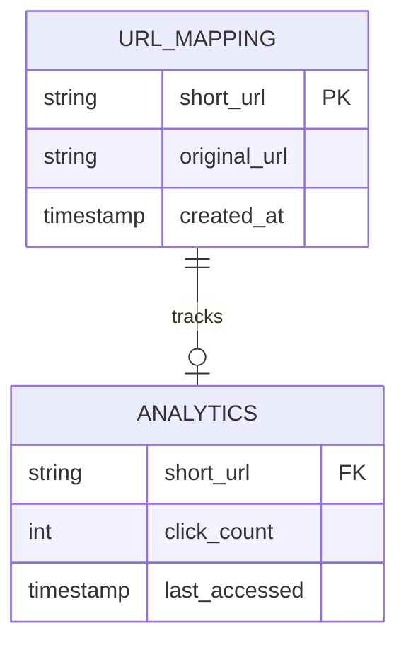
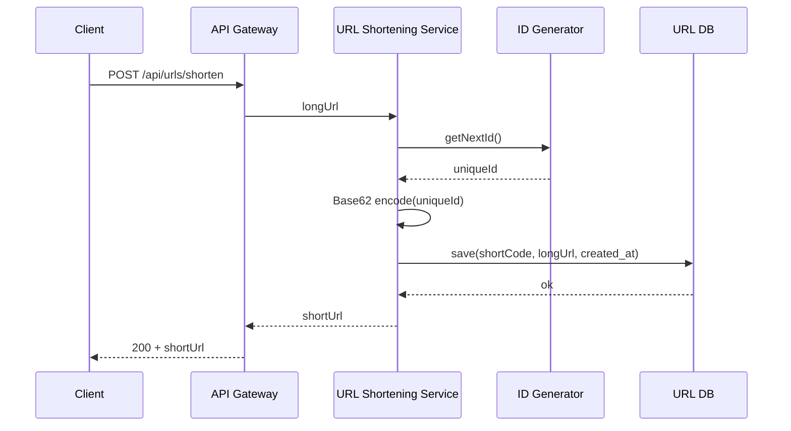
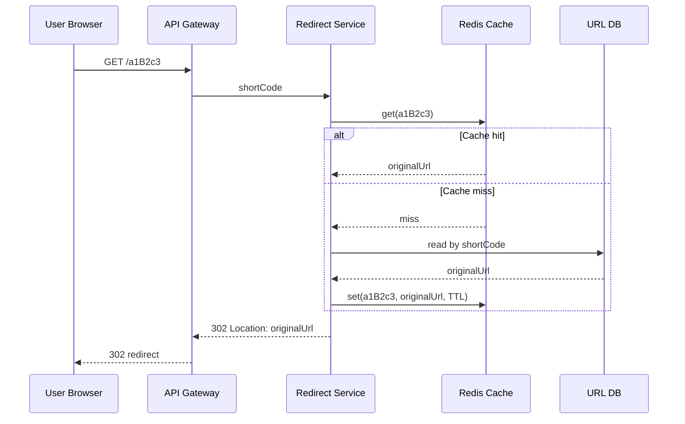
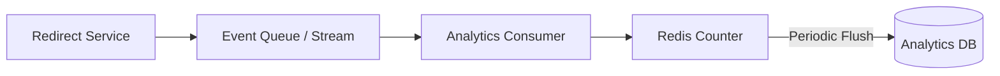
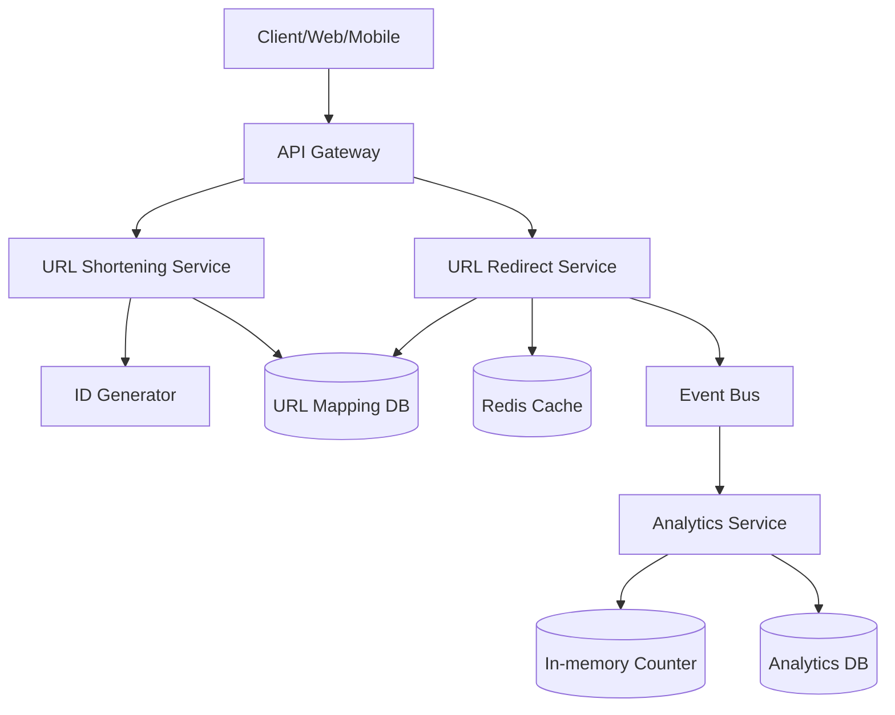
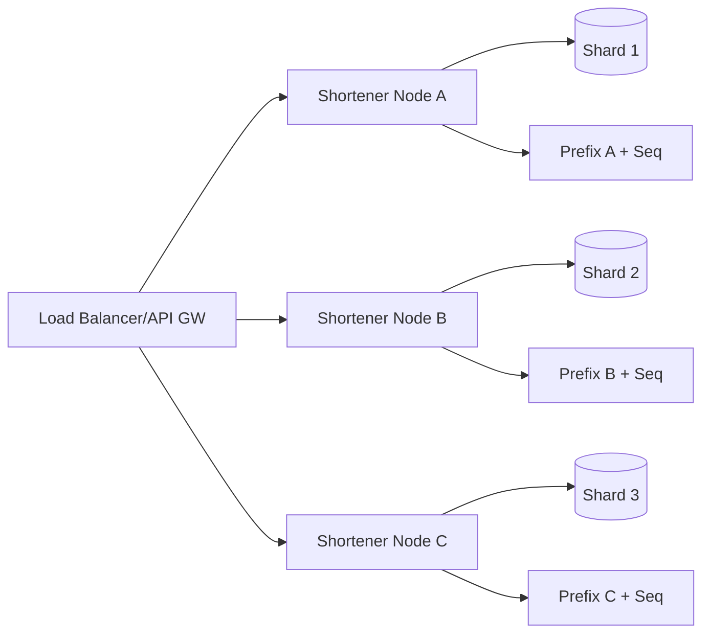

# URL Shortener - System Design Interview Notes

## 1) Problem Statement
A URL Shortener converts a long URL into a short, unique alias and redirects users from the short URL to the original URL.

Examples in real life: Bitly, TinyURL, t.co.

The system must support:
- Fast short URL creation
- Fast redirection at very high read traffic
- Durable storage for long-term link availability
- Optional analytics (click counts, basic usage stats)

---

## 2) Requirements (Sequential)

## 2.1 Functional Requirements
1. **Shorten URL (CREATE):** User provides long URL -> system returns short alias.
2. **Redirect URL (READ):** User opens short URL -> system redirects to original URL.
3. **Track usage (UPDATE/INCREMENT):** System counts clicks per short URL.

## 2.2 Non-Functional Requirements
1. **High availability:** URLs should resolve 24/7 with minimal downtime.
2. **Low latency:** Redirect should be near real-time (ideally a few ms).
3. **High durability:** URL mappings must persist even with failures.
4. **Uniqueness:** Each short code maps to exactly one long URL.
5. **Scalability:** Must handle millions/billions of links and very high read traffic.
6. **Security/abuse control:** Prevent spam, malicious links, and misuse.

## 2.3 Capacity Assumptions (from prompt)
1. DAU: `100M`
2. Read:Write = `100:1`
3. Writes/day: ~`1M`
4. Retention: `5 years`
5. Data per mapping: ~`500 bytes`

Quick estimate:
- Total links in 5 years: `~1.825B`
- Raw storage: `~1.825B * 500B = ~912.5 GB` (without replication/index overhead)

---

## 3) Entity Design (Data Model)

## 3.1 URLMapping (Core entity)
Source of truth: **URL Shortening Service**

| Field | Type | Description |
|---|---|---|
| `short_url` | string | Primary key (e.g., Base62 code like `a1B2c3`) |
| `original_url` | string | Full destination URL |
| `created_at` | timestamp | Creation time (lifecycle, reporting, expiry policy) |

## 3.2 Analytics (Optional but recommended)
Source of truth: **Analytics Service**

| Field | Type | Description |
|---|---|---|
| `short_url` | string | Foreign key to URLMapping |
| `click_count` | integer | Total number of clicks |
| `last_accessed` | timestamp | Last hit time |

Relationship:
- One URLMapping -> one Analytics row (or lazy-created on first click)



---

## 4) API Design

## 4.1 Shorten URL
`POST /api/urls/shorten`

Request:
```json
{
  "longUrl": "https://example.com/very/long/path"
}
```

Response:
```json
{
  "shortUrl": "https://sho.rt/a1B2c3"
}
```

## 4.2 Redirect URL
`GET /api/urls/{shortCode}`

Behavior:
- Return HTTP `302 Found` (or `301` for permanent policy) with `Location: <original_url>`

## 4.3 Analytics endpoint (optional)
`GET /api/urls/{shortCode}/stats`

Response example:
```json
{
  "shortCode": "a1B2c3",
  "clickCount": 124588,
  "lastAccessed": "2026-04-11T09:00:00Z"
}
```

---

## 5) High-Level Design (Mapped to Functional Requirements)

## 5.1 Shorten Flow (CREATE)
1. Client sends long URL.
2. URL Shortening Service validates URL.
3. Service generates unique ID.
4. ID encoded to Base62 short code.
5. Mapping stored in durable DB.
6. Return short URL.



## 5.2 Redirect Flow (READ)
1. Client requests short URL.
2. Redirection service checks cache.
3. If hit -> immediate redirect.
4. If miss -> fetch from DB, fill cache, redirect.



## 5.3 Analytics Flow (UPDATE/INCREMENT)
1. On redirect, publish click event asynchronously.
2. Analytics service consumes event.
3. Counter incremented in in-memory store.
4. Periodic batch flush to analytics DB.



Why async?
- Redirection path remains ultra-fast.
- Analytics failures do not block user redirect.

---

## 6) Core Component Diagram



---

## 7) Deep Dive

## 7.1 ID Requirements
A short code strategy needs:
1. **Global uniqueness** (no collision in final short code)
2. **Short length** (typically 5-8 chars)

## 7.2 ID Generation Options

### Option A: Hash of URL (MD5/SHA)
Pros:
- Deterministic for same input

Cons:
- Collisions need handling
- Hash output usually too long (unless truncated -> collision risk rises)

### Option B: UUID
Pros:
- Collision probability very low

Cons:
- Too long for human-friendly short links

### Option C: Snowflake-style 64-bit IDs
Pros:
- Distributed generation
- Time-sortable

Cons:
- Raw value long unless encoded
- Operational complexity (worker IDs, clock handling)

### Option D (Chosen): Machine/Shard ID + Sequence
Pros:
- Simple uniqueness with horizontal scale
- Controlled output length after Base62 encoding
- Easy shard expansion

Cons:
- Requires shard assignment discipline

---

## 7.3 Base62 Encoding (Chosen)
Character set: `a-z A-Z 0-9` (62 chars)

Why Base62?
1. URL-safe and human-friendly
2. More compact than hex/base10
3. No special chars like `+ / =` (Base64 issues)

Capacity:
- `62^6 ≈ 56.8B` combinations
- Enough for multi-year growth in this problem

Pseudo code:
```python
CHARS = "abcdefghijklmnopqrstuvwxyzABCDEFGHIJKLMNOPQRSTUVWXYZ0123456789"

def base62_encode(num: int) -> str:
    if num == 0:
        return CHARS[0]
    out = []
    while num > 0:
        num, rem = divmod(num, 62)
        out.append(CHARS[rem])
    return ''.join(reversed(out))
```

---

## 7.4 Sharding and Scale Strategy

### Sharding principle
- Use machine/shard prefix in ID generation
- Route writes to corresponding shard
- Read path resolved by short code (or lookup map)



Benefits:
1. Independent write lanes
2. Easy horizontal scale by adding shard + prefix
3. Better write concurrency

---

## 7.5 Caching Strategy for Read Heavy Traffic
1. Read-through cache for shortCode -> originalUrl
2. TTL + lazy refresh
3. Negative cache for invalid codes (short TTL) to reduce DB hits
4. Hot-key protection (replication, local cache, request coalescing)

---

## 7.6 Availability and Reliability
1. Deploy stateless services across multiple AZs/regions.
2. Use replicated managed DB (DynamoDB/Cassandra style setup).
3. Circuit breakers + timeouts + retries for dependencies.
4. Graceful degradation: if analytics down, redirects still work.

---

## 7.7 Consistency Choices
1. URL mapping creation requires **strong write correctness** (no duplicate short code).
2. Redirect reads can be eventually consistent if cache is warm and DB durable.
3. Analytics is eventually consistent by design (async increments).

---

## 7.8 Security and Abuse Prevention
1. URL validation and normalization
2. Block malicious domains / phishing lists
3. Rate limiting for creation API
4. Optional auth for private links
5. Spam detection and CAPTCHA for anonymous users

---

## 8) Trade-offs to Mention in Interview
1. **Custom alias support** increases collision checks and abuse risk.
2. **301 vs 302:**
   - `301` helps caching and SEO permanence
   - `302` safer for mutable destination use cases
3. **Precompute IDs vs on-demand generation** affects complexity and latency.
4. **Strong consistency everywhere** increases latency/cost; use selectively.

---

## 9) Bottlenecks and Mitigations
1. **Hot links** -> heavy cache pressure
   - Mitigate with multi-layer cache and CDN edge redirects.
2. **ID generator single point failure**
   - Mitigate with distributed generators per shard.
3. **DB read storms on cache misses**
   - Mitigate with request coalescing and backoff.
4. **Analytics write amplification**
   - Mitigate with batching and periodic flush.

---

## 10) Interview Answer Template (Quick Revision)
Use this order while speaking:
1. Clarify requirements and traffic assumptions.
2. Propose entities (`URLMapping`, `Analytics`).
3. Define APIs (`POST /shorten`, `GET /{code}`).
4. Explain read-heavy architecture with cache-first redirects.
5. Explain ID generation + Base62 and collision guarantees.
6. Explain sharding for write scale.
7. Add async analytics pipeline.
8. Cover reliability, consistency, and abuse controls.
9. End with trade-offs and bottlenecks.

---

## 11) Final Summary
A good URL shortener design is:
1. **Write-safe** (unique short codes)
2. **Read-optimized** (cache-first redirects)
3. **Durable** (persistent mapping store)
4. **Scalable** (sharding + stateless services)
5. **Observable and secure** (analytics + abuse prevention)

If you present it in this sequence during interview, your design will sound structured, practical, and production-oriented.
