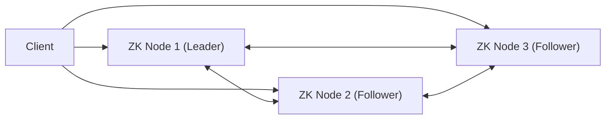
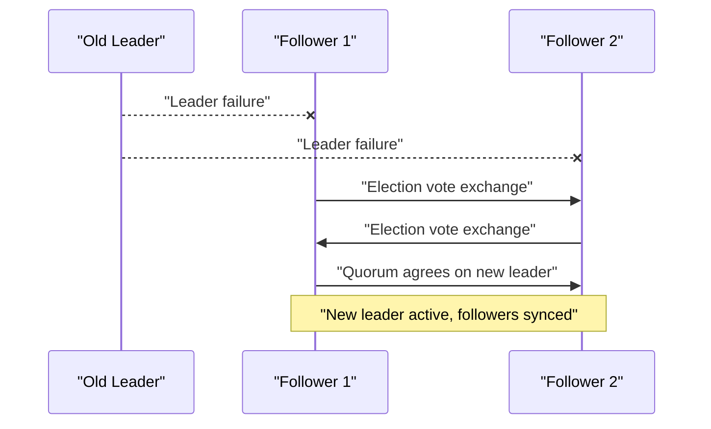
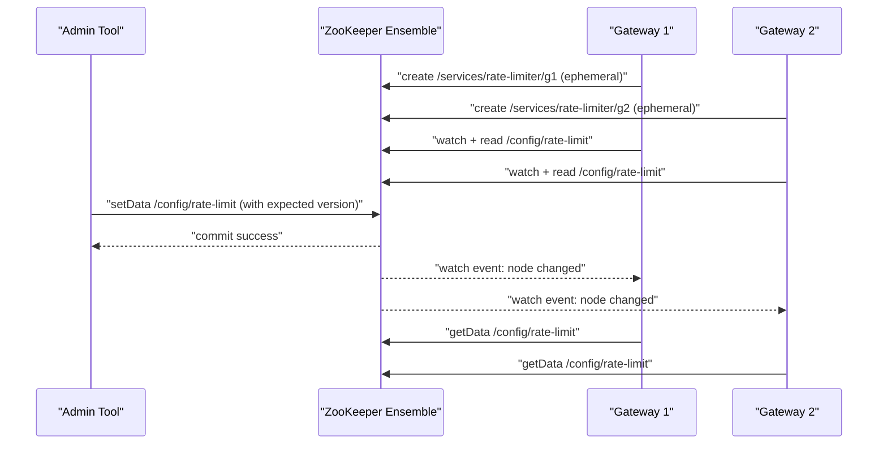
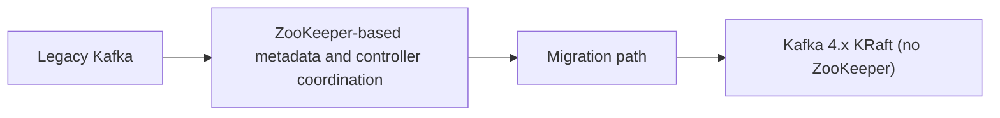

# ZooKeeper Internals and Practical Use Cases

This guide explains how Apache ZooKeeper works internally and how to apply it in real systems, especially for configuration management and Kafka.

---

## 1) What ZooKeeper Is (and Is Not)

ZooKeeper is a **distributed coordination service**. It is great for:

- service discovery
- leader election
- distributed locks
- small shared configuration
- membership/liveness tracking

ZooKeeper is **not** a general database and not meant for large payloads or high-throughput business data.

---

## 2) Core Architecture

### 2.1 Ensemble and Quorum

A ZooKeeper cluster is called an **ensemble**.

- Use an odd number of servers, usually `3` or `5`.
- Updates require a **quorum** (majority) to commit.
- With `3` nodes, you can tolerate `1` failure.
- With `5` nodes, you can tolerate `2` failures.

### 2.2 Server Roles

- **Leader**: orders all writes.
- **Followers**: replicate and acknowledge writes.
- **Observers** (optional): serve reads and forward writes, but do not vote in quorum.

---

## 3) Data Model: Znode Tree

ZooKeeper stores data in a hierarchical tree of **znodes**.

Example:

- `/config/rate-limit`
- `/services/rate-limiter/gateway-1`

### 3.1 Znode Types

- **Persistent znode**: stays until explicitly deleted.
- **Ephemeral znode**: tied to client session; deleted automatically on session expiration.
- **Sequential znode**: ZooKeeper appends an increasing number (useful for ordered queues/election patterns).

### 3.2 Metadata and Versions

Each znode keeps metadata (`Stat`) including:

- `version` for data updates
- `czxid` and `mzxid` (transaction ids)
- timestamps and ACL info

Version enables optimistic concurrency control (`setData` with expected version).

---

## 4) Session Model and Watches

### 4.1 Sessions

Clients connect and get a session.

- client sends heartbeats
- if disconnected briefly, it may reconnect and keep the same session
- if disconnected too long (session timeout), session expires

On session expiration, ZooKeeper deletes that client’s ephemeral nodes.

### 4.2 Watches

A watch is a change notification trigger on a znode/path.

Important properties:

- watches are **one-time triggers**
- after event, client should read latest state and re-register watch
- event says “something changed,” not “here is the full new value”

So the pattern is always:

1. watch event arrives
2. call `getData` / `getChildren`
3. apply new state
4. re-watch

---

## 5) How Writes and Reads Work Internally

### 5.1 Write Path (Strongly Ordered)

1. client sends write request (to any ZooKeeper server)
2. request is handled/forwarded to leader
3. leader proposes transaction to followers
4. majority acknowledges
5. leader commits and responds success
6. change becomes visible

This gives globally ordered writes.

### 5.2 Read Path

Reads are usually served from the connected server’s in-memory state.

- very fast
- may be slightly behind latest global write in some timing windows
- for stronger read guarantees in specific cases, use sync/read patterns at client side

### 5.3 ZAB Protocol (Why Ordering Works)

ZooKeeper uses **ZAB (ZooKeeper Atomic Broadcast)** to keep replica state consistent for committed writes.

- leader assigns an ordered transaction id (`zxid`) to each write
- followers persist proposals and acknowledge
- once quorum acknowledges, leader commits
- all servers apply committed transactions in the same order

This is the core reason ZooKeeper can act as a reliable coordination backbone.

---

## 6) Leader Election in ZooKeeper (Ensemble Side)

When leader fails:

1. servers enter election state
2. they exchange votes
3. one server wins (based on election rules and latest known state)
4. quorum agrees
5. leader activates and followers sync

During this phase, write availability can pause briefly.

---

## 7) Use Case A: Central Configuration Management

### 7.1 Problem

You have multiple API gateway/rate-limiter servers. All must enforce the same rule (for example, requests per minute). Admin changes should propagate consistently.

### 7.2 Znode Layout

- `/config/rate-limit` (persistent): current config JSON
- `/services/rate-limiter/<server-id>` (ephemeral): each server’s liveness marker

### 7.3 End-to-End Flow

1. gateway starts and creates ephemeral node under `/services/rate-limiter`
2. gateway reads `/config/rate-limit`
3. gateway sets watch on `/config/rate-limit`
4. admin updates `/config/rate-limit` with version check
5. ZooKeeper commits update through quorum
6. watch event reaches gateways
7. each gateway re-reads latest config and updates in-memory limiter
8. gateway re-registers watch

### 7.4 Why This Is Consistent

- single shared source of truth (`/config/rate-limit`)
- writes are totally ordered via leader + quorum
- versioned update prevents lost updates between multiple admins

### 7.5 Failure Behavior

If `gateway-2` crashes:

- its session expires
- `/services/rate-limiter/gateway-2` disappears automatically
- monitoring/control-plane watchers can detect this and alert

---

## 8) Use Case B: Kafka and ZooKeeper

### 8.1 Legacy Kafka (ZooKeeper Mode, Kafka 3.x and older)

Historically, Kafka used ZooKeeper for cluster metadata and controller coordination.

Typical patterns included:

- broker registration via paths like `/brokers/ids/<broker-id>`
- controller coordination using `/controller` znode semantics
- topic and partition metadata coordination through ZK-backed controller logic

If controller process failed, ZooKeeper session expiration and znode changes enabled a new controller election path.

### 8.2 Modern Kafka (KRaft)

As of **Kafka 4.0.0 (March 18, 2025)**, Kafka runs in **KRaft mode by default** and no longer depends on ZooKeeper for normal operation.

So for new Kafka deployments:

- prefer KRaft architecture
- treat ZooKeeper knowledge as important mainly for legacy clusters and migration understanding

---

## 9) Practical Design Rules

1. Keep znode payloads small.
2. Use `setData` with expected version for admin updates.
3. Always handle session expiration and reconnect logic.
4. Re-register watches after each event.
5. Use 3 or 5 ZooKeeper nodes, not 2.
6. Separate config paths from service-membership paths.
7. Do not use ZooKeeper as a high-volume data store.

---

## 10) Common Mistakes

1. Assuming watch event includes the full updated data.
2. Forgetting watches are one-shot.
3. Storing large documents/blobs in znodes.
4. Using ZooKeeper for heavy transactional business data.
5. Ignoring `BadVersionException` during concurrent admin writes.

---

## 11) Interview-Ready Summary

- ZooKeeper gives **coordination**, **ordering**, and **membership visibility**.
- Leader orders writes; quorum commits them.
- Ephemeral nodes represent liveness.
- Watches notify clients; clients then pull latest state.
- For config management, use one persistent config znode plus per-instance ephemeral membership nodes.
- Kafka moved away from ZooKeeper in modern versions (KRaft), but ZooKeeper remains highly relevant for distributed systems fundamentals and legacy Kafka environments.

---

## 12) Reference Links

- ZooKeeper Programmer’s Guide: https://zookeeper.apache.org/doc/r3.9.4/zookeeperProgrammers.html
- ZooKeeper Internals: https://zookeeper.apache.org/doc/r3.9.4/zookeeperInternals.html
- ZooKeeper QuorumPeer API notes: https://zookeeper.apache.org/doc/r3.8.1/apidocs/zookeeper-server/org/apache/zookeeper/server/quorum/QuorumPeer.html
- Kafka 4.0.0 Release (KRaft default, no ZooKeeper): https://kafka.apache.org/blog/2025/03/18/apache-kafka-4.0.0-release-announcement/
- Kafka Upgrade Docs (4.x changes): https://kafka.apache.org/42/getting-started/upgrade/
